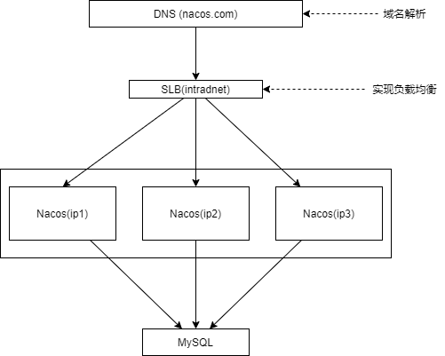
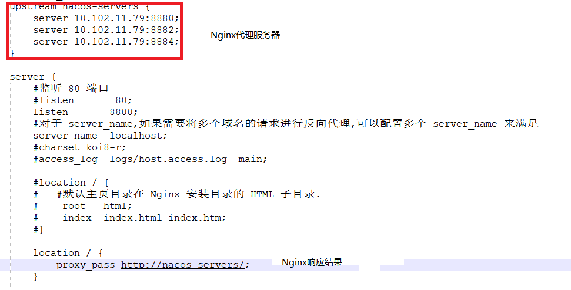

# Nacos
> Name Configuration Service
+ 作用: 
    - 服务注册中心
    - 统一配置中心
+ 使用:
    > Nacos 为一个软件 (与 Consul 一样) [Nacos 官网](https://nacos.io/zh-cn/index.html)
    - 使用 Git 从 Github 上下载原码
    - 使用 Maven 编译
        ```shell
        // 从 github 上下载
        git clone https://github.com/alibaba/nacos.git
        // 进入 nacos 文件夹
        cd nacos/
        // 使用 Maven 编译
        mvn -Prelease-nacos -Dmaven.test.skip=true clean install -U  
        // 列出 distribution/target/ 文件夹下的详细信息
        ls -al distribution/target/
        ```
    - 启动服务器
        ```shell
        // 移进 distribution/target/nacos-server-$version/nacos/bin 文件夹下 ($version: 下载的版本号)
        cd distribution/target/nacos-server-$version/nacos/bin
        // Linux/Unix/Mac
        sh startup.sh -m standalone
        // Ubuntu
        bash startup.sh -m standalone
        // Windows
        startup.cmd -m standalone
        ```
    > 直接开启 startup.cmd / startup.sh Nacos 默认以集群形式启动
    + 使用 Nacos 管理界面 (登陆后页面选项卡简介)
        > 单机启动 默认端口: 8848 Username: nacos Password: nacos
        - 配置管理 + 命名空间 和配置管理有关
        - 服务管理 + 集权管理 和服务注册有关
        - 权限控制 创建、删除以及修改用户、角色以及角色权限
+ Nacos Client 开发:
    - 创建独立 SpringBoot 应用
    - 引入依赖 `spring-cloud-starter-alibaba-nacos-discovery`
    - 写配置 
        ```yaml
        
        spring:
            cloud:
                nacos:
                    # Nacos Server 总地址
                    server-addr: ip:port # 单机模式
                    # 可写可不写
                    discovery:
                        # Nacos Server 服务注册中心地址 
                        server-addr: ip:port 
                            # 默认值 ${spring.cloud.nacos.server-addr}
                        # Nacos Client 注册到 Nacos Server 上的服务ID 
                        service: 服务ID 
                            # 默认值 ${spring.application.name} 但优先级高于 spring.application.name
        ```
    - 加注解 (入口类 `@EnableDiscoveryClient`) **可选**
+ [服务间通信](微服务通信.md)
    + 方式:
        1. Http Rest **推荐**
        2. RPC
    + Rest 方式实现服务间通信
        1. RestTemplate + Ribbon
            > 1. DiscoveryClient (没有负载均衡,获得 List 后, 执行决定负债均衡策略, 最后使用 RestTempate 传递请求)
            > 2. LoadBanlance (找到并负载均衡后,使用 RestTemplate 传递请求)
            > 3. @LoacBalance (对于 RestTemplate 使用)
        2. OpenFeign 
            
            > 写 interface 并使用 @FeignClient("服务id") 标注
+ 统一配置中心
    + 特点:
        - Nacos 自己在服务器上建立版本库(无需远程仓库;存在版本控制)
    + 将微服务的配置交给 Nacos 管理:
        1. 开发业务服务
        2. 注册到服务注册中心 (也是 Nacos)
        3. 在 Nacos 配置管理内添加配置
            > + 在管理页面添加 
            >   - Data ID: <br> 配置文件名.必须添加上环境 => 服务ID-环境.yml/properties
            >   - Group: 组
        4. 业务服务引入依赖
            <br> `spring-cloud-starter-alibaba-nacos-config`
        5. 写 bootstrap.yml/properties
            ```yaml
            spring:
                cloud:
                    nacos:
                        config:
                            server-addr: # config server 地址
                            group: # 哪个 Group 拉取配置 大写
                            name: # 哪个配置文件
                            file-extension: # 配置文件后缀 默认:properties
            ```
        6. 自动刷新: <br> 在需要自动刷新配置的类上添加 `@RefreshScope`
            > Nacos Server 上修改配置将向微服务发送更新请求
            >
            > > 只不过少了 git 操作: git 可以本地修改后通过 git bash 上传远程仓库
    + 细节:
        + 拉取配置文件:
            ```yaml
            spring:
                profiles:
                    active: # 环境
                cloud:
                    nacos:
                        config:
                            server-addr: # config server 地址
                            namespace: # 哪个 命名空间 拉取配置 写命名空间的id
                            group: # 哪个 Group 拉取配置 默认: DEFAULT_GROUP
                            # 第一种
                            name: # 哪个配置文件(文件名)
                            # 第二种
                            prefix: # 前缀 + 环境 + 后缀
                            # 环境 => spring.profiles.active
                            file-extension: # 配置文件后缀 默认:properties
            ```
        + 统一配置中心 三概念
            1. 命名空间 namespcae:
                > 安装后默认生成 public 的命名空间
                - 隔离不同 应用/项目 的配置文件(不同项目)
            2. 组 group:
                > 默认管理配置文件执行组别 DEFAULT_GROUP
                - 隔离 服务 之间的配置文件(同一项目,不同服务)
            3. 文件名 dataid:
                - 含义: 完整配置文件名
                    > dataID = prefix(前缀) + env(环境) + file-extension(后缀) <br>
                    > dataID = `${prefix} + ${spring.profile.active} + ${file-extension}`
                - 设定后不能修改
            4. 配置的导入导出:
                - nacos 配置管理选项卡导出为每个配置文件的包
                - nacos 导入直接选择导出的包(只能是导出的包,不可以是单个配置文件)
            5. 版本回溯:
                + 历史版本:
                    - 默认没有数据
                    - 需要查询才会显示数据
+ Nacos 持久化
    - 持久化: 管理的配置信息持久化
    - 默认 Nacos 存在配置信息的持久化(默认方式:内嵌数据库 derby[不推荐:不能友好的查看数据])
    - 生产情况下,推荐将配置存入 MySQL 数据库
        
        > Nacos 目前只支持 MySQL 
    + 将 Nacos 持久化 MySQL 中:
        > MySQL 5.6.5+
        1. 新建 MySQL 数据库
            
            > 编码: UTF-8
        2. 在新建库中运行 nacos-mysql.sql 文件
            
            > Nacos 安装包中
        3. 修改 Nacos 配置文件,将持久化信息转存到 MySQL 中 (提前将配置导出)
            > 修改 application.properties 文件 (与 nacos-mysql.sql 同目录)
            ```properties
            
            spring.datasource.platform=mysql
            db.num=1
            db.url.0=jdbc:mysql://127.0.0.1:port/数据库名...
            db.user.0=root
            db.password.0=pwd
            ```
        4. 重启 Nacos (可将之前导出的配置导入)
+ Nacos 集群搭建
    > 集群节点个数建议***奇数个*** <br>

    
    <br>
    + 集群规划
        - Nacos 奇数个部署
        - MySQL 主从复制
        - Nginx 
    + 注意事项:
        1. MySQL 持久化
        2. 一台机器搭建多台节点,内存要够 (一个基本 1GB)
    + 搭建 ***(每个 Nacos 都要单独列一个文件夹运行)***
        1. 配置 解压后/编译后 nacos/conf 目录下的 cluster.conf
            > ip:port 的形式
            >
            > > 单机部署多个端口 => 端口号不能连在一起(不然启动了两边的非连在一起的,中间的就报错;中间的启动了,两边的又报错)
        2. 配置文件 `applicaition.properties` 内的数据源应配为外部的 MySQL 数据库 (数据库需要初始化:删除原数据,再运行 SQL 文件)
        3. 启动 Nacos 
            > Windows: <br>
            > &nbsp;&nbsp;&nbsp;&nbsp;startup.cmd <br>
            > Linux/Unix/Mac: <br> 
            > &nbsp;&nbsp;&nbsp;&nbsp;sh startup.sh -p embedded 内嵌数据源 <br>
            > &nbsp;&nbsp;&nbsp;&nbsp;sh startup.sh 外部数据源 <br>
+ 使用 Nignx 实现负载均衡
    + Windows 下:
        - [官网](https://nginx.org/en/download.html)下载
        - 直接解压
        - 更改配置
            > Nginx 默认使用 80 端口, 但是 Windows 下 80 端口默认被 IIS (Internet Information Services: 互联网信息服务;微软提供的搭建网页的平台) 占用. <br>
            > 若不想卸载 IIS 就更改 Nginx 的监听端口.(关闭 IIS 服务没找到对应服务,因此只能更改 Nginx 端口)
            
            
        - 启动 Nginx (CMD 内启动;双击导致只能一个一个进程的关闭)
            > start nginx: 启动 <br>
            > nginx -s stop: 停用/强制重启 <br>
            > nginx -s quit: 处理完正在处理的请求后再退出 <br>
            > nginx -s reload: 重新加载配置，并重启进程 <br>
            > nginx -s reopen: 重启日志文件 <br>
        - 使用 Nginx 配置好的 url 请求
            > 比如上图所示的 Nginx 配置. <br>
            > 将 Nacos 服务器启动好,在请求 http://localhost:8800/nacos 将自动跳转到 Nacos 的登录界面
        #### 注:
        若出现 Nacos 上多个 IP 对应一台 Server, 则需要将所有 IP 都写在 cluster.conf 文件中.
        > 不写将启动不了微服务 <br>
        > 或只将 微服务 注册的 IP 写上. <br>
        > 最好 Nginx 的 upstream 内也写上.
        
        