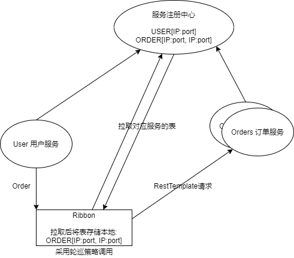

# 微服务

> 基于单体应用围绕业务进行的拆分服务,每个服务都是独立应用、独立运行、独立部署且运行在自己的计算机进程中(基于分布式服务管理)

### 微服务间通信
+ HTTP Rest(OSI 网络七层模型中***应用层***协议 耦合低;效率低):
    - http 协议 Json
    - Spring Cloud 默认使用
+ RPC(OSI 网络七层模型中***传输层***协议 效率高;限制多):
    - 远程过程调用 二进制
    - 设计的服务耦合程度高(相互通信的服务开发语言要相同)
    - 开发语言相同时,考虑效率使用
    - e.g. Dubbo 
### 代码中发起 http 请求
+ RestTemplate
    + Spring 框架提供 HttpClient 对象: RestTemplate (发起 http 请求)[类比浏览器]
    + 实现:
        1. 开发服务(服务都是独立的 SpringBoot 应用)
        2. 引入 Client 依赖
        3. 配置 Server 地址和端口
        4. 启动类添加***服务注册***注解
        5. Controller 中使用 RestTemplate 对象(创建对象 -> 调用对象方法 -> 返回结果)
        ```java
        RestTemplate template = new RestTemplate();
        String res = template.getForObject("http://host:port/map", String.class);
        ```
    + 问题:
        1. 调用服务路径主机和服务端口是写死在url中(集群中的负载均衡未实现)
        2. 调用服务路径写死,不利于日后路径变化的维护
    + 解决:
        1. 自定义负载均衡解决策略 (前提是需要知道所有服务路径和端口,然后随机选取[编写者需要自己写随机])
            - 考虑不周全 (策略单一--仅仅是随机)
            - 无法实现服务的健康检查
        2. 使用 SpringCloud 组件 Ribbon 解决负载均衡调用
+ Ribbon
    + SpringCloud 提供 基于 Netflix
    + 负载均衡的客户端组件 配合 RestTemplate (发请求)使用
    + 实现请求调用时的负载均衡 <br>
    `spring-cloud-starter-netflix-ribbon` <br>
    + 原理: <br>
        
    > 若调用时,正好调用到已经宕机的服务上,则此次服务请求失败(缓存未及时更新,一般只要服务注册中心发现服务宕机就会向有宕机服务缓存的其他服务发送更新的请求,剔除宕机节点)
        - 默认轮巡策略
        - 根据调用服务的服务id去服务注册中心获取对应服务id的服务列表,并将列表保存在本地缓存,然后在本地通过默认的轮巡负载均衡策略在现有的列表中选择一个可用节点提供服务. ***(客户端的负载均衡)***
    + Ribbon 的其他负载均衡策略 (***查看源码***)
        > 源码查询过程: LoadBalanceClient.choose() --(发现)--> LoadBalanceClient 接口未实现父接口 ServiceInstanceChooser 的 choose 方法 --(进而寻找到默认实现类)-->  RibbonLoadBalancerClient --(发现)--> 一个参数的 choose 方法调用两个参数的 choose 实现负载均衡 --(发现)--> choose 方法通过 getServer 方法获得负载均衡后的服务实例 --(发现)--> getServer 方法通过 chooseServer 实现负载均衡 --(发现)--> 多个实现类 --(debug)--> 发现 BaseLoadBalancer 为最终实现类 --(发现)--> IRule 为负载均衡策略的最终父类
        
        .png)
        - RoundRobinRule 轮巡 按顺序选择 Server
        - RandomRule 随机 随机选择 Server
        - AvailabilityFilteringRule 可用过滤 (过滤掉多次访问故障而处于断路器跳闸状态的服务和并发连接数量超过阈值的服务,其他轮巡) 
          
            > Tomcat 同一时间的最大并发线程数为 150
        - WeightedResponseTimeRule 响应时间加权 (根据平均响应时间计算所有服务的权重,响应快的被选概率大;一开始由于数据不够,因此使用轮巡,到数据足够时将自动切换)
        - RetryRule 重试 (先按轮巡获取服务,获取失败时在制定的时间内重试,获取可用服务)
        - BestAviableRule 最低并发 (先过滤掉多次访问故障而处于断路器跳闸状态的服务,再选择并发量最小的服务)
    + Ribbon + RestTemplate
        - 请求方引入 Ribbon 依赖
            - ***consul client 依赖中已经存在 ribbon 相关依赖,无需再次引用***
        - Controller 中使用 
            1. DiscoveryClient(服务注册和发现的客户端对象:根据服务id从服务注册中心获取对应的服务列表到本地.没有负载均衡,需要自己实现)
            2. LoadBalanceClient(负载均衡的客户端对象:根据服务id从服务注册中心获取对应的服务列表到本地,再根据服务负载均衡策略选择一个服务返回.每次都需要根据服务id获取负载均衡的服务后再通过 RestTemplate 调用服务) 
            
            [对象实例](..\SpringCloudDemo\cloud_parent\SpringCloud_04_Users\src\main\java\com\cloud\learn\Controller\UserController.java)
            
            3. @LoadBalanced(负载均衡客户端注解:(范围:使用在方法上.作用:使当前方法 当前对象具有 Ribbon 负载均衡的特性))
            > Spring Boot 不建议 在使用时 new 一个对象, 而是在 BeansConfig 类中注入到 Ioc 容器中,需要时再注入需要的类中
            
            [注解实例](..\SpringCloudDemo\cloud_parent\SpringCloud_04_Users\src\main\java\com\cloud\learn\Controller\UserController.java)
    
        > (Spring Boot 项目启动时自动创建上述两个对象.需要使用时,只需要直接注入即可) 根据服务id (服务名称<spring.application.name>) 实现请求的负载均衡
    + 修改默认的负载均衡策略:
        - 在需要负载均衡的服务的配置文件(调用方的配置文件):
        ```YAML
        服务ID:
            ribbon:
                NFLoadBalancerRuleClassName: 全限定名
        e.g.
            com.netflix.loadbalancer.RandomRule
        ```
    + 解决不了 维护的问题(路径写死在路径中)
    + 现状:
        - ribbon 当前进入 维护状态
        - 部分子项目仍在生产实践中 (core eureka loadbalancer)
### OpenFeign
+ Feign 维护/闭源
    - Netflix 提供
    - Spring Cloud 吸收开发组成 OpenFeign
+ OpenFeign
    - Spring 团队吸收 Feign 特点创建
    - OpenFeign 和 Feign 使用无异
    - Rest Client(Http Client):和 RestTemplate 作用无异
        - RestTemplate Spring: 框架封装的 Http 客户端对象
        - OpenFeign: 伪 Http 客户端对象(可发请求,但实际发请求的是底层的另一个对象) [可使服务间的通信更加简单]
            - 用户使用简单 (写一个接口 加一个注解)
            - 开发简单 (自动完成数据传递过程中的对象转换)
            - ***默认集成 Ribbon 可实现请求的负载均衡***
    - OpenFeign 可解决 RestTemplate 实现服务间通信的所有问题
    - 使用步骤:
        - 创建 SpringBoot 业务项目
        - 注册到服务注册中心 (引入依赖 -> 写配置 -> 加注解)
        - 使用 OpenFeign 进行调用
            - 写接口
            - 服务调用方引入 OpenFeign 依赖
            - 服务调用方入口类加入注解 `@EnableFeignClients`
            - 添加 package: feignclients (存放调用接口 interface[接口命名:调用目标的接口名+client])
            - 接口内部方法的 返回值 形参列表 路径保持和调用接口的一致 (方法名可不一致)
            - [Inferface](../SpringCloudDemo/cloud_parent/SpringCloud_06_Categorys/src/main/java/com/cloud/learn/feignclients/ProductClient.java) <br> [Usage](../SpringCloudDemo/cloud_parent/SpringCloud_06_Categorys/src/main/java/com/cloud/learn/Controller/CategoryController.java)
    + 新版本报错:
        - 1. 由于 SpringCloud Feign 在 Hoxton.M2 RELEASED 版本之后不再使用 Ribbon 而是使用 spring-cloud-starter-loadbalancer,而项目 SpringCloudDemo Module SpringCloud_06_Catagory 使用了 consul 服务注册中心客户端的依赖(其中包括了 spring-cloud-starter-loadbalancer, 因此没有报错).
            
            > 解决方案: 引入依赖 spring-cloud-starter-loadbalancer
        - 2. @RequestMapping annotation not allowed on @FeignClient interfaces: 在 RequestMappingHandlerMapping 有一个isHandler() 方法，在这个方法上判断了被 @Controller 和  @RequestMapping 注解修饰的类就是一个处理请求的 Handler 处理类
            > 方法1: 删去 @RequestMapping (在内部写全) <br>
            > <del>方法2: 重写该方法</del>
            ````java
            @Configuration
            @ConditionalOnClass({Feign.class})
            public class FeignConfig {
                @Bean
                public WebMvcRegistrations feignWebRegistration() {
                    return new WebMvcRegistrations() {
                        @Override
                        public RequestMappingHandlerMapping getRequestMappingHandlerMapping() {
                            return new FeignRequestMappingHandlerMapping();
                        }
                    };
                }
                private static class FeignRequestMappingHandlerMapping extends RequestMappingHandlerMapping {
                    @Override
                    protected boolean isHandler(Class<?> beanType) {
                        return super.isHandler(beanType) && !AnnotatedElementUtils.hasAnnotation(beanType, FeignClient.class);
                    }
                }
            }
            `
            ````
### 服务间通信--参数传递和响应
+ 参数传递
    - 参数类型
        1. 零散类型 (直接接在 url 后面 : **?id=** or **/xxx**)
        2. 对象
        3. 数组/集合
    1. 零散类型:
        - queryString 传递参数 (?name=var):
            - 多参报错 (OpenFeign 为伪 Http 客户端对象,需要明确参数传递方式)
                - 使用`@RequestParam`注解声明传递方和接收方: ?name=var
        - pathVariable 传递参数
            - 使用`@PathVariable`注解声明: /{name}
        - ***注***: 有多个参数双方都需要注解标注,仅一个参数可只有传递方标注
    > 拓: @RequestParam("value")/@PathVariable("value") 若 value 不写,默认为注解后形参名(即:url?形参名=var)
    >
    > > OpenFeign 必须写 value
    2. 对象类型:
        - 接收方和传递方都需要建立相同的 entity 相互对应,以确保传递的参数 (实体类在微服务之间都是公共的)
        - Json 形式传输参数 两边参数都需要 `@RequestBody` 注解修饰 (application/json)
        > 使用 @RequestBody 传输 json 数据只能使用 POST <br> GET 方法传输对象则需要 @SpringQueryMap 注解(仅传递方需要.***注: `@SpringQueryMap`连续多次使用只会传递第一个对象的数据,详见例子***)
        - <del>表单形式传递参数 两方参数都使用 `@RequestPart` 注解修饰 (form) </del> <br>
        `@RequestPart` 注解 只支持文件传递
        > @RequestPart 注解只能修饰 post put patch 3个方法
    3. 数组/集合
        - queryString 形式[e.g. url?name=var1&name=var2] (使用 `@RequestParam` 注解传递方 接收方可标注也可不标注)
        - 不支持路径传参
        - 传递 List
            - 传递后转成 List (`Arrays.asList(数组)`)
            - 传递前转换 (不能直接接收集合 List or ArrayList Set Map 都不行;只能将其放入对象,使用对象的方式传递)
                > vo:值对象,仅用来传递数据 <br> dto:数据传输对象,仅用来接收数据
                1. 使用 `@SpringQueryMap` 注解,将 List 封装成对象
                2. 将传递方的形参设置为***数组***传递 (详见例子)
    - [例子](../SpringCloudDemo/cloud_parent/SpringCloud_06_Categorys/src/main/java/com/cloud/learn/feignclients/ProductClient.java)
+ 响应处理
    - 返回对象/集合 (详见 SpringBoot 学习时的项目 HY-Online-be 主要是信息传递)
    - 分页 (接收:当前页 + 页的记录数 + 筛选条件->返回:当前页集合 + 多少页/多少条) => Map/DTO
    - 请求方接收到的响应数据类型的都是 Object 类,不能强转.(Json 字符串不能强行转换, 强转将报错)
        - 解决方法:
            - 自定义 Json 反序列化
                1. client 接口直接将返回类型改为 String
                2. 业务逻辑接收返回的 String
                3. 使用 FastJson / Jackson 的 Json 数据处理工具将接收的 String 自行反序列化 (需引依赖)
                ```Java
                JSONObject json = JSONObject.parseObject(接收的String);
                Object var1 = json.get(json数据名);
                // 二次 JSON 反序列化
                List<需要转换到的对象类型> var2 = json.parseArray(var1.toString(), 需要转换到的对象类型.class);
                ```
+ OpenFeign 补充
    - 默认超时处理:
        - 默认的调用超时: 使用 OpenFeign 组件进行服务间的通信时,要求被调用的服务在 1s 内给予响应;超时 OpenFeign 将直接报错
            - 修改 OpenFeign 超时时间:
                1. 特定服务调用时间:
                ```yaml
                feign:
                    client:
                        config:
                            PRODUCTS: # 服务id
                                connectTimeout: 5000 # 配置指定服务链接超时 
                                readTimeout: 5000    # 配置指定服务的等待超时 一般业务逻辑 3~5s 即可
                ```
                > 默认 连接超时 & 等待超时 时间都是 1s.
                >> 连接超时: 一开始服务之间的连接,超过设定时间即报错
                >> 等待超时: 连接之后对服务的调用,超过设定时间也将报错
                2. 全局服务调用时间(openfeign默认时间);
                ```yaml
                feign:
                    client:
                        config:
                            default:
                                connectTimeout: 5000 # 配置指定服务链接超时 
                                readTimeout: 5000    # 配置指定服务的等待超时 一般业务逻辑 3~5s 即可
                ```
    - OpenFeign 日志展示:
        - OpenFeign 伪 HttpClient 客户端对象, 底层使用 Http 协议
        - 日志: 更好且方便在开发过程中调用 OpenFeign 数据传递和响应处理
        - 默认: 关闭
        - 只对 debug 产生响应
        - feign 为每一个 feign 客户端都创建 logger 对象, 且 logger 的名称是 feign 的全限定名
        - 使用日志:
            - 展示日志信息的级别:
                NONE: 不记录
                BASIC: 仅记录 请求方式、url、响应状态码以及执行时间
                HEADERS: 在记录 Basic 级别的基础上, 记录请求和响应的 header (Request Header & Response Header)
                FULL: 请求头 响应头 body 和元数据 (展示 Http 协议状态)
            - 开启日志:
            ```yaml
            feign:
                client:
                    config:
                        服务id:
                            loggerlevel: 上述的一种
            ```
            - 展示日志:
            ```yaml
            logging:
                level:
                    com:
                        项目的限定名:
                            feignclient: debug
            ```
> 完整文档: [官网](https://docs.spring.io/spring-cloud-openfeign/docs/current/reference/html/)
>
> > 版本: 3.1.1