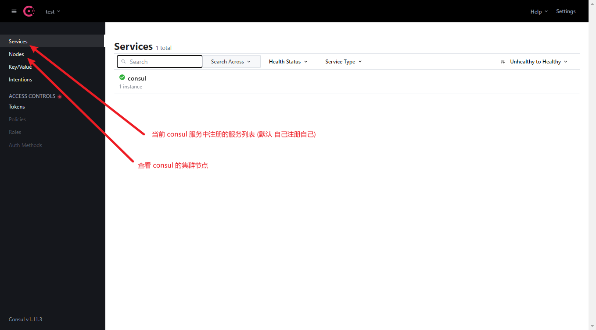

# Eureka
- Netflix 开发的服务发现框架, 集成到 springcloud-netflix-eureka 中 
- 包含 Eureka Server(服务注册中心) & Eureka Client(自己开发的微服务/完成业务的服务) <br> 
    
### Eureka Server 开发:
- 添加 SpringBoot 项目 (配置文件 启动程序)
- 引入 Eureka Server 依赖
- 指定 Eureka Server 的端口 服务地址 服务名(默认端口: 8761)
- 在入口类上加入注解(@EnableEurekaServer)开启服务注册中心
``` 
细节:
- 启动后默认在 Eureka Server 的管理页面出现 UNKNOWN 未知应用(实际上为 Eureka Server 将自己也注册上去了) => 微服务架构中服务名必须注明,是唯一标识 (配置文件中写 : spring.application.name = EUREKASERVER 不能有下划线 推荐大写)
- Eureka Server 启动过程中的报错: 
    com.netflix.discovery.shared.transport.TransportException: Cannot execute request on any known server
    Eureka 含两个组件 Server 和 Client,当项目引入 eurekaserver 时,该组件同时将 eurekaclient 引入到项目(即 启动时即将自己视为服务中心启动,也会将自己视为服务客户端注册)默认启动时立即注册,注册时服务还未准备完成,因此报错
- 解决上述报错 (两者都需)
    # 关闭立即注册
    eureka.client.fetch-registry=false
    # 让服务注册中心不为客户端
    eureka.client.register-with-eureka=false
```
### Eureka Client:
- Eureka Client 基于业务的每个服务
- 开发步骤:
    - 创建好业务服务(名字根据业务命名) SpringBoot 项目 (配置文件 启动类)
    - 引入 Eureka Client 依赖
    - 指定 Eureka Server 服务地址
    - 在入口类上添加注解(@EnableEurekaClient)开启客户端 注册服务
- 启动前,需要保证 Server 也是启动状态
- ***Eureka 自我保护(Self Preservation Mode)***
    - 目的: 网络分区时的自我保护 针对网络异常波动的措施
    - 现象:
        - 远程(?)服务关闭(Down)后, Server 上注册的服务并不会立即消失,而是等待其响应时间超时后, Server 端才会将其消去 (本地上是立即消失) ***实例保护状态*** (管理页面 出现一排红色报告 非报错)
        - 可能因为网络的原因导致服务响应超过设定时间, Eureka 将对应服务加入自我保护状态(而不是直接移除)
        - 在自我保护下, Eureka 服务器将停止移除所有实例(注册的服务)
    - 机制:
        - 一个微服务传递请求前,从服务注册中心拉取传递请求的目标的列表(集群部署在服务器,其ip端口都存储在服务注册中心建立的一个列表中)到自己本地,再在其中根据负载平衡选择集群中的一个传递请求;由于第一次已经拉取了列表到本地,因此第二次及以后传递请求,都直接从拉去下来的列表中选择传递目标.
        - 若服务注册中心发现注册服务中,某个服务过期(生命周期已完),则会清除注册表中的数据,且会向拥有对应服务列表的服务发送请求,更新其本地列表.
        - 可能由于网络问题导致服务响应超时,若没有服务注册中心的自我保护机制,将会导致服务资源的浪费.为避免浪费,才产生自我保护机制.
    - 自动触发(默认开启自我保护机制)
    - 清除自我保护的条件:
        - 自我保护被禁用(官方不建议) <br>
            Eureka Server 使用:
            ```yaml
            eureka: 
                server:
                    enable-self-preservation: false # 关闭自我保护机制
                    eviction-interval-timer-in-ms: 3000 # 超时3秒自动清除 (默认 60 * 1000 => 1分钟)
            ```
            Eureka Client 使用:
            ```yaml
            eureka:
                instance:
                    lease-expiration-duration-in-seconds: 10 # 服务器接收最大时间
                    lease-renewal-interval-in-seconds: 5 # 客户端发送时间
            ```
        - 心跳次数高于预期阈值 (正常情况<没有自我保护机制>下, Eureka在一定时间<90秒>内没有接收到某微服务的心跳<定期通信>, Eureka Server便会将该微服务移除. 在自我保护机制下, Eureka Server 在运行时会统计心跳失败比例,15分钟低于85%,则会保护这些失败的微服务)
            - 可在配置中修改心跳阈值(服务器接收最大时间<默认:90s>`eureka.instance.lease-expiration-duration-in-seconds=10`/客户端发送时间<默认:30s>`eureka.instance.lease-renewal-interval-in-seconds=5`)

> ***默认情况下***, 90s(服务器接收周期)视为一组, 30s(客户端发送周期)发送心跳, 一组内3次心跳, 15分钟便有10组, 30次心跳(无异常), 25次及以下将会在自我保护机制开启的情况下 Eureka Server 进入自我保护.
### Eureka Server 集群搭建
- 无需第三方中间件,仅需两者之间相互通信
    - 多个 Eureka Server(多个 SpringBoot 项目), 每两个 Eureka Server 之间相互注册.
- 完全集群
    1. 需要几个 Eureka Server 就创建几个 SpringBoot 项目
    2. 引入 Eureka Server 依赖
    3. 配置文件 端口 服务名 服务注册中心地址 一一配置
    4. 每个项目的入口(启动)类中加入 `@EnableEurekaServer` 注解
- 简单实现方法: JavaVM参数 `-Dserver.port=8761` (SpringBoot相关) + 修改配置文件 (注:启动项目需要复制创建)
- 由于集群中的每个服务都是两两相互通信的,因此某个微服务向一个服务注册中心注册,服务注册中心集群中的每个都将注册该微服务
- 客户端注册虽然是说向一个服务注册中心注册了,集群同步注册,当实际上还是需要向所有服务注册中心注册(防止指定的服务注册中心宕机,导致其他服务注册中心认为正常微服务为不健康状态)
- 在`eureka.client.service-url.defaultZone=http://ip:port/eureka, http://ip:port/eureka, http://ip:port/eureka`上,配置多个服务注册中心地址,运行时客户端随机选取其中一个进行注册等操作
- 微服务集群
    - 操作与 Eureka Server 一致
    - 注意点: 同一服务, 服务名一致 (Eureka Server 注册为一个列表)
### Consul 服务注册中心
- Eureka 缺点:
    - 不再更新
    - 每次都需要手动通过代码开发服务注册中心
- Consul (无需手动开发)
    - Google 基于 Go 开发
    - 作用:
        - 管理所有服务注册和发现
        - 存储元数据 (服务名 地址列表)
        - 心跳检测
    - 官网下载 (consul.io)
    - 启动 (consul agent -dev) (配置环境变量,否则需要在 consul.exe 文件所在位置使用命令) **[启动完成即为服务注册中心]**
    - 默认端口: 8500 (-http-port= / -https-port= 更改)
    
- Consul 客户端开发
    - 创建 SpringBoot 项目
    - 引依赖 
        - 服务发现 `spring-cloud-starter-consul-discovery`
        - 健康检查 `spring-boot-starter-actuator` (可关闭,即只引入服务发现依赖.***不建议***)
        ```yaml
        spring:
            cloud:
                consul:
                    discovery:
                        register-health-check: false # 默认 true
        ```
    - 写配置 
    ```yaml
    spring:
        cloud:
            consul:
                host: localhost
                port: 8500
                discovery:
                    service-name: CONSULCLIENT # 默认 ${spring.application.name} 指定当前服务注册名
    ```
    - 添注解 (`@EnableDiscoveryClient` 非 Eureka 服务注册中心通用,其性质取决于引入依赖)
- 若使用 Consul 作为服务注册中心时,仅引入服务发现依赖(consul-discovery),且没有关闭健康检查,则会发现在 Consul 管理页面上,刚刚开启服务无法通信(?)<边上是红叉>:由于 server 检查所有客户端心跳,发送的心跳必须有响应才能使服务正常使用,因此健康检查不通过,导致不能使用.
- ***Consul 没有自我保护***