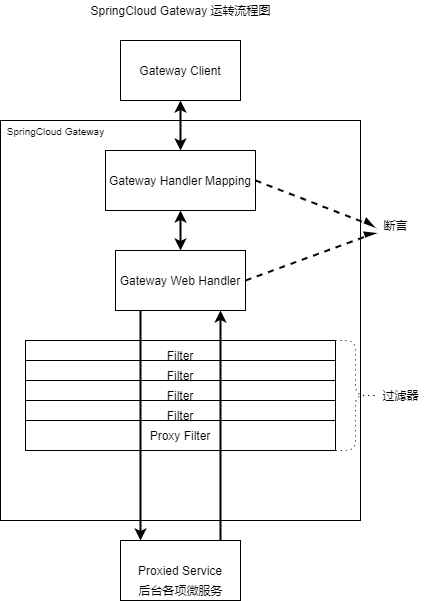

# Gateway 网关/服务网关
+ 网关 = 路由转发(router) + 过滤器(filter)
+ 作用:
    1. 统一所有微服务入口 (前端访问后端)
    2. 实现路由(router)转发(dispatcher), 以及请求过程中的负载均衡
    3. 过滤处理: 
        - 身份认证、
        - 防报文重放和数据篡改(token)、
        - 业务鉴权(权限查询)、
        - 响应数据的脱敏(脱去敏感数据;替换响应数据中的私人内容)、
        - 流量和并发控制、
        - 基于 API 调用的计量或计费
+ SpringCloud 提供网关组件:
    1. Netflix Zuu1.x(效率低) -> Zuu2.x(构建长:近2年)
    2. SpringCloud Gateway (Flux + 异步非阻塞IO模型:Reactor) **推荐**
    > 拓:BIO 阻塞式 
+ Gateway(<a title="响应式异步非阻塞 IO 模型">基于 SpringBoot 2.x + Spring WebFlux + Reactor 构建</a>):
    + 实际作用:
        - 动态路由
        - 服务统一管理
        - 请求过滤
    + <a id="GatewayRunning">运转图</a>:<br>
        
    + 使用步骤:
        - 创建独立 SpringBoot 项目/Module
        - 注册到**服务注册中心**
        - 引入依赖 `spring-cloud-starter-gateway`
        > 同时需要去除 spring-boot-starter-web 依赖:对应 Spring MVC 
        >> Spring Web Flux 和 Spring MVC 不能共存
        + 编写配置 
            - 配置文件形式(***推荐使用***):推荐使用 yml 格式文件 [完全展开方式] 
            ```yaml
            spring:
                cloud:
                    gateway:
                        router:
                            - id: xxx                   # 路由唯一标识
                            uri: http://host:port       # 路由服务地址
                            predicates:                 # 翻译: 断言
                                - Path=/xxx/**, /yyy/** # 路由规则(多个路径,逗号隔开;支持通配'**')
                                - ...                   
                            # 请求路径内有 /xxx/... 则转到 http://host:port/xxx/...
                            - ...
            ```
            > [例子_YAML](../SpringCloudDemo/cloud_parent/SpringCloud_11_Gateway/src/main/resources/application.yml)
            - Java代码形式
            ```java
            @Configuration
            public class GatewayConfig {
                @Bean
                public RouteLocator customRouteLocator(RouteLocatorBuilder builder) {
                    return builder.routes()
                            . route("id_name", r->r.path("/path/**").uri("http://host:port"))
                            .build();
                }
            }
            ```
            > [例子_JAVA](../SpringCloudDemo/cloud_parent/SpringCloud_11_Gateway/src/main/java/com/cloud/learn/config/GatewayConfig.java)
        > 优先级: Java 代码 > 配置文件
    + 路由解析规则
        - 访问网关路径(/path) + 现有网关配置(匹配到后 `http://host:port`)
    + 网关路由转发时的负载均衡
        - `uri: http://host:port` --> `uri: lb://服务id`
        > 1. lb: load balance <br>
        > 2. Java代码内也可使用上述方式修改,实现负载均衡
    + 断言(predicate) 过滤(filter)
        - 根据<a href="#GatewayRunning">运转图</a>可定义: <br>
            网关 Gateway = 断言:前置 filter --更直观--> predicate + 过滤:后置filter
        - 断言: 网关的前置处理 满足放行;不满足拦截并立即返回
        - 过滤: 当请求满足断言的所有条件后,进行一些过滤,再向后端服务转发
        + SpringCloud 提供了很多 断言工厂 和 过滤工厂
            + Route Predicate Factories (配置文件中按照数组的形式写;官方提供了 10+ 个)
                1. Path=/xxx,/yyy : 路径断言(访问规则包含配置路径才能转发访问) 若有多个 routes Path 相同, 则 Gateway 从上向下使用第一个 route 作为该 path 的转发路由.
                2. After=datetime(ZonedDateTime) : 代表必须在该时间***后***才能访问;该时间前访问为 404
                > jdk 1.8 新增 ZonedDateTime now 方法: 显示当前地区的当前时间
                3. Before=datetime(ZonedDateTime) : 表示必须在该时间之***前***才能访问;该时间后访问为 404
                4. Between=datetime(ZonedDateTime), datetime(ZonedDateTime) : 表示必须在该时间之***间*** 才能访问
                5. Cookie=key,value : 必须需携带指定 cookie 才能访问(键值对)
                > 一个 Cookie 不能对应多个 kv (键值对);需要对应多个 kv 则需要些多个 Cookie 项 <br> 配合 curl 测试
                >> curl使用: <br>
                >> curl url --cookie "key=value"  // 指定 cookie 的请求访问指定 url <br>
                >
                > 可以配合正则表达式: <br>
                > Cookie=key,[A-Za-z0-9]+
                6. Header=key,value : 必须含有指定请求头才能访问
                > Postman / curl 测试
                >> Postman Headers 选项卡 <br>
                >> curl url -H "key:value" <br>
                >
                > 也可配合正则表达式:
                7. Method=GET,POST : 基于请求方式才能访问
                > 以上均为常用 断言
                8. Query=param,regexp : 允许包含***查询参数*** param 的请求访问;若后 regexp 存在,则也进入匹配范围(即 不仅含有 param 参数的请求可以访问,包含符合 regexp 正则表达式的参数请求也将允许访问)
                9. RemoteAddr=IP ?
                10. Weight=group,weight : 按照设定的 weight 将统一 group 内的路由分流.
                > weight 值为 int
                ```yaml
                spring:
                    cloud:
                        gateway:
                            routes:
                            - id: weight_high
                              uri: https://weighthigh.org
                              predicates:
                                - Weight=group1, 8
                            - id: weight_low
                              uri: https://weightlow.org
                              predicates:
                                - Weight=group1, 2
                ```
                > 此路由将约 80% 的流量转发到 weighthigh.org，将约 20% 的流量转发到 weighlow.org
                11. Host=patterns.host,patterns.host : 只允许指定的 host 主机名访问(只允许 patterns.host 域名 访问)
                12. XForwardedRemoteAddr=IP ?
            + Gateway Filter Factries (内置,常用;可自定义)
                > 在原始的 gateway.routes 下添加 filters 项即可(和 predicate 同级)
                1. AddRequestHeader Filter : 为路由对象的所有转发请求加入指定请求头信息
                    > `AddRequestHeader=key,value` <br> 后端可以通过 HttpServletRequest 的 getHeader("Key") 方法,获取请求头内指定内容
                2. AddRequestParameter Filter : 为路由对象的所有转发请求添加指定请求参数 (controller 方法的接收参数)
                    > `AddRequestParameter=key,value` <br> 可以借此 filter 为 controller 方法添加默认值(以免未输入指定参数就发送请求而导致异常;输入参数的优先级高于该 filter 设置的参数) 
                3. AddResponseHeader Filter : 为路由对象的所有响应添加指定响应头信息
                    > `AddResponseHeader=key, value` <br> 为响应头添加信息
                4. PrefixPath Filter : 为路由对象的所有转发请求的 url 加入前缀信息
                    > `PrefixPath=/path` <br> 原请求地址为 url + /xxx, 根据此 filter 加入前缀路径 /yy 最终访问路径为 url + /yy/xxx
                5. StripPrefix Filter : 为路由对象的所有转发请求的 url 去掉**指定个数**前缀
                    > `StripPrefix=n` (n 为 int) <br> 去掉指定个数前缀 <br> 原请求地址为 url + /xxx/yy,根据该 filter(n=1) ,最终访问路径为 url + /yy
            - 自定义全局 Filter
            ```java
            @Configuration
            public class CustomerGlobalFilter implements GlobalFilter, Ordered {

                // springweb filter 的 request、response 被封装进入到 exchange 中
                @Override
                public Mono<Void> filter(ServerWebExchange exchange, GatewayFilterChain chain) {
                    ServerHttpRequest request = exchange.getRequest();
                    ServerHttpResponse response = exchange.getResponse();
                    // 全局 Filter 的 操作...
                    Mono<Void> filter = chain.filter(exchange);
                    // 响应回来后的 Filter 处理...
                    return filter;
                }

                // order:排序 返回值:int 类型 指定 filter 的执行顺序.
                // 默认按照自然数字顺序 即: 0 先于 1
                // 特殊: -1 所有 filter 之前执行 (两个自定义 filter order 都是 -1 的,由框架内部决定;不像配置文件可以从上到下排序)
                @Override
                public int getOrder() {
                    return 0;
                }
            }
            ```
            + 根据 Gateway 提供 web 路径查看路由的详细规则
                - 暴露所有路由
                    ```yaml
                    management:
                        endpoints:
                            web:
                                exposure:
                                    include: "*"
                    ```
                - 访问 `http://host:port/actuator/gateway/routes` 

> 完整 Gateway 文档见[官网](https://docs.spring.io/spring-cloud-gateway/docs/current/reference/html/#the-addrequestparameter-gatewayfilter-factory)
>> 版本 3.1.1
                