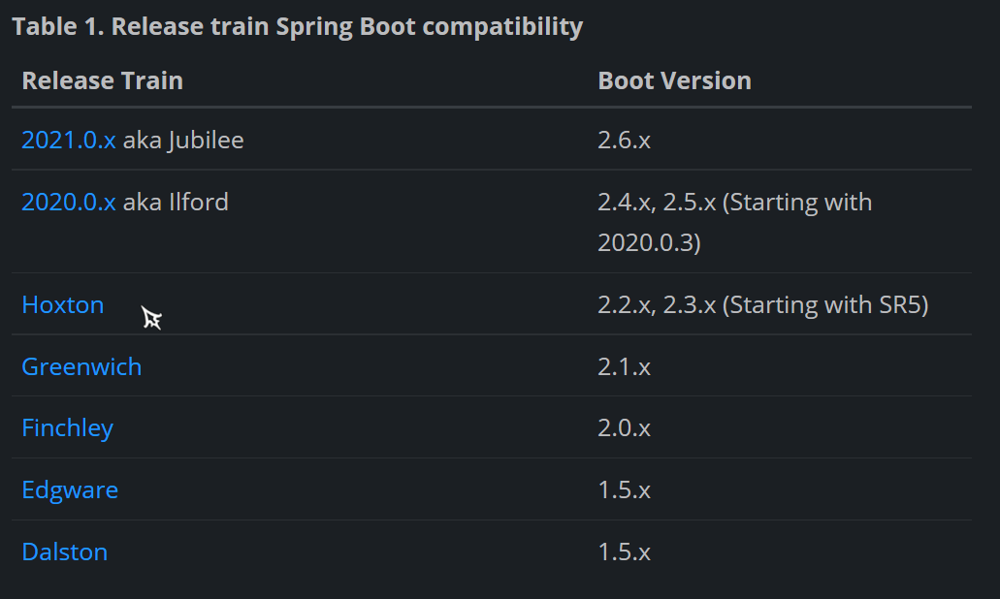

# Spring Cloud
> 关键词: 分布式系统 微服务 SpringBoot 包含众多子项目的工具集 单个应用业务拆分  
> 组件编写三步: 引依赖 写配置 加注解

+ SpringCloud 提供 配置管理(configuration management) 服务搜寻(service discovery) 服务熔断(circuit breakers) 集成路由(intelligent routing) 微代理(micro-proxy) 控制/消息总线(control bus) 
    - 各服务(**集群处理**)  
    - 服务注册中心(服务名 服务地址:管理服务间通信)  
    - 负载均衡调用组件(解决集群部署)  
    - 服务熔断组件(解决服务调用链路中某个不可用\访问时间过长)  
    - 配置管理组件(同步配置)  
    - 服务网关组件(与前端通信 转发前端请求 | **集群处理** : Nginx处理网关的负载均衡)  
    - 消息总线(配置自动刷新)  

`每个组件都是不同的项目` 
+ SpringCloud 命名 & SpringBoot 版本选择:
    - 命名:
        - 主项目一开始并不是以数字命名(但子项目为数字命名)
        - 早期选择伦敦地铁站命名 (A - H) 后使用年份
        - 版本生命结束:2017 (AB) 2018 (C) 2018.12(D)
        - 命名版本官方只建议使用 H(oxton) 对应 SpringBoot 2.2.x, 2.3.x(2.3.x只能从SR5开始使用)
    - SpringCloud 与 SpringBoot 版本对应关系:
        
        - 必须严格对应
### 环境搭建
- 基于 SpringBoot 
    - 创建 springcloud-parent 管理维护依赖(不写任何代码)
    - 在父项目中继承 SpringBoot 
    - 维护 SpringCloud 的版本
### 组件
+ 服务注册中心 (简:记录微服务状态)
    - 从整个微服务架构中提取出来一个服务(不完成任何业务功能)
        - 记录微服务 (注册和服务发现 调用)
        - 检查整个系统的健康 (对服务健康状态的监控和管理) 剔除长时间无法访问的服务
        - 存储服务元数据:名称 IP 端口... (集群管理)
    - 常用:
        - eureka (Netflix)
        - zookeeper (Java)
        - consul (Go)
        - nacos (Alibaba\Java)
+ 服务通信
    - OpenFeign
+ 服务熔断
    - Hystrix
+ 网关
    - Gateway
+ 统一配置中心
    - Config (Bus)

### [服务注册中心](MarkDown/服务注册中心.md) (Eureka & Consul)
### [微服务之间的通信](MarkDown/微服务通信.md) (Ribbon + RestTemplate & OpenFeign)

### [服务熔断](MarkDown/服务熔断.md) (Hystrix)

### [网关](MarkDown/网关.md) (Gateway)

### [统一配置中心](MarkDown/统一配置中心.md) (config)

#### 总结: 
+ Micro Service: 服务架构
    - 单体应用 独立应用(独立部署 独立运行) 分布式管理
    + 优势:
        - 拆分业务 解耦合
        - 每个服务高度自治 (团队管理)
        - 服务之间互不影响
        - 新人面对单一服务,整体应用代码复杂度低
        - 方便新增业务
    + 缺点:
        - 部署量大且复杂
        - 分布式系统复杂性高(服务间通信;高可用)
+ SpringCloud (一站式)微服务工具集
    - 作用: 解决分布式系统的问题,帮助开发者专注于业务开发
    + 组件:
        1. 服务注册中心: 服务健康状态以及元数据存储
          
            > Server;Client(每个微服务)
        2. OpenFeign: 服务间通信(整合 RestTemplate)
          
            > 每个微服务之间通信
        3. Hystrix: 服务熔断(解决服务雪崩)
          
            > 服务链路
        4. 网关(Gateway): 路由、转发、过滤
          
            > 前端请求 -> 断言:predicate -> 过滤:filter -> 后台服务
        5. 统一配置中心(Config): 远端仓库统一管理微服务的配置文件
            > Server;Client(每个微服务) 远端仓库存储配置文件
            >
            > > MQ: Bus 消息总线组件的消息中间件 Message Queue
# SpringCloud Alibaba
- **Ailbaba 团队**提供微服务工具集
- 包含开发分布式系统的所有组件
+ 特点:
    - 服务 流量控制 和 服务降级 ==> Sentinel
    - 服务注册和发现 ==> Nacos
    - 统一配置中心 ==> Nacos (可自动配置刷新)
    - 事件驱动 ==> RocketMQ (Alibaba 利用 Java 开发)
    - 消息驱动 (异步处理)
    - 分布式事务 ==> Seata
    - Dubbo RPC 集成 服务间通信
> + 实战开发: SpringCloud Netflix + SpringCloud Spring + Spring Cloud Alibaba (一个例子)
>   - 服务注册中心: Nacos
>   - 服务间通信: OpenFeign / RestTemplate+Ribbon
>   - 服务流量控制和服务降级: Sentinel
>   - 网关: Gateway
>   - 统一配置中心: Nacos
+ 搭建环境
    - 创建全局父项目
        > - 维护 SpringCloud 的依赖
        > - 维护 Alibaba 的依赖
        > - 维护 SpringBoot 的依赖
## 组件
+ [***Nacos***](MarkDown\Nacos.md)
+ [***Sentinel***](MarkDown\Sentinel.md)

# 项目环境搭建:
- Module commons 维护公共的实体类和工具类
+ 每个微服务都向指向***统一配置中心***
    > 若使用 Nacos 服务注册中心与统一配置中心为一体
    - 引依赖
    - 写配置
    - 加注解
+ 每个微服务都向***服务注册中心***注册
    > 服务注册中心需提前启动  
    > Nginx 实现负载均衡
    - 引依赖
    - 写配置
    - 加注解
+ 服务间调用 OpenFeign
    > 写 interface. 注解 `@FeignClient`  
    > 实现负载均衡
    - 引依赖
    - 写配置
    - 加注解
+ 服务高可用 Sentinel
    > 接口资源加注解 `@SentinelResource`
    - 引依赖
    - 写配置
    - 加注解
+ Module 网关 Gateway 
    > 路由转发  
    > 也需要注册  
    > gateway: routes: - id: uri: predicate: filter: - id...  
    > 负载均衡的实现: uri: lb://服务ID
    - 引依赖
    - 写配置

# 参考资料
1. [*Spring 官网*](https://spring.io/)
2. [*SpringCloud 页面*](https://spring.io/projects/spring-cloud)
3. [*SpringCloud Alibaba 页面*](https://spring.io/projects/spring-cloud-alibaba)
  
    > [SpringCloud Alibaba 文档](https://spring-cloud-alibaba-group.github.io/github-pages/2021/en-us/index.html)
4. [*Nacos 文档*](https://nacos.io/zh-cn/docs/quick-start.html)
  
    > [Github 项目](https://github.com/alibaba/nacos)
5. [*Sentinel 文档*](https://sentinelguard.io/zh-cn/docs/quick-start.html)
  
    > [Github 项目](https://github.com/alibaba/Sentinel)
6. [RabbitMQ](https://www.rabbitmq.com/) : 消息总线
    > [前提条件语言 Erlang](https://www.erlang.org/downloads)以及 [RabbitMQ Github项目](https://github.com/rabbitmq/rabbitmq-server)  
    > [入门学习](https://developer.aliyun.com/article/769883#slide-8)及其[Github](https://github.com/yehongzhi/mall)
7. [Nginx](https://nginx.org/en/download.html) : 代理服务器/负载均衡
  
    > [Windows 下安装 Nginx 及其配置](https://cloud.tencent.com/developer/article/1333800)
8. [Consul](https://www.consul.io/downloads) : 服务注册中心
  
    > [入门学习](https://cloud.tencent.com/developer/article/1444664)
9. [JMeter](https://jmeter.apache.org/) : 负载测试
  
    > [入门学习](https://cloud.tencent.com/developer/article/1633626)
10. [Natapp](https://natapp.cn/) : 内网穿透
