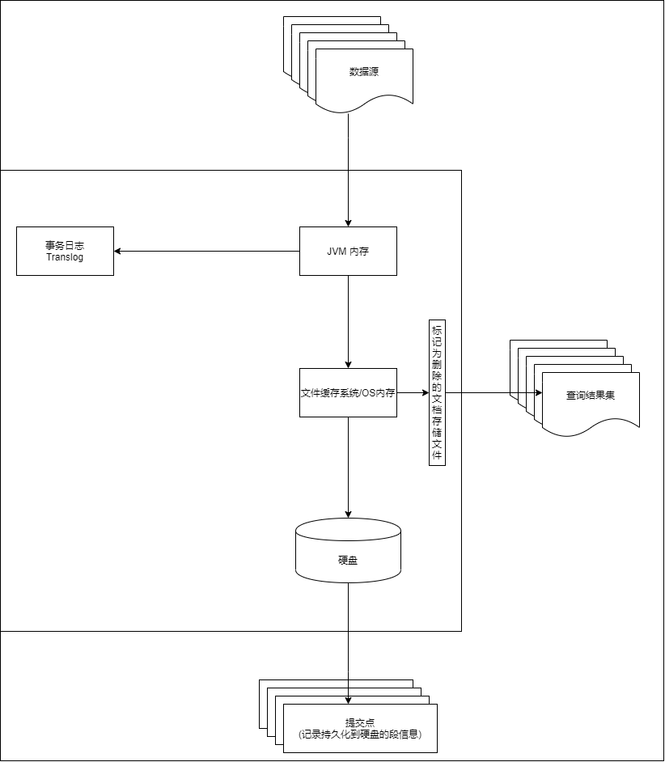
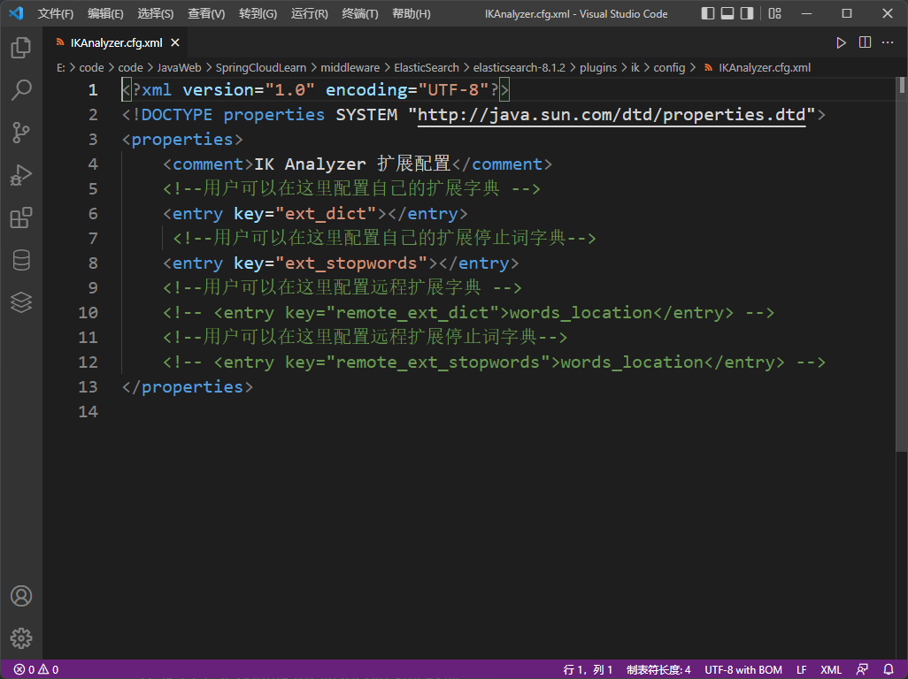

# ElasticSearch 

> <a id="ver">ES Version: 8.1.2</a>  Win 11
>
> ​	访问端口: 9200
>
> ​	通信端口: 9300
>
> Kibana Version: 8.1.2
>
> ​	访问端口: 5601
>
> ELK: ES + Logstash + Kibana 日志分析架构
>
> > Logstash 将业务系统生成的日志**收集**, 交由 集群部署的 ES **处理存储** 使用 Kibana **可视化查看**.
> >
> > 基本上都是 解压即用

## 简介

+ ElasticSearch 分布式全文搜索引擎 & 近乎实时存储 检索数据

+ ElasticSearch 采用对 关键字 的 倒排索引/反向索引

  > 采用倒排索引(根据一个内容的一部分指定该内容)
  >
  > > e.g.
  > >
  > > *静夜思*
  > >
  > > *唐 李白*
  > >
  > > *床前明月光,疑似地上霜.*
  > >
  > > *举头望明月,低头思故乡.*
  > >
  > > 正常的索引是, **静夜思 -> 静夜思的内容**. (Key -> Value 形式)
  > >
  > > 当时需要 寻找包括 床 的诗时, 即 **床 -> ?** 这时若没有将诗列出, 很难查找满足需求的结果.
  > >
  > > 因此需要**倒排索引/反向索引**: 床 -> 静夜思的内容
  > >
  > > 但若这样, 一首静夜思就将有 20 条索引, 这时**索引量十分庞大**.因此需要进行一些**压缩**.
  > >
  > > 1. **床 -> 静夜思**
  > >
  > >    索引指向诗名(根据诗名就可以直接找到其内容: 正向索引)
  > >
  > > 2. **停顿词过滤** / **分词**
  > >
  > >    将 无意义的词 去掉, 没有必要建立索引

+ ElasticSearch 是对 Lucene(方便建立倒排索引的库) 的封装 和 增强

  > 搜索引擎 运转流程: 爬虫爬取页面 -> 分词/过滤停顿词 -> 倒排索引
  >
  > 使用 Lucene 建立倒排索引
  >
  > Lucene 
  >
  > + Java 开源
  > + 全文检索
  >
  > **权重 score** 
  >
  > 搜索的越匹配, 权重越高. (也可人工调整)
  >
  > <hr>
  >
  > ElasticSearch 对 Lucene 进行封装, 将对搜索引擎的操作都封装成 Restful Api (通过 http 请求[GET|POST|...]就能对其进行操作)
  >
  > > Api & REST Api & RESTful Api & Web Service Api
  > >
  > > Api > REST Api
  > >
  > > > API: 两个应用程序之间的交流方式(协议)
  > > >
  > > > ​	API 文档: URL + 参数 + 请求方式 + 响应状态
  > > >
  > > > REST API: 针对 Web 设计的 API
  > > >
  > > > ​	Web 所有事物 (文本 音频 视频 图片 链接) 都为资源
  > > >
  > > > ​	每个资源都有 唯一资源标识符 (资源状态改变 唯一资源标识符不变)
  > > >
  > > > ​	REST 下的所有操作无状态. REST 遵循 CRUD 原则, 所有资源都是可以通过 GET | POST | PUT | DELETE 四行为完成对应操作.
  > > >
  > > > ​	可缓存, 为完成大量处理
  > >
  > > RESTful Api 为 REST Api 的一种实现方式 (可以不按照 行为 操作数据: GET 创建数据 ...)
  > >
  > > > | CURD 描述    | HTTP 操作行为 | URL+Args       |
  > > > | ------------ | :------------ | -------------- |
  > > > | 获取资源清单 | GET           | /resources     |
  > > > | 获取指定资源 | GET           | /resource/{id} |
  > > > | 创建资源     | POST          | /resource      |
  > > > | 修改资源     | PUT           | /resource/{id} |
  > > > | 删除资源     | DELETE        | /resource/{id} |
  > > >
  > > > reource 为 某种资源; id 为 **指定资源**的**唯一标识符**
  > > >
  > > > API:
  > > >
  > > > ​	创建资源: [POST] http://host:port/resource
  > > >
  > > > ​	获取资源: [GET] http://host:port/resources | [GET] http://host:port/resource/{id}
  > > >
  > > > ​	修改资源: [PUT] http://host:port/resource/{id}
  > > >
  > > > ​	删除资源: [DELETE] http://host:port/resource/{id}
  > >
  > > ***API 共享数据资源, 屏蔽内部实现***
  > >
  > > > API 使用者, 只关注资源的状态, 不管资源怎么提供的
  > > >
  > > > API 提供者, 只关注资源怎么提供, 不管资源是什么状态
  > >
  > > Web Service
  > >
  > > ​	两个 Web Service 之间通过 HTTP 网络协议通信, 依赖 XML-RPC & SOAP (简单对象访问协议) 实例: SOA (面向服务体系框架)
  > >
  > > ​	只要两者之间的信息能够转换成 XML 就可以实现通信.

+ ElasticSearch 实现了分布式

  > 主从架构 (Master - Slave)
  >
  > 类 Hadoop 的 HDFS
  >
  > ES 对数据进行切分, 每个切片保存多个副本(保证分布式环境下的高可用性)
  >
  > ES 中的节点对等, 节点之间根据规则选出 Master , Master 负责**同步集群状态给其他节点**
  >
  > 建立**索引 & 类型** (Mapping)的请求需要经过 Master, Master 同步信息到其他节点. 
  >
  > 数据的写入只根据简单的 routing 规则, 便可路由到集群中的任意节点(数据写入的压力分散到整个集群)

## ElasticSearch 基本概念

> ES 面向文档 (最小单位: 文档 document)
>
> 只接受 JSON 格式的数据 (输出输入都是 JSON)
>
> 默认即为集群(一个 也是 集群) 默认名: elasticsearch
>
> 一个集群至少一个节点, 一个节点即为一个 ES 进程, 一个节点可以有多个索引(默认就有多个)

+ **索引 indices** 类似 数据库

+ 类型 mapping 类似 数据库中的 type int/float...

  > <a href="#ver">当前版本</a> 类型 已被弃用

+ **文档 documents** 类似 数据库中的数据
  
  + 特性:
    + 自我包含. 一个文档同时包含 key & value
    + 可为层次型. 文档包含文档
    + 不像 关系型数据库, 需要固定好字段; ES 可以随时忽略定义好的字段, 也可以动态的增加一个新的字段 (JSON 数据格式)
  
+ **域 fields**

  > 即 键值对的 key
  >
  > json 格式的字段名

  + 关键字 Keyword: 不分词, 直接建立索引
  + 文本 Text: 先分词, 再根据分词内容建立索引

+ **分片**

  > 默认: 一个索引, 五个分片(为主分片 primary shard,  每个主分片都有一个复制分片 replica shard)
  >
  > 最小级别的 工作单元, 只存储索引的部分内容
  >
  > **主分片和复制分片不会位于同一个节点**
  >
  > 实际上, 一个(主/复制)分片即为一个 Lucene 索引(包含倒排索引的文件目录).
  >
  > > **主分片或者复制分片都可以处理读请求——搜索或文档检索，所以数据的冗余越多，能处理的搜索吞吐量就越大。**
  >
  > So, 一个 ElasticSearch 索引 包含 多个 Lucene 索引
  
  + 主分片
  
    > 通过路由确定数据写入的分片(大致): shard = hash(routing) % number_of_primary_shards
    >
    > routing 可变(默认为文档 _id) 通过将 hash 生成数字取余决定进入的分片.
    >
    > 因此 索引创建好就不能修改主分片数量 (一旦修改, 之前的路由值将无效)
  
    + 文档只属于一个独立的主分片, 因此主分片的数量决定索引的最大容量(数量取决于 硬件 数据 应用场景).
  
  + 复制分片
  
    + 仅为主分片副本, 放置 ES 宕机导致数据丢失
  
    > 可提出 搜索或从别的分片(shard)取回文档 的请求
    >
    > 复制分片的最大值: n-1 (n: 节点数量)
    >
    > 和主分片不同的是, 复制分片在创建后可以随时修改数量
    >
    > ```shell
    > curl -H "Content-Type: application/json" -XPUT localhost:9200/blogs/_settings -d '
    > {
    >     "number_of_replicas": 2
    > }'
    > ```
    >
    > <修改 索引设置>
  
  + 对文档的新建、索引和删除请求都是写操作，**必须在主分片上面完成之后**才能被复制到相关的副本分片，ES 为了提高写入的能力这个过程是**并发写**的，同时使用**乐观锁**解决*并发写时产生的数据冲突*.
  
    > 每个文档都有一个 _version （版本）号，当文档被修改时版本号**递增**。一旦**所有的副本分片都报告写成功**才会向协调节点报告成功，协调节点向客户端报告成功。
    >
    > 协调节点: 接收写请求的节点 (不一定是执行操作的节点)
  
+ 倒排索引

  + 写入磁盘的倒排索引是**不可变的**
    + 优点
      + 倒排索引不需要锁(不更新就不用尝试修改, 不修改就不用锁) 
      + 倒排索引被读入内存后, 只要系统内存足够就不用将读请求作用于磁盘, 而是内存(因此性能提升大)
      + 其他缓存在整个索引的生命周期始终有效(因此不需要每次数据修改是重建, 倒排索引的数据不发生改变)
      + 倒排索引可以被压缩

    + 缺点
      + 删除不会立即删除而是标记(在.del文件中被标记为删除),只有到 段更新时(?) 才会将 .del 中标记的数据移除 (空间浪费)
      + 一条数据的频繁修改(新增新的数据, 标记旧的数据) 导致大量空间浪费
      + 每新增一个数据就需要一个段存储数据, 段的数量太多就将消耗大量服务器/主机文件句柄资源
      + 查询时将返回全部结果集(包括被标记删除的旧数据),增加查询负担

+ 段

  > 保持倒排索引的不可变,而更新倒排索引:
  >
  > ​	使用多个索引: 不重写整个索引, 而是添加额外的索引反应最近的变化.
  >
  > 因此引入 段 segment :
  >
  > > 段: 分片下的索引文件分成的多个子文件
  > >
  > > 每个段就是一个倒排索引, 因此被写入磁盘后就不能修改
  >
  > 1. 新文档写入 首先存入内存内部的索引缓存(此时不可检索)
  >
  > 2. 一段时间内(默认 1s/次), 内存区的索引缓存被 refresh 到文件系统缓存(代价低于直接写入磁盘), 成为新段(可被检索)
  >
  > 3. 新段提交, 写入磁盘, 生成提交点, 缓存清除, 接收新文档
  >
  >    > 提交点: 段写入磁盘后产生, 是 **记录所有提交后段信息** 的文件 (提交点是文件) 可看为存档点/快照
  >    >
  >    > + 段 没有提交点 只有写的权限
  >    >
  >    > + 段 有提交点 只有读的权限
  >
  > 底层的分段存储, 避免了产生锁, 提高了读写能力

  + **索引文件分段存储并且不可修改**

  + 新增文档: 新增段

  + 删除文档: 新增 .del 文件 标记被删除的文档

  + 更新文档: 删除 + 新增 (版本旧的文档 将在查询输出之前被 .del 文件中的标记移除)

  + **段合并**

    > 问题: 
    >
    > 1. 大量的段将导致系统资源的大量消耗
    >
    > 2. 每次的查询都是轮流检查每个段后合并查询结果, 因此段越多查询也越慢.

    + ElasticSearch 通过后台 段合并 处理

      + 小段合成大段, 再合成更大的段

        > 合并进程将选择一小部分大小相似的段, 并在后台将其合并到更大的段中.
        >
        > 段的选择 可为 提交, 也可为 未提交

      + 旧文档删除时, 就文档并不会合并到更大的新段中

        > 合并的过程不中断 索引 和 查询
        >
        > 且 段合并再进行 索引 和 搜索时自动进行

      + 段合并后, 老段将被删除, 新段将被 flush 进硬盘.

        > 同时, 之前因文档删除而不被合并的老段将和新的大段一起写入提交点,

    + 段的合并将消耗大量 IO & CPU, 不检查将影响查询性能.

      > 默认 ES 将限制合并过程, 保证搜素的资源

+ 近实时搜索 (延迟写策略) refresh *JVM 内存 -> OS 内存*

  + 在内存中积累新增数据, 达到默认时间(1s)/内存数据达到一定量时, 触发 refresh 刷新, 将内存中的数据生成新的**段**缓存到文件缓存系统中(介于内存和磁盘之间), 稍后刷新到磁盘生成提交点.

    > ElasticSearch 使用的是 JVM 的内存 (上述的所有内存也是该内存)
    >
    > 文件缓存系统 使用的是 OS 的内存
    >
    > JVM 内存中的数据并非以段的形式存储, 因此不能检索.
    >
    > 而当数据到达 OS 内存中的文件缓存系统中时, 数据以段的形式存储, 可以被检索.

  + ES 中的 refresh : 写入并打开新段的轻量过程/数据写入文件缓存系统

  + 默认情况下, 每个分片每秒刷新 -> 近实时搜索(改动不会立即被搜索, 但在一秒内可见)

    > 手动刷新: 
    >
    > POST /_refresh # 所有索引
    >
    > POST /索引/_refresh # 指定索引
    >
    > ```json
    > PUT /my_logs
    > {
    >     "settings": {
    >         "refresh_interval": "30s" // 默认单位: ms
    >         // -1 为关闭索引的自动刷新
    >         // 降低索引的刷新频率: 优化索引的速度
    >     }
    > }
    > ```

+ 持久化 flush *OS 内存 -> 磁盘*

  + ElasticSearch Translog 事务日志: 记录所有没有持久化到磁盘的数据

  + 加入到 JVM 内存的数据, 同时加入到 事务日志 中, 事务日志中的数据只有当日志数据文件 大小超过 512M 或 时间超过 30 min 时, 进行一次全提交:

    + JVM 内存中的数据形成新段传入文件缓存系统

    + 文件缓存系统中的数据通过 fsync 操作 flush 到硬盘, 生成提交点

      > fsync: 同步文件缓存系统的数据到磁盘(保证失电时/应用退出时 数据的安全). 但消耗很大, 大量的 fsync 将导致系统的卡慢甚至卡死.

    + 事务日志文件删除, 创建新的事务日志

  + 因为 事务日志 保存了 所有没有持久化数据 的操作, 因此在故障后, ES 

    1. 将根据最后一次提交点恢复所有已知的段
    2. 根据事务日志恢复所有操作

    > 手动 flush: 
    >
    > POST /_flush # 所有索引
    >
    > POST /索引/_flush # 指定索引

    

    


## 安装

> 官网: 
>
> [Download Elasticsearch | Elastic](https://www.elastic.co/cn/downloads/elasticsearch)
>
> [Download Kibana Free | Get Started Now | Elastic](https://www.elastic.co/cn/downloads/kibana)
>
> 两者版本最好对应.
>
> 集群最好在 Linux 上搭建

+ Window 下都是 .zip 压缩包, 解压即可.

  > 本地 JDK 1.8 以上(版本对应: ES & Java jar 包)
  >
  > confg 目录下:
  >
  > ​	elasticsearch.yml // ElasticSearch 配置
  >
  > ​	// 跨域问题(9300 访问 9200)
  >
  > ​	jvm.options // jvm 配置
  >
  > ​	log4j2.properties // 日志配置
  >
  > plugins 目录, 默认没有任何文件, 需要时自己找, 在此安装/放置插件.

+ 启动: bin 下 elasticsearch.bat

+ 当前<a href="#ver">版本</a> ElasticSearch 默认加载 xpack 安全插件(账号密码访问) 因此需要设置 账号密码, 否则访问 9200 端口不予显示内容(一直需要你登录, 但有没有登录账号和密码)

  > 参考: [ElasticSearch安全-账号密码验证 - 快乐的凡人721 - 博客园 (cnblogs.com)](https://www.cnblogs.com/luo630/p/15341532.html)

  + 开启账号密码验证(当前版本 默认开启):

    ```yaml
    # config\elasticsearch.yml
    ...
    # ------------------------------------- Security----------------------------------
    xpack.security.enabled: true
    ```

  + 启动 ElasticSearch: bin 下 elasticsearch.bat

    ```shell
    # 访问 9200 端口
    CMD> curl localhost:9200
    {"error":{"root_cause":[{"type":"security_exception","reason":"missing authentication credentials 
    for REST request [/]","header":{"WWW-Authenticate":"Basic realm=\"security\" charset=\"UTF-8\""}}],
    "type":"security_exception","reason":"missing authentication credentials for REST request [/]",
    "header":{"WWW-Authenticate":"Basic realm=\"security\" charset=\"UTF-8\""}},"status":401}
    # 返回 401
    ```

  + 设置账号密码: 

    ```shell
    # 执行 bin 下 elasticsearch-setup-passwords.bat
    # interactive adj. 交互的 即交互式执行命令
    CMD> elasticsearch-setup-passwords.bat interactive
    "warning: usage of JAVA_HOME is deprecated, use ES_JAVA_HOME"
    Future versions of Elasticsearch will require Java 11; your Java version from [D:\Program Files\Java\jdk1.8.0_202\jre] does not meet this requirement. Consider switching to a distribution of Elasticsearch with a bundled JDK. If you are already using a distribution with a bundled JDK, ensure the JAVA_HOME environment variable is not set.
    Initiating the setup of passwords for reserved users elastic,apm_system,kibana,kibana_system,logstash_system,beats_system,remote_monitoring_user.
    You will be prompted to enter passwords as the process progresses.
    Please confirm that you would like to continue [y/N]y
    
    
    Enter password for [elastic]:
    Reenter password for [elastic]:
    Enter password for [apm_system]:
    Reenter password for [apm_system]:
    Enter password for [kibana_system]:
    Reenter password for [kibana_system]:
    Enter password for [logstash_system]:
    Reenter password for [logstash_system]:
    Enter password for [beats_system]:
    Reenter password for [beats_system]:
    Enter password for [remote_monitoring_user]:
    Reenter password for [remote_monitoring_user]:
    Changed password for user [apm_system]
    Changed password for user [kibana_system]
    Changed password for user [kibana]
    Changed password for user [logstash_system]
    Changed password for user [beats_system]
    Changed password for user [remote_monitoring_user]
    Changed password for user [elastic]
    ```

    > 设置密码的显示方式 类 Linux 
    >
    > 自己本地上的 ES password 全设为 123456

    ```shell
    # 设置后即可登录查看 localhost:9200 的内容.
    # 第一种格式：命令中没有 密码
    CMD>curl localhost:9200 -u elastic
    Enter host password for user 'elastic':
    
    # 第二种格式：命令中有密码
    CMD>curl localhost:9200 -u elastic:123456
    
    # 结果
    {
      "name" : "LAPTOP-VHBIN",
      "cluster_name" : "elasticsearch",
      "cluster_uuid" : "zuJVns-6TUu6hnrTkBbJMw",
      "version" : {
        "number" : "8.1.2",
        "build_flavor" : "default",
        "build_type" : "zip",
        "build_hash" : "31df9689e80bad366ac20176aa7f2371ea5eb4c1",
        "build_date" : "2022-03-29T21:18:59.991429448Z",
        "build_snapshot" : false,
        "lucene_version" : "9.0.0",
        "minimum_wire_compatibility_version" : "7.17.0",
        "minimum_index_compatibility_version" : "7.0.0"
      },
      "tagline" : "You Know, for Search"
    }
    ```

    > 六个账号都可登录

  + 登录 Kibana

    > 之前开启了 xpack 没有设置密码, 且报以下错误:
    >
    > ```shell
    > log   [10:24:50.678] [error][savedobjects-service] Unable to retrieve version information from Elasticsearch nodes. security_exception: [security_exception] Reason: missing authentication credentials for REST request [/_nodes?filter_path=nodes.*.version%2Cnodes.*.http.publish_address%2Cnodes.*.ip]
    > ```
    >
    > 访问 kibana 将显示 Kibana server is not ready yet , 即 kibana 连接不到 ES.

    + 需要初始化 ES 的账号密码(即上一步操作)

    + 在 Kibana 配置文件(conf/kibana.yml)中修改 ES 账号密码信息: 

      ```yaml
      elasticsearch.username: "kibana_system"
      elasticsearch.password: "123456"
      ```

    + 再次访问即可进入管理登录页面

      > 使用 ElasticSearch 的 kibana_system 账号登录将显示权限不足, 只有一个页面.
      >
      > 需要替换成 elastic 账号登录才能成功访问管理页面.

### 分词器

> ElasticSearch 内置多个分词器,但其均不兼容(分不好)中文, 因此需要 ElasticSearch IK 分词器

+ ElasticSearch IK 分词器

  > 下载地址: [medcl/elasticsearch-analysis-ik: The IK Analysis plugin integrates Lucene IK analyzer into elasticsearch, support customized dictionary. (github.com)](https://github.com/medcl/elasticsearch-analysis-ik)
  >
  > 标准中文分词器, 根据定义的字典对域进行分词(支持自定义字典)
  >
  > 可以插件的形式接入 ES (版本需对应)

  1. (下载的为 zip 压缩包)解压到 ElasticSearch 安装目录下的 plugins 包内 重启 ES 即可

  2. 使用命令 `elasticsearch-plugins install https://github.com/medcl/elasticsearch-analysis-ik/releases/download/${ES version}/elasticsearch-analysis-ik-${ES version}.zip` 重启 ES

+ <a href="#ik"> 分析</a>

### 可视化插件

> ElasticSearch Head
>
> ***建议只当作数据展示插件, 不要进行任何数据操作.***
>
> 官网: [mobz/elasticsearch-head: A web front end for an elastic search cluster (github.com)](https://github.com/mobz/elasticsearch-head)
>
> 解压后, 进入 elasticsearch-head 目录, 运行 npm install / cnpm install (淘宝镜像) 安装依赖

+ 直接运行 `npm run start` 将产生 CORS 跨域访问问题

  > ***解决办法***: 
  >
  > elasticsearch conf/elasticsearch.yml 中添加 (该配置文件每行配置第一个字符必须为空格)
  >
  > ```yaml
  >  http.cors.enabled: true
  >  http.cors.allow-origin: "*" 
  >  # 允许全部
  > ```
  >
  > 重启 elasticsearch

+ 重启 返回 401 需要认证

  > **解决办法**: 
  >
  > 参考: [elasticsearch和head 配置x-pack访问登录控制_pqq的迷弟的博客-CSDN博客](https://blog.csdn.net/qq_36317804/article/details/103277396)
  >
  > 修改 elasticsearch conf/elasticsearch.yml 添加:
  >
  > ```yaml
  > http.cors.allow-headers: Authorization
  > ```
  >
  > 重启 ES 
  >
  > 访问: http://localhost:9100/?auth_user=elastic&auth_password=123456 (修改 9100 Head 的地址, 而不是 es 的地址)

## 插件

> bin 目录下 elasticsearch-plugin 
>
> elasticsearch-plugin list 显示所有已安装的插件
>
> elasticsearch-plugin install url 安装指定 url 下的插件
>
> 日志中将体现添加的插件 以及插件的修改信息

### Kibana

+ 开发工具: Management -> Dev Tools

  > RESTful API 风格

+ 设置中文

  > 配置文件 kibana.yml 中添加: i18n.locale: "zh-CN" 

### <a id="ik">IK 分词器</a>

+ 分词: 字段划分出关键字

+ IK 提供的分词算法:

  1. ik_smart : 最少切分
  2. ik_max_word : 最细粒度划分 (穷尽词库, 词库里有就输出) 

+ 字典

  + 添加自己的字典

    > 在 ik 目录下 conf/IKAnalyzer.cfg.xml 修改



## 操作

> 参考: [ElasticSearch学习(二)——索引、文档简单操作_用脑袋装水的博客-CSDN博客](https://blog.csdn.net/weixin_52000204/article/details/123647439)
>
> 可使用 Kibana 开发工具 也可使用浏览器 以及 Postman 等一系列 API 工具.
>
> Kibana 则默认在登录的节点上操作 (不用 ip:port)
>
> 推荐: Kibana / Chrome 系的浏览器添加插件

+ ES REST 风格说明 (示例, 实际上 ES 8.0 已经更改了很多)

  | Method |             URL             | 描述         |
  | ------ | :-------------------------: | :----------- |
  | PUT    |     ip:9200/索引/文档id     | 创建指定文档 |
  | POST   |      ip:9200/索引/名称      | 创建随机文档 |
  | POST   | ip:9200/索引/文档id/_update | 修改文档     |
  | DELETE |     ip:9200/索引/文档id     | 删除文档     |
  | GET    |     ip:9200/索引/文档id     | 查询指定文档 |
  | POST   |    ip:9200/索引/_search     | 查询所有文档 |

### 索引相关

+ PUT ip:9200/索引名 // 创建索引

  > 返回

  ```json
  {
    "acknowledged" : true, // 承认
    "shards_acknowledged" : true, // 分片承认
    "index" : "test2" // 索引名
  }
  ```

+ GET ip:9200/索引名 // 获取索引信息 未找到返回 404

  > 返回

  ```json
  {
    "test2" : {
      "aliases" : { }, // 别名
      "mappings" : { }, // 映射配置
      "settings" : { // 设置
        "index" : {
          "routing" : {
            "allocation" : { // allocation n. 分配
              "include" : {
                "_tier_preference" : "data_content" // 层级优先权(?)
              }
            }
          },
          "number_of_shards" : "1", // 分片数
          "provided_name" : "test2", // 提供的名称 索引名
          "creation_date" : "1650027279990",
          "number_of_replicas" : "1", // 复制分片数
          "uuid" : "8HFHsTSeSV6GJHtWi0PqfA",
          "version" : {
            "created" : "8010299" // 创建时分配的版本号
          }
        }
      }
    }
  }
  ```

  

+ GET ip:9200/_cat/indices?v // 获取所有索引的详细信息 (参数 v: 显示 详细信息)

  > 返回: 

  ```
  health status index                                     uuid                   pri rep docs.count docs.deleted store.size pri.store.size
  green  open   metrics-endpoint.metadata_current_default SkFU97-uS7aBxh1TNPBBNA   1   0          0            0       225b           225b
  yellow open   test2                                     8HFHsTSeSV6GJHtWi0PqfA   1   1          0            0       225b           225b
  yellow open   .lists-default-000001                     LT2fIC30RfS_iPpt8H2cZg   1   1          0            0       225b           225b
  yellow open   .items-default-000001                     Cx2MyRItQUiAA86NIxXOVQ   1   1          0            0       225b           225b
  yellow open   test1                                     4daiw3oqREq1ts6Dyu5KZQ   1   1          4            6     25.5kb         25.5kb
  健康状态 状态   索引名									uuid			分片数 复制分片数 文档数 被删除的文档数 存储大小	分片存储大小
  ```

+ DELETE ip:9200/索引名 // 删除索引 未找到返回 404

  > 返回

  ```json
  {
    "acknowledged" : true
  }
  ```

### 文档操作

> _doc并不指定, 你创建文档的时候有可以_creat, 过去之后仍然是_doc, 因为在 ES 7.0 以后的版本 已经废弃文档类型 Type 了, 一个 index 中只有一个默认的 type, 即 _doc.

+ 创建文档

  ```json
  // 随机生成id
  POST ip:9200/索引名/_doc
  {
      "key1": "value1",
      "key2": [
          "value1",
          "value2"
      ],
      "key3": {
          "key4": "value4",
          "key5": "value5"
      }
  }
  // 指定id
  POST ip:9200/索引名/_doc/{id}
  {
    	"key1": "value1",
      "key2": [
          "value1",
          "value2"
      ],
      "key3": {
          "key4": "value4",
          "key5": "value5"
      }
  }
  ```

  > 未创建索引时, 将先创建索引再创建文档(此条命令全部达成)
  >
  > PUT 将报错(Incorrect HTTP method for uri) <a href="#ver">当前版本</a>

  ```json
  // 返回
  {
    "_index" : "test2", // 索引名
    "_id" : "j8tVLYABoPri3Y4YbY4I", // 文档id (随机分配的)
    "_version" : 1, // 修改版本 没有修改则为 1. 每修改一次 +1
    "result" : "created", // 创建; updated 修改
    "_shards" : { // 分片
      "total" : 2, // 总数
      "successful" : 1, // 成功片数
      "failed" : 0 // 失败片数
    },
    "_seq_no" : 0, // ? 
    "_primary_term" : 1 // ?
  }
  
  ```

+ **查询文档**
  + 一般查询
  ```json
  // 指定主键查询
  GET ip:9200/索引名/_doc/{id}
  	// 返回(未找到)
  {
    "_index" : "test1",
    "_id" : "1002",
    "found" : false
  }
  	// 返回(已找到)
  {
    "_index" : "test1",
    "_id" : "1003",
    "_version" : 2, // 修改版本 (修改了一次)
    "_seq_no" : 14,
    "_primary_term" : 1,
    "found" : true,
    "_source" : { // 内部数据
      "name" : "Kano",
      "age" : 17,
      "job" : "Singer"
    }
  }
  // 全查询(查询全部文档)
  GET ip:9200/索引名/_search
  	// 结果
  {
    "took" : 0,
    "timed_out" : false,
    "_shards" : {
      "total" : 1,
      "successful" : 1,
      "skipped" : 0,
      "failed" : 0
    },
    "hits" : {
      "total" : {
        "value" : 5, // 返回文档数目/匹配数量
        "relation" : "eq" // 关系 eq 相等
      },
      "max_score" : 1.0, // 权值 (?)
      "hits" : [ // 索引和文档信息及其内容
        {
          "_index" : "test1",
          "_id" : "kMtWLYABoPri3Y4YBI7C",
          "_score" : 1.0,
          "_source" : {
            "name" : "Luu",
            "age" : 23
          }
        },
  ...
          // 未找到索引
  {
    "error" : { // 失败信息
      "root_cause" : [
        {
          "type" : "index_not_found_exception",
          "reason" : "no such index [test2]",
          "resource.type" : "index_or_alias",
          "resource.id" : "test2",
          "index_uuid" : "_na_",
          "index" : "test2"
        }
      ],
      "type" : "index_not_found_exception",
      "reason" : "no such index [test2]", // 原因
      "resource.type" : "index_or_alias",
      "resource.id" : "test2",
      "index_uuid" : "_na_",
      "index" : "test2"
    },
    "status" : 404 // 失败状态码 未找到
  }
  ```
  + 条件查询

  ```json
  // 条件查询
  	//1 不推荐, 在请求路径中添加参数比较麻烦, 且中文在请求路径中容易乱码
  GET ip:9200/索引名/_search?q=key:value
  	//2 推荐, 在请求体中方便添加参数且由于是 Json 格式,适配多种语言
  GET ip:9200/索引名/_search
  {
      "query": { // 查询
          "match": { // match 全文检索匹配
              "key": "value" // value 可以是一部分 (当然是分词的结果中有才行, 否则返回 200 但 hits 中 hits 为空) 且当 value 为一个可分词的值时, 即使全匹配 也将返回包括 value 一部分的文档 
              // 例如: 有 余华 余彬 浩彬 三个文档字段, value=余彬 返回结果: 余彬 余华 浩彬 三个按顺序输出(全匹配权值最大, 顺序按权值大小排) 
              // 可见 "match" 并不是完全匹配 而是 全文检索匹配(将所有文档中有匹配的都输出) 对输入的 value 进行了分词, 并按照匹配的权值排序输出
              // 完全匹配使用 "match_phrase" 或 "term" 不会分词 value, 且只输出最匹配的 (但还是可以只输入一部分, 最后按权值排序输出) (但是输入一个字段, 其值不能匹配所有文档, 但输入的字段的一部分在所有文档中有匹配, 此时没有结果输出. e.g. 有 余华 余彬 浩彬 三个文档字段, value=海彬, 返回结果为空)
              // 若索引 mapping 内对应字段的类型设置为 keyword, 则表示字段不可被分词
          }
      }
  }
  	// 或者
  {
      "query": { // 查询
          "match_all": { // 全匹配
              
          }
      }
  }
  // 多条件查询
  	// 不能再 一个 "match" 内写多个条件
  GET ip:9200/索引名/_search
  {
      "query": { 
          "bool": {
              "must": [
                  {
                      "match": { 
                          "key1": "value1"
                      },
                      "match": {
                          "key2": "value2"
                      }
                  }
              ]
          }
      }
  }
  // 范围查询
  	// 条件运算符 gt:> lt:<  gte:>= lte:<=
  GET ip:9200/索引名/_search
  {
      "query": { 
          "bool": { // 布尔查询
              "must": [ // 所有条件必须匹配 must 
                  	  // 所有条件都不能匹配 must_not 
                  	  // 条件其一符合即可 should 
                  {
                      "match": { // 条件一
                          "key1": "value1"
                      },
                      "match": { // 条件二
                          "key2": "value2"
                      }
                  }
              ],
              "filter": { // 在 must 外, bool 内
                  "range": { // 表示范围
                      	   // prefix 根据前缀
                      	   // and 内嵌一个新的 filter
                      "key": {
                          "条件运算符1": range1, // range 为 数
                          "条件运算符2": range2
                      }
                  }
              }
          }
      }
  }
  ```
  
  + 查询结果处理
  
    > 只用在 hits 内有区别
    >
    > 没找到对应 文档, 则 hits 的数组为空
  
  ```json
  // 分页查询 (匹配输出的太多, 限制输出的结果数量)
    	// 超过页数将返回 200 但 hits 内的 hits 没有内容
    GET ip:9200/索引名/_search
    {
        "query": { // 查询
            "match_all": { // 全匹配
                
            }
        },
        "from": 0, // 起始页/显示的页面
        "size": 1 // 每页文档数量
    }
  // 指定字段查询输出
  	// _source (定义的字段)内的又不必要的内容, 指定需要的字段输出即可
  	// 没有的字段 _source 显示为空
  GET ip:9200/索引名/_search
  {
      "query": { // 查询
          "match_all": { // 全匹配
  
          }
      },
      "from": 0, // 起始页/显示的页面
      "size": 1, // 每页文档数量
      "_source": ["age"] // 需要输出的字段
  }
  // 查询排序
  GET ip:9200/索引名/_search
  {
      "query": { // 查询
          "match_all": { // 全匹配
  
          }
      },
      "sort": [
          {
              "key.keyword": { // 只使用 key 值 (text 类型), 将报错: text 类型字段 默认禁用文档字段数据的操作(e.g. 聚合 排序), 原因没有优化. 因此需要使用 key.keyword 来进行对应操作
                  "order": "desc" // desc 降序 | asc 升序
              }
          }
      ]
  }
  // 高亮显示查询
  GET ip:9200/索引名/_search
  {
      "query":{
          "match_phrase":{ // 完全匹配 或 使用 term
              "key":"value"
          }
      },
      "highlight":{
          "pre_tags": "<html+css>", // 实现自定义高亮
          "post_tags": "</html>",
          "fields":{
              "key":{} // 必须和 "query" 内的 key 一致才有输出结果
          }
      }
  }
  // 聚合查询
      // 聚合: 即统计, 统计某个符合设定要求的文档数量 (分组: 设定字段符合某种要求的在同一组)
      // 聚合查询: 根据查询的结果进行聚合处理, 输出聚合结果
      // 下面格式的输出为 全局查询后聚合的结果
      // 两个 聚合结果 相互分开
      // 该种聚合 只能处理 单字段
  GET ip:9200/索引名/_search
  {
      "aggs": {
          "NAME1": { // 聚合结果的名字, 自己起
              "GG_TYPE": { // 聚合类型 terms 分组; avg 平均值
                  // avg 平均值 string.keyword 类型不可用
                  "field": "key.keyword", // 分组字段
                  "size": number, // 分几组 可选
                  "order": {
                      "_key": "desc" // 根据输入的 key 排序 (field 对应值)
                      // _key: 根据 key p; _count: 根据 key 的数量
                  }
              }
          },
          "NAME2": {
              "GG_TYPE": {
                  "field": "",
                  "size": number 
              }
          }
      }, 
      "size": 0 // 不显示原始数据 (分页查询处解释: 每页显示的文档数量)
  }
  // 多字段聚合处理
  ```
  
  > 未找到返回 404 
  >
   > [聚合](Aggregations.md)
  
+ 修改文档

  ```json
  // 全局修改 (替换整个文档) 
  	// POST 也可以: 其意义即为 创建新的文档覆盖原文档
  PUT ip:9200/索引名/_doc/{id}
  {
      "key1": "value1",
      "key2": [
          "value1",
          "value2"
      ],
      "key3": {
          "key4": "value4",
          "key5": "value5"
      }
  }
  // 局部修改
  	// 修改文档内指定字段的值
  POST ip:9200/索引名/_update/{id}
  {
      "key1": "value1",
      "key2": [
          "value1",
          "value2"
      ],
      "key3": {
          "key4": "value4",
          "key5": "value5"
      }
  }
  ```

+ 删除文档

  ```json
  DELETE ip:9200/索引/_doc/{id}
  // 返回
  {
    "_index" : "test1",
    "_id" : "1003",
    "_version" : 3,
    "result" : "deleted",
    "_shards" : {
      "total" : 2,
      "successful" : 1,
      "failed" : 0
    },
    "_seq_no" : 31,
    "_primary_term" : 1
  }
  // 未找到
  {
    "_index" : "test1",
    "_id" : "1003",
    "_version" : 4,
    "result" : "not_found", // 非查询操作结果的最明显区别一般都在此.
    "_shards" : {
      "total" : 2,
      "successful" : 1,
      "failed" : 0
    },
    "_seq_no" : 32,
    "_primary_term" : 1
  }
  ```

### 映射关系

> Mapping

+ 设置映射关系

  > 已经插入文档的索引就不能再设置映射关系了
  >
  > **只有在新建索引 时/后, 插入文档前才能设置映射关系**

  ```json
  PUT ip:9200/索引名/_mapping
  {
      "name": { // key 字段名称
          "type": "", // 字段类型 text 文本 可分词; keyword 关键字 不可分词
  	    "index": true // true 该字段可被索引查询; false 该字段不可被索引查询
      }
   }
  ```

+ 获取映射关系

  ```json
  GET ip:9200/索引名/_mapping
  
  // 返回:
  {
    "test1" : { // 索引名
      "mappings" : { 
        "properties" : {
          "age" : { // key 字段名称
            "type" : "text", // 字段类型
            "fields" : {
              "keyword" : {
                "type" : "keyword",
                "ignore_above" : 256
              }
            }
          },
  ...
  ```
  

### 杂项

+ 获取当前节点的各项信息

  `GET _cat/COMMAND?PARAM` // 推荐 Kiana 内使用(有命令联想)

  > COMMAND:
  >
  > ​	health : 健康信息
  >
  > ​	indices  : 索引信息
  >
  > PARAM:
  >
  > ​	v : 显示详细信息

+ 分析字段

  ```json
  GET _analyzer
  {
      "analyzer": "",
      "text": "text"
  }
  ```

  > 分词分析

## 数据类型

> 数据创建时 默认 字符串类型 text
>
> 官方文档: <https://www.elastic.co/guide/en/elasticsearch/reference/8.1/mapping-types.html>

+ 字符串类型
  + [text](https://www.elastic.co/guide/en/elasticsearch/reference/8.1/text.html)
  + [keyword](https://www.elastic.co/guide/en/elasticsearch/reference/8.1/keyword.html)
+ [数值类型](https://www.elastic.co/guide/en/elasticsearch/reference/8.1/number.html)
  + long -2^63^ ~2^63^-1
  + unsigned_long 0 ~ 2^64^-1
  + integer -2^31^ ~ 2^31^-1
  + short -2^15^ ~ 2^15^-1 (-32768 ~ 32767)
  + byte -2^7^ ~ 2^7^-1 (-128 ~ 127)
  + double 64-bit IEEE 754 
  + float 32-bit IEEE 754
  + half float 16-bit IEEE 754
  + scaled float **长整型**数为底 固定**双精度**数为缩放系数
+ 日期类型
  + [date](https://www.elastic.co/guide/en/elasticsearch/reference/8.1/date.html)
+ 布尔值类型
  + [boolean](https://www.elastic.co/guide/en/elasticsearch/reference/8.1/boolean.html)
+ 二进制类型
  + [binary](https://www.elastic.co/guide/en/elasticsearch/reference/8.1/binary.html)
+ ...

 ### 指定创建数据的类型

+ 通过 设置索引的映射

## 集成

> [Elastic Stack and Product Documentation | Elastic](https://www.elastic.co/guide/index.html) -> [Elasticsearch Clients | Elastic](https://www.elastic.co/guide/en/elasticsearch/client/index.html)
>
> Java REST 高级客户端 (封装了 低级客户端)
>
> <a href="#ver">当前版本</a> 将 Java REST 高级客户端停用了, 但兼容最后的 Java REST 高级客户端版本(7.15.0)
