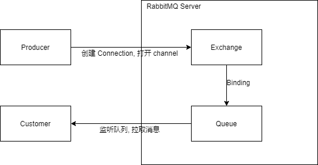

#  RabbitMQ

## MQ

>  Message Queue 消息队列 (存储消息的中间件)
>
> 分布式系统的通信方式

+ 消息: 两个应用之间传递的数据

  > 形式多样: 字符串、嵌套对象

+ 队列: 数据结构

  > 先进先出,后进后出

+ 消息队列: **消息传递过程**中的**保存消息的容器**

  + 角色

    + 生产者

      > 只负责发送数据到消息队列
      >
      > 不管谁从消息队列中取出数据

    + 消费者

      > 只负责从消息队列中取出数据
      >
      > 不管谁发的数据

  + 作用

    1. 解耦

       > 例:
       >
       > ​	*服务B C D* 都需要 *服务A* 的数据, 因此 *服务A* 需要编写 3 个接口供 *服务B C D* 取数据.
       >
       > ​	当 *服务D* 不需要 服务A 的数据时, *服务A* 又需要把相关的接口删除.
       >
       > ​	当 *服务E* 需要 服务A 的数据时, *服务A* 又需要添加相关的接口.
       >
       > 上述系统耦合度很高,为解决这种强耦合,可使用 MQ
       >
       > ​	服务A 将消息发送到 MQ 其他服务需要数据时再向 MQ 提取.
       >
       > 服务 A 只需要写将数据发送到 MQ 中的接口即可, 数据给谁都由 MQ 控制, 而其他服务只需要想 MQ 提取数据.

    2. 异步

       > 例:
       >
       > ​	系统如上.
       >
       > ​	客户端请求到 *服务 A* ,此时 *服务 A* 将调用 *服务 B C D* 三个服务,
       >
       > ​	若同步请求, 响应时间将是 *服务 A* 和 *服务 B C D* 四者的总和
       >
       > ​		t = t(a) + t(b) + t(c) + t(d)
       >
       > ​	若使用 MQ , 到 *服务 A* 的请求将只是 *服务 A* 的响应时间 (*服务 A* 将数据发送到 MQ 即响应请求), 不需要等待 *服务 B C D* 的响应
       >
       > ​		t = t(a)
       >
       > 适合对象:
       >
       > ​	发送短信, 发送邮件 ... (非必要业务)
       >
       > 提高了系统的吞吐量

    3. 削峰

       > 某时刻, 请求暴增, 对应服务请求不来, 导致服务崩溃, 系统瘫痪.
       >
       > 使用 MQ 将接受服务请求, 但消费者将按自己的步调提取请求, 防止请求峰值时期大量请求导致系统瘫痪.
       >
       > ***注意:*** MQ 压数据怎能在短时间内积压.

  + 缺点:

    1. 将系统的复杂度提高了
    2. 系统的可用性降低
    3. 系统中各服务的一致性

## RabbitMQ AMQP

> Advanced Message Queuing Protocol 
>
> 提供统一消息服务的应用层标准高级消息队列协议
>
> 不受***客户端/中间件/开发语言等条件***的不同而受限制.

+ 特征

  1. 可靠: 持久化 传输确认 发布确认...

  2. 分发消息策略灵活: Exchange(交换机) 对进入 MQ 的信息进行路由信息.

     > 策略:
     >
     > 1. 简单模式
     > 2. 工作队列模式
     > 3. 发布订阅模式
     > 4. 路由模式
     > 5. 通配符模式

  3. 支持集群部署: 多台 RabbitMQ 服务器可组成集群(形成逻辑 Broker 中间件)

  4. 支持多种协议: STOMP MQTT 等消息队列协议

  5. 支持不同语言的客户端: 几乎所有常用语言

  6. 可视化管理

  7. 插件

## RabbitMQ 简单使用

+ 在 common 内共享 RabbitMQ 的配置

  > 公共 Module common 共享整个项目的配置 实体 ...

  1. 队列名称
  2. Direct Exchange 交换机名
  3. 路由匹配(Direct 交换机 和 队列绑定)键值对的名称
  4. ...

+ 写配置

  > host post username password ...
  >
  > 微服务访问端口默认为 5672
  >
  > 浏览器访问端口默认为 15672

+ 生产者

  + 引入依赖

    ```xml
    <dependency>
        <groupId>org.springframework.boot</groupId>
        <artifactId>spring-boot-starter-amqp</artifactId>
    </dependency>
    ```

  + 创建 RabbitMQ 配置类

    ```java
    @Configuration
    public class DirectRabbitConfig {
        @Bean
        public Queue rabbitmqDemoDirectQueue() {
            /**
             * 1、name:    队列名称
             * 2、durable: 是否持久化
             * 3、exclusive: 是否独享、排外的。如果设置为true，定义为排他队列。则只有创建者可以使用此队列。也就是private私有的。
             * 4、autoDelete: 是否自动删除。也就是临时队列。当最后一个消费者断开连接后，会自动删除。
             * */
            return new Queue(RabbitMQConfig.RABBITMQ_DEMO_TOPIC, true, false, false);
        }
        
        @Bean
        public DirectExchange rabbitmqDemoDirectExchange() {
            //Direct交换机
            /**
             * 1. name: 交换机名称
             * 2. durable: 是否持久化
             * 3. autoDelete: 是否自动删除 (长期不用是否删除)
             * */
            return new DirectExchange(RabbitMQConfig.RABBITMQ_DEMO_DIRECT_EXCHANGE, true, false);
        }
    
        @Bean
        public Binding bindDirect() {
            //链式写法，绑定交换机和队列，并设置匹配键
            return BindingBuilder
                    //绑定队列
                    .bind(rabbitmqDemoDirectQueue())
                    //到交换机
                    .to(rabbitmqDemoDirectExchange())
                    //并设置匹配键
                    .with(RabbitMQConfig.RABBITMQ_DEMO_DIRECT_ROUTING);
        }
        
        /*
        // 在配置文件中写了就不用再写
        // 链接到 RabbitMQ 的配置
        @Bean
    	public ConnectionFactory connectionFactory() {
    		CachingConnectionFactory connectionFactory = new CachingConnectionFactory("127.0.0.1", 5672);
    		connectionFactory.setUsername("admin");
    		connectionFactory.setPassword("123456");
    		return connectionFactory;
    	}
    	*/
    }
    ```

  + 创建业务逻辑: 实现将信息传到 RabbitMQ 

    > ***注意:*** 传输消息的实体 (下例的 data) 需要实现 序列化 Serializable 接口.
    
    ```java
    ...
    @Resource
    private RabbitTemplate rabbit;
    ...
        rabbit.convertAndSend(Exchange-name, Rounting-name, data);
    ...
    ```

+ 消费者

  + 引入依赖

  + 写配置

  + 创建 接收信息的类

    > ***注意:*** @RabbitHandler 修饰的方法不能返回任何值, 否则将报错(abbit reply message 回复异常)
    >
    > 直接调用 生产者的方法 将信息传递到 RabbitMQ Server 中, 消费者将自动获取其信息
    >
    > 消费者自己调用该方法将返回空值(? 没有输出信息).
    
    ```java
    // 使用注解标识类名
    // 可以写多个队列名
    @RabbitListener(queues = {Queue-name, ...})
    ...
        @RabbitHandler
    ...
    ```

> ***注***: 一开始在生产者没有生产任何信息时, RabbitMQ 服务器内将没有创建队列, 消费者现在访问将报错(没有找到对应队列)
>
> ***解决办法:*** 
>
> 1. 生产者发送信息到 RabbitMQ 服务器中, RabbitMQ 创建对应队列, 此时消费者才可以正常访问
>
> 2. 生产者 & 消费者 都尝试创建相应队列.
>
>    + 生产者 - 配置类(补充):
>
>      ```java
>      //实现BeanPostProcessor类，使用Bean的生命周期函数
>      @Component
>      public class DirectRabbitConfig implements BeanPostProcessor {
>          ...
>          //这是创建交换机和队列用的rabbitAdmin对象
>          @Resource
>          private RabbitAdmin rabbitAdmin;
>          
>          //初始化rabbitAdmin对象
>          @Bean
>          public RabbitAdmin rabbitAdmin(ConnectionFactory connectionFactory) {
>              RabbitAdmin rabbitAdmin = new RabbitAdmin(connectionFactory);
>              // 只有设置为 true，spring 才会加载 RabbitAdmin 这个类
>              rabbitAdmin.setAutoStartup(true);
>              return rabbitAdmin;
>          }
>          
>          //实例化bean后，也就是Bean的后置处理器
>          @Override
>          public Object postProcessAfterInitialization(Object bean, String beanName) throws BeansException {
>              //创建交换机
>              rabbitAdmin.declareExchange(rabbitmqDemoDirectExchange());
>              //创建队列
>              rabbitAdmin.declareQueue(rabbitmqDemoDirectQueue());
>              return null;
>          }
>      }
>      ```
>    
>    + 消费者 - 获取信息类:
>    
>      ```java
>      ...
>      // queuesToDeclare 属性在队列没有定义时创建队列
>      @RabbitListener(queuesToDeclare = @Queue(queue-name))
>      ...
>          @RabbitHandler
>      ...
>      ```
>

## RabbitMQ 组成部分

+ Broker: 消息队列服务进程(包括 Exchange & Queue)
+ Exchange: 消息队列交换机(按照一定规则将消息路由转发到绑定/指定队列)
+ Queue: 消息队列(存储消息)
+ Producer: 消息生产者
+ Consumer: 消息消费者



> Producer 链接到 RabbitMQ Broker, 创建 Connection, 开启 Channel
>
> Producer 声明 Exchange 类型, 名称, 持久化与否 等属性
>
> Producer 发送消息, 指定消息的属性 (是否持久化 等属性 + routing key )
>
> Exchange 接收到消息, 根据 routing key 将消息路由到与当前 Exchange 绑定的队列当中
>
> Customer 监听 RabbitMQ Server 中对应队列, 接收到消息便处理业务.

### Exchange

> Producer 的消息进入 RabbitMQ 首先必须经由 Exchange 路由才能到达对应 Queue

#### 类型

##### Direct Exchange

> 直连交换机

+ 一对一/点对点: 绑定一个队列, 要求消息和特定 ***routing key 路由键*** 完全匹配

##### Fanout Exchange

+ (多个)队列 绑定到 (一个)交换机 上

+ 一个发送到该种类型的交换机上的消息 将被转发到**所有和该交换机绑定的队列**中

  > 发布订阅: 每个队列都获得一份复制的信息

+ 代码:

  ```java
  // common RabbitMQConfig.java
  public class RabbitMQConfig {
      // 和 Fanout Exchange 绑定的 Queue A 名字
      public static final String FANOUT_EXCHANGE_QUEUE_A = "fanout-queue.A";
      // 和 Fanout Exchange 绑定的 Queue B 名字
      public static final String FANOUT_EXCHANGE_QUEUE_B = "fanout-queue.B";
      // Fanout Exchange 名字
      public static final String FANOUT_EXCHANGE = "fanout.exchange.name";
  }
  
  // producer RabbitConfig.java
  // 配置 Fanout Exchange 和 Queue A & Queue B, 并将 Queue 和 Exchange 进行绑定
  // 此类型的 Exchange 不需要 routing key
  @Configuration
  public class RabbitConfig implements BeanPostProcessor {
      @Resource
      private RabbitAdmin rabbitAdmin;
  // 创建
      //队列A
      @Bean
      public Queue fanoutExchangeQueueA() {
          return new Queue(RabbitMQConfig.FANOUT_EXCHANGE_QUEUE_A, true, false, false);
      }
      //队列B
      @Bean
      public Queue fanoutExchangeQueueB() {
          return new Queue(RabbitMQConfig.FANOUT_EXCHANGE_QUEUE_B, true, false, false);
      }
      //创建FanoutExchange类型交换机
      @Bean
      public FanoutExchange rabbitmqDemoFanoutExchange() {
          return new FanoutExchange(RabbitMQConfig.FANOUT_EXCHANGE, true, false);
      }
  // 绑定
      //队列A绑定到FanoutExchange交换机
      @Bean
      public Binding bindFanoutA() {
          return BindingBuilder.bind(fanoutExchangeQueueA()).to(rabbitmqDemoFanoutExchange());
      }
      //队列B绑定到FanoutExchange交换机
      @Bean
      public Binding bindFanoutB() {
          return BindingBuilder.bind(fanoutExchangeQueueB()).to(rabbitmqDemoFanoutExchange());
      }    
  //启动项目即创建交换机和队列
      @Override
      public Object postProcessAfterInitialization(Object bean, String beanName) throws BeansException {
          rabbitAdmin.declareExchange(rabbitmqDemoFanoutExchange());
          rabbitAdmin.declareQueue(fanoutExchangeQueueB());
          rabbitAdmin.declareQueue(fanoutExchangeQueueA());
          return null;
      }
  }
  
  // 使用 RabbitTemplate 的 convertAndSend 方法.
  ...
  @Resource
  private RabbitTemplate rabbitTemplate;
  ...
  rabbitTemplate.convertAndSend(RabbitMQConfig.FANOUT_EXCHANGE_DEMO_NAME, "", message);
  ...
  
  // 监听
  @Component
  @RabbitListener(queuesToDeclare = @Queue(RabbitMQConfig.FANOUT_EXCHANGE_QUEUE_TOPIC_B))
  public class FanoutExchangeConsumerB {
  
      @RabbitHandler
      public void process(Map<String, Object> map) {
          System.out.println("队列B收到消息：" + map.toString());
      }
  }
  ```

  > 生产者 发送消息, 对应队列的 消费者 都将收到消息.

##### Topic Exchange

+ 通配符交换机: 使用 通配符 进行匹配, 路由到对应队列

  > 通配符(使用时, 前需要添加 '.' ):
  >
  > 1.  " \* " :  有且只匹配一个词
  > 2.  " \# " : 匹配一个或多个词
  >
  > e.g.
  >
  > ​	① a.*
  >
  > ​	② a.#
  >
  > ​	③ b.#
  >
  > a.update 可以匹配 ① & ②
  >
  > a.update.release 只有 ② 可以匹配
  >
  > b.update 只用 ③ 可以匹配

+ 匹配: rounting key 

  ```java
  // common RabbitMQConfig.java
  ...
  // TOPIC_EXCHANGE交换机名称
  public static final String TOPIC_EXCHANGE_DEMO_NAME = "topic.exchange.demo.name";
  // TOPIC_EXCHANGE交换机的队列A的名称
  public static final String TOPIC_EXCHANGE_QUEUE_A = "topic.queue.a";
  // TOPIC_EXCHANGE交换机的队列B的名称
  public static final String TOPIC_EXCHANGE_QUEUE_B = "topic.queue.b";
  // TOPIC_EXCHANGE交换机的队列C的名称
  public static final String TOPIC_EXCHANGE_QUEUE_C = "topic.queue.c";
  ...
  
  // Producer RabbitConfig.java
  @Configuration
  public class DirectRabbitConfig implements BeanPostProcessor {
      //省略...
  // 创建
      @Bean
      public TopicExchange rabbitmqDemoTopicExchange() {
          //配置TopicExchange交换机
          return new TopicExchange(RabbitMQConfig.TOPIC_EXCHANGE_DEMO_NAME, true, false);
      }
      @Bean
      public Queue topicExchangeQueueA() {
          //创建队列1
          return new Queue(RabbitMQConfig.TOPIC_EXCHANGE_QUEUE_A, true, false, false);
      }
      @Bean
      public Queue topicExchangeQueueB() {
          //创建队列2
          return new Queue(RabbitMQConfig.TOPIC_EXCHANGE_QUEUE_B, true, false, false);
      }
      @Bean
      public Queue topicExchangeQueueC() {
          //创建队列3
          return new Queue(RabbitMQConfig.TOPIC_EXCHANGE_QUEUE_C, true, false, false);
      }
  // 绑定
      @Bean
      public Binding bindTopicA() {
          // 队列A绑定到TopicExchange交换机
          return BindingBuilder.bind(topicExchangeQueueB())
                  .to(rabbitmqDemoTopicExchange())
                  .with("a.*");
      }
      @Bean
      public Binding bindTopicB() {
          // 队列A绑定到TopicExchange交换机
          return BindingBuilder.bind(topicExchangeQueueC())
                  .to(rabbitmqDemoTopicExchange())
                  .with("a.*");
      }
      @Bean
      public Binding bindTopicC() {
          // 队列A绑定到TopicExchange交换机
          return BindingBuilder.bind(topicExchangeQueueA())
                  .to(rabbitmqDemoTopicExchange())
                  .with("rabbit.#");
      }
  // 启动项目时 创建队列
      @Override
      public Object postProcessAfterInitialization(Object bean, String beanName) throws BeansException {
          rabbitAdmin.declareExchange(rabbitmqDemoTopicExchange());
          rabbitAdmin.declareQueue(topicExchangeQueueA());
          rabbitAdmin.declareQueue(topicExchangeQueueB());
          rabbitAdmin.declareQueue(topicExchangeQueueC());
          return null;
      }
  }
  
  // 发送消息
  	// service
  ...
  public String sendMsgByTopicExchange(String msg, String routingKey) throws Exception {
      ...
      rabbitTemplate.converAndSend(RabbitMQConfig.TOPIC_EXCHANGE_DEMO_NAME, routingKey, message);
      ...
  }
  ...
      // controller
  public String topicSend(@RequestParam(name = "msg") String msg, @RequestParam(name = "routingKey") String routingKey) throws Exception {
      return rabbitMQService.sendMsgByTopicExchange(msg, routingKey);
  }
  
  // 监听
  @Component
  @RabbitListener(queuesToDeclare = @Queue(RabbitMQConfig.TOPIC_EXCHANGE_QUEUE_C))
  public class TopicExchangeConsumerC {
  
      @RabbitHandler
      public void process(Map<String, Object> map) {
          System.out.println("队列[" + RabbitMQConfig.TOPIC_EXCHANGE_QUEUE_C + "]收到消息：" + map.toString());
      }
  }
  ```

  > Topic Exchange 发送的消息需要带参数 routingKey.
  >
  > Direct Exchange 虽然不用带, 实际上是其内部指定了 rountingKey 只能是以那一个.
  >
  > Fanout Exchange 不用绑定 routingKey 因此性能比两者都要好些.
  >
  > 但是, Topic Exchange 可以实现 Direct Exchage & Fanout Exchange 的效果.
  >
  > 以上三个 Exchange 基本上可解决大部分业务

##### Headers Exchange

+ 路由不用 routing key 进行路由匹配, 而是用 <del>**请求头中所带键值** </del>匹配路由. **并不一定为请求头内参数, 只要是传入到 RabbitMQ 的参数都可以**

  > {"x-match":"all"} : 全部匹配 ( Headers 中**必须**包含**全部**绑定的头部信息)
  >
  > {"x-match":"any"} : 部分匹配 (Headers 中**有绑定的头部信息的一部分**即可)

  ```java
  // 定义名称
  // HEADERS_EXCHANGE交换机名称
  public static final String HEADERS_EXCHANGE_DEMO_NAME = "headers.exchange.demo.name";
  // RabbitMQ的HEADERS_EXCHANGE交换机的队列A的名称
  public static final String HEADERS_EXCHANGE_QUEUE_A = "headers.queue.a";
  // RabbitMQ的HEADERS_EXCHANGE交换机的队列B的名称
  public static final String HEADERS_EXCHANGE_QUEUE_B = "headers.queue.b";
  
  // 创建&绑定
  @Configuration
  public class DirectRabbitConfig implements BeanPostProcessor {
  // 创建
      @Bean
      public Queue headersQueueA() {
          return new Queue(RabbitMQConfig.HEADERS_EXCHANGE_QUEUE_A, true, false, false);
      }
      @Bean
      public Queue headersQueueB() {
          return new Queue(RabbitMQConfig.HEADERS_EXCHANGE_QUEUE_B, true, false, false);
      }
      @Bean
      public HeadersExchange rabbitmqDemoHeadersExchange() {
          return new HeadersExchange(RabbitMQConfig.HEADERS_EXCHANGE_DEMO_NAME, true, false);
      }
  // 绑定
      @Bean
      public Binding bindHeadersA() {
          Map<String, Object> map = new HashMap<>();
          map.put("key_one", "java");
          map.put("key_two", "rabbit");
          //全匹配
          return BindingBuilder.bind(headersQueueA())
                  .to(rabbitmqDemoHeadersExchange())
                  .whereAll(map).match();
      }
      @Bean
      public Binding bindHeadersB() {
          Map<String, Object> map = new HashMap<>();
          map.put("headers_A", "coke");
          map.put("headers_B", "sky");
          //部分匹配
          return BindingBuilder.bind(headersQueueB())
                  .to(rabbitmqDemoHeadersExchange())
                  .whereAny(map).match();
      }
  // 项目启动时即创建队列
      @Override
      public Object postProcessAfterInitialization(Object bean, String beanName) throws BeansException {
          rabbitAdmin.declareExchange(rabbitmqDemoHeadersExchange());
          rabbitAdmin.declareQueue(headersQueueA());
          rabbitAdmin.declareQueue(headersQueueB());
          return null;
      }
  }
  
  // 发送信息
  	// service
  @Service
  public class RabbitMQServiceImpl implements RabbitMQService {
      @Resource
      private RabbitTemplate rabbitTemplate;
      
      @Override
      public String sendMsgByHeadersExchange(String msg, Map<String, Object> map) throws Exception {
          try {
              MessageProperties messageProperties = new MessageProperties();
              //消息持久化
              messageProperties.setDeliveryMode(MessageDeliveryMode.PERSISTENT);
              messageProperties.setContentType("UTF-8");
              //添加消息
              messageProperties.getHeaders().putAll(map);
              Message message = new Message(msg.getBytes(), messageProperties);
              rabbitTemplate.convertAndSend(RabbitMQConfig.HEADERS_EXCHANGE_DEMO_NAME, null, message);
              return "ok";
          } catch (Exception e) {
              e.printStackTrace();
              return "error";
          }
      }
  }
  	// controller
  	// 此处为获取请求体内的参数
  @RestController
  @RequestMapping("/mall/rabbitmq")
  public class RabbitMQController {
      @Resource
      private RabbitMQService rabbitMQService;
      
      @PostMapping("/headersSend")
      @SuppressWarnings("unchecked")
      public String headersSend(@RequestParam(name = "msg") String msg,
                                @RequestParam(name = "json") String json) throws Exception {
          ObjectMapper mapper = new ObjectMapper();
          Map<String, Object> map = mapper.readValue(json, Map.class);
          return rabbitMQService.sendMsgByHeadersExchange(msg, map);
      }
  }
  	// 此处为获取请求头内的参数
  @PostMapping("/send-requset_header")
  public String sendRequestHeader(@RequestParam("msg") String msg,
                                  @RequestHeader("header_a") String headerA,
                                  @RequestHeader("header_b") String headerB)
      throws Exception {
      Map<String, Object> map = new HashMap<>();
      map.put("header_a", headerA);
      map.put("header_b", headerB);
      return headerExchangeService.sendMsg(msg, map);
  
  }
  
  // 监听
  @Component
  public class HeadersExchangeConsumerA {
      @RabbitListener(queuesToDeclare = @Queue(RabbitMQConfig.HEADERS_EXCHANGE_QUEUE_A))
      public void process(Message message) throws Exception {
          MessageProperties messageProperties = message.getMessageProperties();
          String contentType = messageProperties.getContentType();
          System.out.println("队列[" + RabbitMQConfig.HEADERS_EXCHANGE_QUEUE_A + "]收到消息：" + new String(message.getBody(), contentType));
      }
  }
  ```

## 总结

1. MQ
2. RabbitMQ
3. RabbitMQ 4 种 Exchange

# SpringCloud 集成 RabbitMQ

+ Spring Cloud Stream 整合 RabbitMQ

  > SpringCould Stream 抽象了中间件的不同, 只需要在配置文件中修改几行即可灵活切换中间件
  >
  > 官方文档: [spring-cloud/spring-cloud-stream-binder-rabbit (github.com)](https://github.com/spring-cloud/spring-cloud-stream-binder-rabbit)

+ 引入依赖

  ```xml
  <dependency>
      <groupId>org.springframework.cloud</groupId>
      <artifactId>spring-cloud-starter-stream-rabbit</artifactId>
  </dependency>
  ```

+ 生产者

  + 配置文件

    ```yaml
    spring:
      cloud:
        stream:
          binders: # binder 集合 可集成 rabbitmq kafka ...
            test: # binder 的名字
              type: rabbit # 指定中间件/指定环境
              environment:
                spring:
                  rabbitmq:
                    addresses: ip:port
                    username: root
                    password: root
                    virtual-host: / # 虚拟主机
          bindings: # binding 集合 使用了多个交换机则有多个 binding
            testOutPut: # binding 的名字
              destination: testRabbit # 指向的 exchange (rabbitmq z)
              content-type: application/json # 可选
              default-binder: test # 指定默认 binder
              binder: test # 指定 binder
              group: test # 队列 queue 名称
    ```

  + 创建通道 channel 

    > 定义通道类型和通道名称

    ```java
    public interface MqMessageSource {
        String TEST_OUT_PUT = "testOutPut"; // 通道名称: 通道的名字就是 binding 的名字
        @Output(TEST_OUT_PUT) // 指定通道类型 Output 为输出信息, 即该通道为输出类型的通道, 
        MessageChannel testOutPut(); // 方法名可自定义
    }
    ```

  + 创建消息发送者 MessageProducer

    ```java
    @EnableBinding(MqMessageSource.class) // 启用通道
    @Service // 注入到 Spring IOC 容器中
    public class MqMessageProducer {
        
        // 注入通道
        @Autowired
        @Output(MqMessageSource.TEST_OUT_PUT)
        private MessageChannel channel;
            
        // 发送消息
        public void sendMsg(String msg) { // 返回值不必要为 void
            channel.send(MessageBuilder.withPayload(msg).build()); // withPayload() 方法可以传入任何实现了序列化接口的类型的对象
            System.err.println("消息发送成功："+msg);
        }
    }
    ```

    或者: 

    ```java
    @EnableBinding(MqMessageSource.class) // 启用通道
    @Service // 注入到 Spring IOC 容器中
    public class MqMessageProducer {
        
        // 注入通道
        @Autowired
    	private MqMessageSource source;
        
        // 发送消息
        public String sendMsg(Object message, Map<String, Object> properties) throws Exception {
            // 设置消息头
            Messageheaders header = new Messageheaders(properties);
            // 创建消息(通过消息和消息头)
            Message msg = MessageBuilder.createMessage(message, header).build();
            // 调用通道发送消息
            if (source.testOutPut().send(msg)) {
                return "Well";
            } else {
                returne "Fault";
            }
        }
    }
    ```

  + 使用消息发送者 MessageProducer

    > 在 Controller 中使用

    ```java
    @Autowired // 注入 MessageProducer
    private MqMessageProducer mqMessageProducer;
    @GetMapping(value = "/testMq")
    public String testMq(@RequestParam("msg")String msg){
        mqMessageProducer.sendMsg(msg); // 发送消息到队列中
        return "发送成功";
    }
    ```

    或者

    ```java
    @Autowired // 注入 MessageProducer
    private MqMessageProducer mqMessageProducer;
    @GetMapping(value = "/testMq")
    public String testMq(@RequestParam("msg")String msg){
        try {
            Map<String, Object> properties = new HashMap<String, Object>();
            properties.put("serial_number", "12345");
            properties.put("bank_number", "abc");
            properties.put("plat_send_time", DateUtils.formatDate(new Date(), "yyyy-MM-dd HH:mm:ss.SSS"));
            rabbitmqProducer.sendMessage(msg, properties);
        return "发送成功";
        } catch (Exception e) {
            e.printStackTrace();
            return "发送失败";
        }
    }
    ```

+ 消费者

  + 配置文件

    ```yaml
    spring:
      cloud:
        stream:
          binders:
            test:
              type: rabbit
              environment:
                spring:
                  rabbitmq:
                    addresses: 10.0.20.132:5672
                    username: root
                    password: root
                    virtual-host: /unicode-pay
          bindings:
            testInPut: # 注意 简单使用下和生产者的唯一不同点
              destination: testRabbit
              content-type: application/json
              default-binder: test
              binder: test # 指明 binding
              group: testqueue # 队列名称
              consumer:
              	concurrency: 1 # 默认监听数量
          rabbit:
            bindings:
              input_channel:
                consumer:
                  requeue-rejected: false # 是否将消息重新放回队列
                  acknowledge-mode: MANUAL # 消息的接收模式 MANUAL 手工接收
                  recovery-interval: 3000 # 服务断开时过多久重连 单位: ms
                  durable-subscription: true # 是否持久化订阅
                  max-concurrency: 5 # 最大监听数
    ```

  + 创建通道 channel

    ```java
    public interface  MqMessageSource {
        String TEST_IN_PUT = "testInPut"; // 输入通道名称
        @Input(TEST_IN_PUT) // Input 表明该通道类型为输入通道, 为消费者使用
        SubscribableChannel testInPut();
    }
    ```

  + 创建消息接收者

    ```java
    @EnableBinding(MqMessageSource.class)
    @Service
    public class MqMessageConsumer {
        @StreamListener(MqMessageSource.TEST_IN_PUT) // 指定输入管道 接收消息
        public void messageInPut(Message<String> message) { 
            System.err.println(" 消息接收成功：" + message.getPayload());
        }
    }
    ```

    或者

    ```java
    @EnableBinding(MqMessageSource.class)
    @Service
    public class MqMessageConsumer {
        @StreamListener(MqMessageSource.TEST_IN_PUT)
        public void consumer(Message msg) throws Exception {
            // 获得具体 channel
            Channel channel = (com.rabbitmq.client.Channel) message.getHeaders().get(AmqpHeaders.CHANNEL);
            // 获得 deliveryTag
            Long deliverTag = (Long) message.getHeaders().get(AmqpHeaders.DELIVERY_TAG);
            // 使用消息
            System.out.println("Input Stream 1 接受数据：" + message);
            
            //        logger.info("Msg: {}", msg);
    	 //        logger.info("Values: {}", msg.getHeaders().values()); // 即将 message 去 key 输出
            logger.info("UUID: {}", msg.getHeaders().getId());
            logger.info("TimeStamp: {}", msg.getHeaders().getTimestamp());
            logger.info("Size: {}", msg.getHeaders().size());
            logger.info("Payload: {}", msg.getPayload()); // 获取消息
            // 手动ack确认机制,false代表了1条一条进行消息签收
            channel.basicAck(deliveryTag, false); 
            // 需要在配置文件中设置消息接收模式为手动接收
        }
    }
    ```

## Spring Cloud Stream Rabbit 使用 3.1.x 开始

> 参考: [Spring Cloud Stream Rabbit 3.2.1版本入门实践](https://blog.csdn.net/weixin_43834401/article/details/122269503?spm=1001.2101.3001.6650.2&utm_medium=distribute.pc_relevant.none-task-blog-2%7Edefault%7ECTRLIST%7ERate-2-122269503-blog-124040255.pc_relevant_3mothn_strategy_recovery&depth_1-utm_source=distribute.pc_relevant.none-task-blog-2%7Edefault%7ECTRLIST%7ERate-2-122269503-blog-124040255.pc_relevant_3mothn_strategy_recovery&utm_relevant_index=3)

+ 生产者:

  yml:

  ```yml
  server:
    port: 8081
  spring:
    rabbitmq:
      host: 127.0.0.1
      port: 5672
      username: guest
      password: guest
      virtual-host: /
    application:
      name: MessageSender
    cloud:
      stream:
        binders:
          MS:
            type: rabbit
        bindings:
          output:
            destination: rabbit
            default-binder: MS
            group: message
          msg-out-0:
            destination: testExchange # exchange
  #          content-type: application/json
            group: test_new # queue
  ```

  > 生产者可以 binding 多个 exchange, 并分 exchange 进行消息入队

  生产者类:

  ```java
  @Component
  public class NewMessageProducer {
      private static final Logger logger = LoggerFactory.getLogger(NewMessageProducer.class);
      @Resource
      private StreamBridge streamBridge;
  
      public boolean msg(String msg) {
          try {
              MessageHeaders header = new MessageHeaders(new HashMap<>(1, 1f) {{
                  put("content-type", "UTF-8");
              }});
              // streamBridge 可以只传 Object, 不必要使用 Message
              if (streamBridge.send("msg-out-0",
                      MessageBuilder.createMessage(new ObjectMapper().writeValueAsString(msg), header))) {
                  logger.info("Message Sent Successfully!");
                  return true;
              } else {
                  logger.warn("Message Sent Fail!");
                  return false;
              }
          } catch (JsonProcessingException json) {
              logger.warn("Message Sent Exception", json);
              return false;
          }
      }
  }
  ```

+ 消费者:

  yml:

  ```yml
  server:
    port: 8082
  spring:
    rabbitmq:
      host: 127.0.0.1
      port: 5672
      username: guest
      password: guest
      virtual-host: /
    application:
      name: MessageReceiver
    cloud:
      function:
        definition: msg
      stream:
        binders:
          MS:
            type: rabbit
        bindings:
          input:
            destination: rabbit
            default-binder: MS
            group: message
            consumer:
              concurrency: 1
          msg-in-0:
            destination: testExchange
  #          content-type: application/json
            group: test_new
  
  ```

  > 消费者只能连接一个 bindings, 写多个只使用项目里写的(项目里多个 StreamListen 覆盖新的 @Bean, 导致 @Bean 无法连接到指定 Exchange)

  消费者类

  ```java
  @Component
  public class NewMessageConsumer {
      private static final Logger logger = LoggerFactory.getLogger(NewMessageConsumer.class);
      @Bean
      public Consumer<Flux<Message<String>>> msg() {
          return flux -> flux.map(message -> {
              logger.info("Message: {}", message);
              return message;
          }).subscribe();
      }
  }
  ```

  