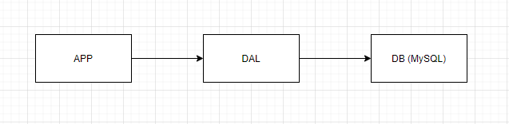
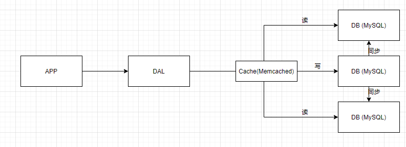
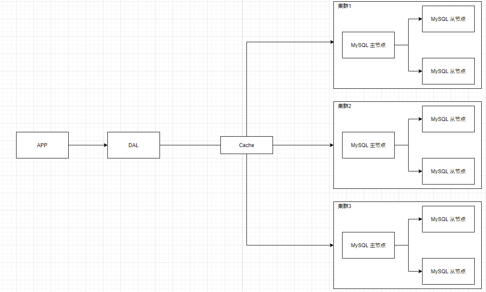
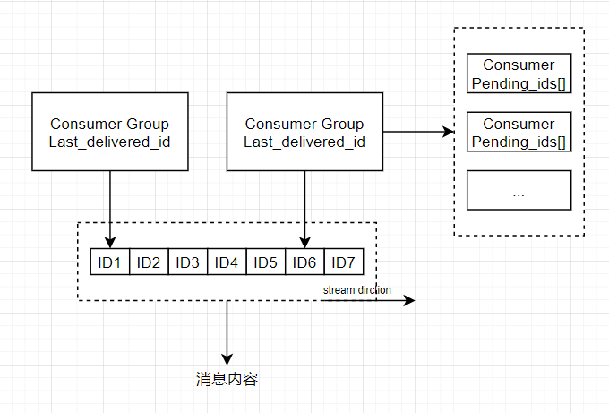
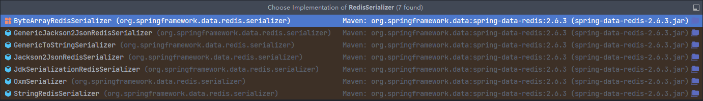
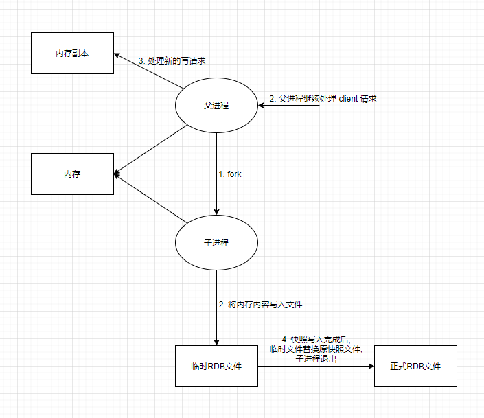
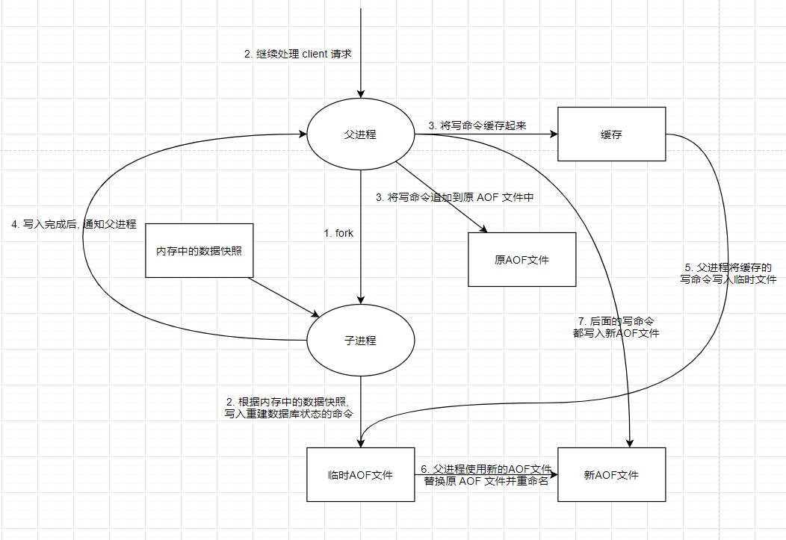
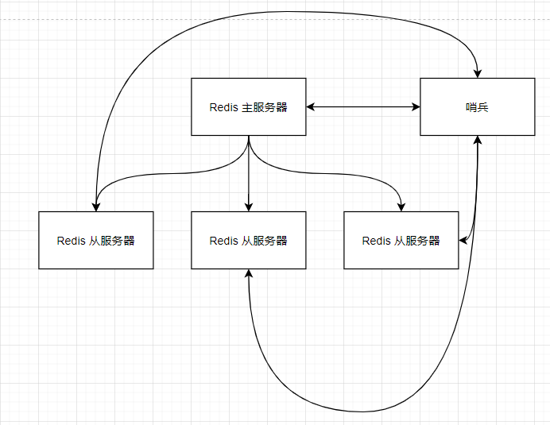
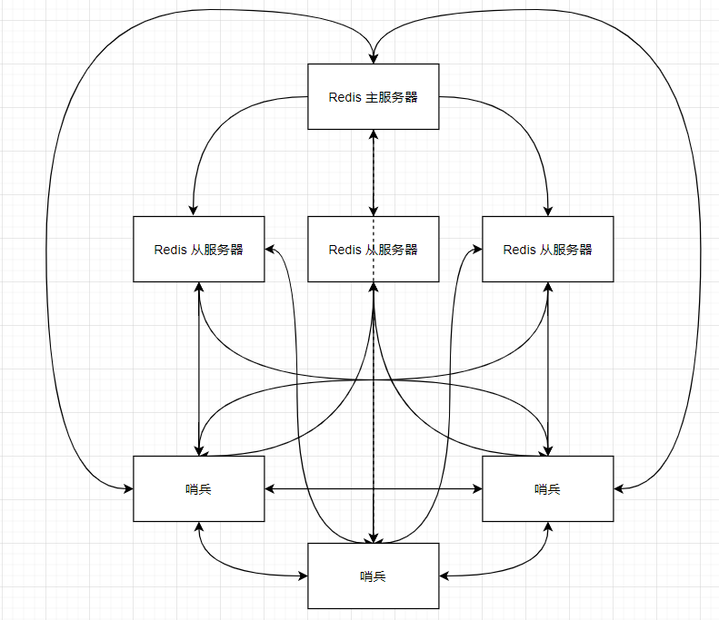
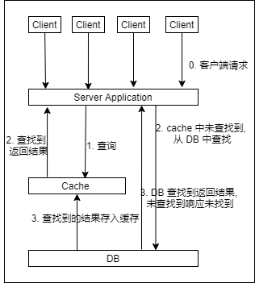

# Redis

> 关系型数据库(RDBMS) MySQL  SQL Server
>
> 非关系型数据库(NoSQL) Redis MongoDB

## NoSQL

> 1. 单机数据库
>
>    ​	
>
>    ​	应用通过**数据库访问层(DAL)**和数据库联系(不同数据库的语言差异,DAL解决)
>
>    ​	**访问量不大**|**数据索引(内存占比小)**|**数据量小**
>
> 2. 缓存+数据库+垂直拆分(读写分离)
>
>    ​	
>
>    ​	垂直分离(读写分离) 
>
>    ​	缓存(优化 DB 结构和索引 -> 文件缓存 IO -> Memcached)
>
> 3. 分库分表 + 水平拆分 + MySQL集群
>
>    
>
>    数据库的读写性能
>
>    > 早期 MySQL 使用 MylSAM 引擎: 表锁(高并发下将产生严重的锁问题)
>    >
>    > 现使用 Innodb 引擎: 行锁 
>
>    分库分表: 解决写

+ 关系型数据库对于当前大数据的处理不够用(数据大, 变化快), 表越大处理越满.

> 

### NoSQL(not only SQL)

> 泛指非关系型数据库

+ 特点

  + 一些数据的存储不需要固定格式, 方便扩展.

    > 需要实现: 无需多余操作实现横向扩展.

  + **高并发 大数据**处理性能好

    > Redis官方: 一秒写 8万次, 读11万次. 每秒 QPS :10W+
    >
    > 细粒级缓存.

  + 数据类型多样

    > 不需要事先设计数据库

  > RDBMS & NoSQL
  >
  > 关系型数据库 有严格的一致性
  >
  > NoSQL 仅需要最终一致性

  > NoSQL 的 CAP 定理 & BASE 理论

### 3V & 3高

+ 3V : 主要是描述问题

  > 海量: Volume
  >
  > 多样: Variety
  >
  > 实时: Velocity

+ 3高 : 主要是对程序的要求(解决问题)

  > 高并发
  >
  > 高性能 
  >
  > 高可扩展 (服务器不够 随时添加)

### 大型互联网应用的问题

+ **数据类型**繁多
+ **数据源**繁多, 经常**重构**
+ 数据一旦需要改造, 需要改造的面也很多, 改造起来很繁琐

### NoSQL 分类

#### KV 键值对

> Redis & Tair & memcache
>
> Hash Table 实现

+ 应用场景

  + 主要处理大量数据的高访问负载

    > 内容缓存...

+ 优缺

  + 优: 查找速度快
  + 缺: 数据无结构, 通常指被识别为字符串或二进制数据

#### 文档型数据库 (bson & json)

> ### MongoDB
>
> + 基于分布式文件存储的数据库
>
>   > C++ 编写, 处理大量文档
>
> + 介于**关系型数据库**和**非关系型数据库**之间
>
>   > NoSQL 中功能最丰富的, 最像**RDBMS**的

+ 应用场景

  + Web应用

    > 类 KV, 但 Value 为结构化数据, 数据库可以分析了解数据内容

+ 优缺

  + 优: 数据结构要求不严格, 表结构可变(不需要像 RDBMS 一样预先构表)
  + 缺:  查询效率不高, 缺乏统一查询语法

#### 列存储数据库 

> HBase
>
> 列簇式存储: 属于同一列的数据存储在一起

+ 应用场景
  + 分布式文件系统
+ 优缺
  + 优: 查找快, 拓展性强(易分布式拓展)
  + 缺: 功能相对局限

#### 图关系数据库 

> **图数据结构** 存储对象之间的关系 
>
> + Neo4j
>
> + InfoGrid

+ 应用场景

  > 专注于构建关系图谱

  + 朋友圈社交网络
  + 广告推荐
  + ...

+ 优缺

  + 优: 利用图结构的算法(最短寻路, 关系查询...)
  + 缺: 需要对整个图做计算才能得出结果信息(不好做分布式集群处理)

## Redis

> **Re**mote **Di**ctionary **S**erver
>
> Key-Value C编写
>
> 官网: [Redis](https://redis.io/)
>
> 中文网: [CRUG网站 (redis.cn)](http://www.redis.cn/)
>
> GitHub: [redis/redis: Redis is an in-memory database that persists on disk. The data model is key-value, but many different kind of values are supported: Strings, Lists, Sets, Sorted Sets, Hashes, Streams, HyperLogLogs, Bitmaps. (github.com)](https://github.com/redis/redis)
>
> 官方不建议 Windows 上运行
>
> Redis 可以用作**数据库**、**缓存**和**消息中间件**.

+ 应用场景: 

  + 内存存储 -> 持久化

    > 持久化: 
    >
    > + RDB
    >
    > + AOF

  + 计数器/计时器(点击量)

  + ...

+ 特点

  + 数据类型
  + 持久化
  + 集群部署
  + 事务管理
  + ...

### 安装

> 默认端口号: 6379

#### Windows 下

> [ServiceStack/redis-windows: Vagrant redis configuration and the binary releases of MS Open Tech redis port of windows (github.com)](https://github.com/ServiceStack/redis-windows)

+ redis-benchmark.exe // 测试性能
+ redis-check-aof.exe // 检查 aof 持久化文件的正确性
+ redis-server.exe // 服务
+ redis-cli.exe // 客户端

> 链接 redis 服务
>
> redis-cli命令:  [Redis命令中心（Redis commands） -- Redis中国用户组（CRUG）](http://redis.cn/commands.html)
>
> ```shell
> ping # 测试链接
> # PONG 则表示连接成功
> set Key Value # 设置基本值(key - value)
> get Key # 获取基本值
> # 未设置的基本值返回空
> select N # 选择操作的数据库 N
> EXISTS Key # 判断对应键值对是否存在, 存在返回 (integer) 1; 不存在返回 (integer) 0 所有数据类型都可用
> move Key N # 将当前数据库下对应的键值对, 移动到指定数据库 N 中
> copy Key1 Key2 # 在当前数据库下复制 Key1 的 Value 到 Key2 的 Value 中
> del Key # 删除对应键值对
> expire Key seconds # 设置对应键值对的过期时间(单位: 秒)
> ttl Key # 查看键值对的剩余过期时间(返回 -2 即为过期 或 不存在)
> type Key # 查看当前 Key 的 Value 的数据类型
> config get parameter [parameter ...] # 获取配置文件中的设置
> ```

#### Linux 下

+ 下载 tar (wget / scp 传入)

+ 解压

+ 配置文件: redis.conf

+ 确认 gcc / g++  & make 环境已配置好

  > Redis 为 C 编写的

+ 使用 make 命令编译安装 Redis

  ```shell
  make # 编译安装
  make install # 确认 make 命令的执行完毕 (可选)
  ```

  > 默认安装路径 `/usr/local/bin` 下
  >
  > + redis-server
  > + redis-sentinel
  > + redis-benchmark
  > + redis-cli
  > + redis-check-aof
  > + redis-check-rdb

+ 启动 Redis

  > 默认启动 非后台启动
  >
  > 需要通过配置文件设定 daemonize 设为 yes (启动守护进程)

  + 通过指定配置文件启动

    1. `redis-server path-config_file`

       > 默认配置文件在解压后的目录下, 为保存默认配置, 可以 copy 默认配置文件到指定目录, 之后修改复制的配置文件, 运行启动即可.
       >
       > Redis配置文件参考: [Redis 配置 | 菜鸟教程 (runoob.com)](https://www.runoob.com/redis/redis-conf.html)

    2. `redis-cli -p Port`

       > Redis 客户端链接指定的本地端口

       + ping
       + set key value
       + get key
       + keys * // 显示所有 key
       + **shutdown // 关闭 Redis 服务(但不退出 Redis 客户端)**
       + **exit // 退出 Redis 客户端**

#### docker 部署

+ 官方: [Redis - Official Image | Docker Hub](https://hub.docker.com/_/redis)

+ pull image

+ run image: 

  + docker run ...配置... redis # 使用默认配置启动

  + docker run ...配置... redis redis-server ...redis服务配置... # 配置 redis 服务启动

    > 使用自己的配置文件启动需要将 redis.conf 文件放入镜像(重构镜像 | 使用 docker-compose 构建) 运行时 redis-server path-to-redis.conf
    >
    > docker 镜像的 后台守护进程不能启动, 否则将启动了容器就退出(docker 容器中的一个进程必须为前台进程, 否则将默认认为程序正常退出)

+ redis-cli: docker exec -it redis-name redis-cli ...配置

+ redis-benchmark: docker exec -it redis-name redis-benchmark ...配置

<hr>

+ 单机 多Redis 进程 模拟集群部署

+ redis-benchmark

  > 参考: [Redis 性能测试 | 菜鸟教程 (runoob.com)](https://www.runoob.com/redis/redis-benchmarks.html)

  + -h # 指定测试主机 默认 127.0.0.1
  + -p # 指定端口 默认 6379
  + -c # 指定并发连接数 默认 50
  + -n # 指定请求数 默认 10000
  + -d # 以字节的形式指定 Get/Set 的 Value 数据大小 默认 3 bytes
  + -k # 两个值: 1 => keep alive; 0 => reconnect 默认 1
  + -P # 通过管道传输 `<numreq>` 请求 默认 1
  + --csv # 以 csv 形式输出

  ```shell
  root@Laptop-VHBin /home/kano # docker exec -it redis01 redis-benchmark -c 100 -n 1000
  ====== PING_INLINE ====== # 执行的命令
    1000 requests completed in 0.04 seconds # 执行总时间 -n 设置
    100 parallel clients # 100个并行客户端执行 -c 设置
    3 bytes payload # 3个字节处理数据 -d 设置
    keep alive: 1 # 有几台服务器处理请求
    host configuration "save": 3600 1 300 100 60 10000
    host configuration "appendonly": no
    multi-thread: no
  
  Latency by percentile distribution: # 按百分比分布的延时
  0.000% <= 0.495 milliseconds (cumulative count 1)
  ...
  100.000% <= 24.607 milliseconds (cumulative count 1000)
  
  Cumulative distribution of latencies: # 累计
  0.000% <= 0.103 milliseconds (cumulative count 0)
  ...
  100.000% <= 25.103 milliseconds (cumulative count 1000)
  
  Summary:
    throughput summary: 25000.00 requests per second # 每秒处理请求数
    latency summary (msec):
            avg       min       p50       p95       p99       max
          3.250     0.488     0.975    23.695    24.415    24.607
  ...
  ```

#### 注

1. 密码设置

   > Redis 可以只设置密码而不设置用户名(因为设为了默认的 dufault)
   >
   > 配置文件中设置:
   >
   > requirepass `<password>`

### 基础认识

1. 默认 16 个数据库(使用的是第0个数据库)

   > 通过 redis-cli 替换数据库: select N # N 为替换的数据库编号(反映: host:port[N], 默认为 0[不显示])

   ```shell
   127.0.0.1:6379> keys *
   1) "counter:__rand_int__"
   2) "mylist"
   3) "password"
   4) "myhash"
   5) "name"
   6) "key:__rand_int__"
   127.0.0.1:6379> select 1
   OK
   127.0.0.1:6379[1]> keys * # 查看当前数据库的所有 key 
   (empty array)
   ```

   > 清空当前数据库: flushdb
   >
   > 清空所有数据库: flushall

2. Redis 单线程

   > 6.0.0以后有多线程, 但只用于**网络数据的读写**和**协议解析**(执行命令仍为单线程, 即工作线程仍只有一个)
   >
   > Redis 内存操作:
   >
   > ​	因此瓶颈为**服务器的内存大小**和**网络带宽**(并非CPU性能)

   + 误区

     1. 高性能并不一定为多线程

     2. 线程执行速度(硬件的运行速度: CPU > 内存 >> 硬盘)

        > 多线程将导致 CPU 对线程的切换(每个线程只能运行指定时间, 时间片用完了, 就切换到下一个线程; 原线程的任务做完了, 就回复响应, 没做完则回到等待队列的末尾), 线程切换将一定时间.
        >
        > 而 Redis 执行的为内存操作, 没有线程上下文切换的效率最高, 因此执行命令的工作线程仍为单线程.
        >
        > 多线程的使用是在线程任务 IO 阻塞时 CPU 切换, 这样就提高了 CPU 的利用率(将等待 IO 阻塞时的时间利用到其他线程)

### 数据类型

> 指令文档: [Redis命令中心（Redis commands） -- Redis中国用户组（CRUG）](http://redis.cn/commands.html)

#### 1. strings

> 适合字符串存储

   + Redis 创建键值对, 默认数据类型为 string 类型数据

     > set key value
     >
     > + 设置 键值对
     >
     > get key
     >
     > + 获取键值对的 value
     >
     > append key value 
     >
     > + 对应 key 存在则在其 value 后追加 value 
     >
     > + 对应 key 不存在则新建对应键值对(value 为空字符串), 再追加 value
     >
     >   > 类似 set
     >
     > + 返回值: 处理完后的 value 字符串长度.
     >
     > strlen key
     >
     > + 获取对应 key 的 value 字符串长度
     >
     > <hr>
     >
     > incr key
     >
     > + 自增 1
     >
     > incrby key 步长
     >
     > + 根据步长自增
     >
     > decr key
     >
     > + 自减 1
     >
     > decrby key 步长
     >
     > + 根据步长自减
     >
     > <hr>
     >
     > getrange key front behind
     >
     > + **截取**对应键值对的 value [front, behind] 的子串(闭区间)
     > + <del>behind < front 倒取</del> front > behind 
     >   1. front > 0 & behind > 0 时, 返回皆为 空串
     >   2. front >= 0 & behind < 0 时, 返回 [front, strlen-behind+1] 的子串
     >
     > setrange key 偏移量 修改值
     >
     > + **替换**对应键值对 的**从偏移量开始的值**修改为**修改值**(长度对应)
     >
     > <hr>

     > #### ***Redis 分布式锁***
     >
     >
     > + 特点
     >   1. 互斥性: 任意时刻, 只能有一个线程设置锁
     >
     >   2. 锁的超时时间: 当一个设置了锁的线程 down , 但其在 down 前并没有主动解锁, 这时只能通过超时时间来保证超时后其他线程可以设置锁(**防止宕机没解锁**)
     >
     >   3. 加锁&解锁必须由同一个线程完成
     >   
     >+ 使用命令
     > 
     >  1. setex key second value
     > 
     >     + 创建键值对时即设置过期时间
     >     
     >      + **可使用 set key value ex seconds 替换**
     >     
     >     + set key value px milliseconds 为毫秒级过期时间
     >      
     >                >  等同: psetex 命令
     > 
     >
     >  2. setnx key value
     > 
     >     + 若对应键值对不存在时创建
     >        + 存在则保持原来不变
     >        + 不存在则创建对应键值对
     > 
     >     + **可使用 set key value nx 替换**
     > 
     >     + set key value xx 仅在 key 存在时设置 value
     > 
     >  3. EXPIRE key seconds [ NX | XX | GT | LT]
     > 
     >     + 设置 key 的过期时间 (过期后自动删除)
     >      + 设定的 过期时间 **只能**通过删除/修改 key 内容的指定(del set getset & 所有使用 store 参数的指令)才能删除
     >      + 参数
     >        + NX : 只有当 key 没有设置超时时间才执行(设置超时时间)
     >        + XX : 只有当 key 设置了超时时间才执行(更新超时时间)
     >        + GT : 只有当新设置的大于当前剩余超时时间时执行(更新超时时间)
     >        + LT : 只有当新设置的小于当前剩余超时时间时执行(更新超时时间)
     > 
     >  + **上述指令都可以由 set 指令添加参数替代.**
     > 
     ><hr>
     > 
     >mset key value [key value ...]
     > 
     >+ 批量创建键值对
     > 
     >mget key [key ...]
     > 
     >+ 批量获取对应键值对的 value
     > 
     >msetnx key value [key value ...]
     > 
     >+ 批量创建(对应键值对不存在时)
     > + 但由于是原子操作(要么全部成功, 要么全部失败), 因此不能**在存在的键值对后面添加不存在的键值对**(后面的键值对将创建失败)
     > 
     ><hr>
     > 
     >set key_lv_1:key_lv_2:... value 
     > 
     >+ 层级 key (范围分区技术)
     > + value 可为 json 数据对象
     > 
     ><hr>
     > 
     >getset key value
     > 
     >+ 先获取 再设置
     >   + 原来不存在则返回 (nil的) 再创建 key value
     >   + 原来存在则返回原来的值 再更新 value
     
   + string 可为 字符串 也可为 数字(实现计数器; 统计多单位的数量: uid; 对象缓存存储 )

#### 2. hashes

   > 哈希散列 `key - <key, value>`
   >
   > 适合对象存储

+ 一般以 h 开头

  > hset key field value [field value ...]
  >
  > + **创建/更新**哈希散列属性的键值对
  > + 返回值: 创建成功的个数 (更新时由于没有创建因此不计数)
  > + key 也可以使用**层级**表示
  >
  > hget key field
  >
  > + 获取指定 key 的指定**域**的 value
  >
  > hgetall key
  >
  > + 获取所有域名与其值
  > + 返回偶数行, 奇数:域名, 偶数:值
  > + 对应 key 不存在则返回: `(empty array)`
  >
  > hdel key field [field ...]
  >
  > + 删除指定域
  > + 返回值: N 执行成功的个数; 0 执行失败(对应域不存在或其他原因)
  >
  > hlen key
  >
  > + 获取对应hash数据的长度
  > + 不存在则返回 0
  >
  > HEXISTS key field
  >
  > + 判断对应key的对应**域**是否存在
  > + 返回值: 1 存在; 0 不存在(key / field)
  >
  > HKEYS key
  >
  > + 获取指定 key 的所有 field 名
  >
  > HVALS key
  >
  > + 获取指定 key 的所有值
  >
  > HINCRBY key field increment
  >
  > + 指定 key 指定*域*的值**自增** increment 量 (increment 可为负数)
  >
  > <hr>
  >
  > hsetnx key field value
  >
  > + 不存在时创建
  > + 返回值: 创建成功 1;创建失败(已存在) 0

#### 3. lists

> 可以实现栈 队列 等数据结构

+ <del>指令都是 l (小写L, 指令可大写) 开头</del> **双端链表** 左右都可以插入新值 (且左右插值效率最高, 中间插值效率较低)

  > `LPUSH key element [element...]`
  >
  > + **设置** list 属性的键值对
  >
  >   即 key - list
  >
  > + <del>由于是 push 因此是先入的在下面(序号大), 后入在上面(序号小)</del> L 代表 Left 因此是从左插入新值 (左小右大)
  >
  > `LRANGE key start stop`
  >
  > + **获取** [start, stop] 内的元素
  > + 和 getrange 一样的特性
  >
  > `RPUSH key element [element...]`
  >
  > + **设置** list 属性的键值对
  > + R 代表 Right 因此是从右插入新值
  >
  > `LPOP key [count]` & `RPOP key [count]`
  >
  > + **移除**指定数量的元素(从序号小的开始) L *(R 相反)*
  > + **不指定 count 则默认移除序号为 1 的元素** L *(R 相反)*
  >
  > lindex key index
  >
  > + 此处的 l 为 List 的 l 因此没有 rindex 一命令
  >
  > + **获取**指定 index (序号/下标) 的 value 从0开始计数
  >
  > lset key index element
  >
  > + **更新/替换**指定 index 的值
  > + 指定 index 不存在时, 将报错 `(error) ERR index out of range`
  >
  > linsert key BEFORE|AFTER pivot element
  >
  > + 在指定 key 的 pivot 前|后插入 element; 即在列表的某个元素前|后**插入**新值
  > + 重复值将从左边开始的第一个值前后操作
  >
  > Llen key
  >
  > + 此处的 l 为 List 的 l 因此没有 rlen 一命令
  > + **获取指定 list 的长度**
  >
  > lrem key count element
  >
  > + **移除** key 中指定个数的 element 
  >
  > + 由于 list 中可存在相同的 element 因此需要 count. count 表示移除几个 element (count 不可省略)
  > + 返回值为移除执行成功的数量(因此 count 大于 list 中含有的 element 数量时, 返回结果将小于 count)
  >
  > ltrim key start stop
  >
  > + **截取** [start, stop] 内的元素, 赋值给 key, 范围外的元素删去
  >
  > rpoplpush source destination
  >
  > + **移除 source 的最后一个元素,移动到 destination 的第一个**
  > + 只有 rpoplpush 没有 lpoplpush & lpoprpush & rpoprpush 命令

+ 队列实现: 左进(lpush)右出(rpop)

+ 堆栈实现: 左进(lpush)左出(lpop)

#### 4. sets

> set 集合中无重复值

+ 指令基本上以 s 开头

  > sadd key member [member ...]
  >
  > + 添加 set 元素
  > + 添加纯数字元素将进行排序
  > + 若在纯数字集合中添加非数字元素, 顺序将紊乱
  >
  > smembers key
  >
  > + 查看 set 的全部元素
  >
  > sismember key member
  >
  > + 查看 key 中是否存在 member; 即 集合中是否存在元素 member
  > + 存在返回 1; 不存在返回 0
  >
  > scard key
  >
  > + 查看集合中的元素个数
  >
  > srem key member [member ...]
  >
  > + 移除集合中的指定元素
  > + member 原本不存在时也将执行(不报错)
  > + key 不存在也将执行 (只是返回值为 0)
  >
  > SRANDMEMBER key [count]
  >
  > + 随机抽取集合中的元素
  > + count 为抽取的元素数量, 默认为 1
  >
  > SPOP key [count]]
  >
  > + 随机移除集合中的元素
  > + 可指定移除个数,默认为 1
  >
  > SMOVE source destination member
  >
  > + **移动** source 内的 member 到 destination 中
  >
  > SDIFF key [key ...]
  >
  > + 返回不同集合的**差集** 不同的元素
  >
  > SINTER key [key ...]
  >
  > + 返回不同集合的**交集** 相同元素
  >
  > SUNION key [key ...]
  >
  > + 返回不同集合的**并集** 所有元素

#### 5. zsets

   > Zset => sorted sets (with range queries) :带有范围查询的有序集合
   >
   > 在 set 基础上添加权值进行排序
   >
   > **score 小的排前, 大的排后, 相同的按 value 的首字母字典序排列**

+ 一般 z 开头

  >zadd key [NX|XX] [GT|LT] [CH] [INCR] score member [score member ...]
  >
  >+ 创建元素/更新元素的 score (member 已存在则修改对应的 score)
  >
  > > score 只能为 **整型数** 或 **双精度浮点数**
  >
  >+ 参数:
  > 1. XX 只更新,不新增
  > 2. NX 只新增,不更新
  > 3. CH 修改返回值(默认返回值: 新增个数; 修改后: 数据有变化的个数) [CH = changed]
  > 4. INCR 相当于执行 zincrby 操作 (对元素的权值 score 进行递增操作)
  > 5. LT 不影响创建, 只影响更新: 只有当 score 小于存储的元素的 score 时才更新
  > 6. GT 不影响创建, 只影响更新: 只有当 score 大于存储的元素的 score 时才更新
  >
  ><hr>
  >
  >zrange key min max [BYSCORE|BYLEX] [REV] [LIMIT offset count] [WITHSCORES]
  >
  >+ 显示 [min,max] 之间的元素(**默认按照 score 从小到大排序输出**)
  >
  >+ 参数:
  >
  > 1. WITHSCORES 返回的数据包括每个元素各自的 score
  > 2. BYSCORE 单独使用等同 ZRANGEBYSCORE; 配合 REV 使用等同 ZREVRANGEBYSCORE
  > 3. BYLEX 单独使用等同 ZRANGEBYLEX;配合 REV 使用等同 ZREVRANGEBYLEX
  > 4. REV 输出从大到小 (单独使用 等同 zrevrange)
  > 5. LIMIT 分页(有 LIMIT 则 offset<元素的起始位置, 非页码> count<结果数量> 必须输入)
  >
  >+ **example:**
  >
  > **`ZRANGE myzset (1 +inf BYSCORE LIMIT 1 1` // 范围 (1 , +inf] 不包括1 到 无限大, 只返回第二个元素**
  >
  >+ 注
  >
  > + min & max 可以以 `(` or `[` 开头表示 **开闭区间**
  > + min max 的位置不能反
  >
  >ZRANGEBYSCORE key min max [WITHSCORES] [LIMIT offset count]
  >
  >+ 按照 score 排序**从小到大**输出
  >+ 不支持 min=0, max=-1 的输出(从小到大输出,因此不能 max < min), 需要全部输出则为 :min=-inf, max=+inf
  >+ **从大到小**输出使用 ZREVRANGEBYSCORE (该指令的要求与 ZRANGEBYSCORE 相反)
  >
  >ZRANGEBYLEX key min max [LIMIT offset count]
  >
  >+ 返回 **score 相同**的按**字典序(默认ASCII码)从小到大**排序的元素
  >
  > > score 不同则结果有偏差
  >
  >+ min & max 前必须添加 `(` or `[` (min & max 内不能有空格), 且两者顺序不能反
  >
  >+ 可使用 `+` 表示无穷大; `-` 表示无穷小
  >
  >+ <del>**字符长度长的元素优先级低于字符长度短的元素**</del> 6.2.6 版本就按首字母字典序排列
  >
  >+ **从大到小**输出使用 ZREVRANGEBYLEX (该指令的要求与 ZRANGEBYSCORE 相反)
  >
  >ZRANDMEMBER key [count [WITHSCORES]]
  >
  >+ 随机输出
  >
  ><hr>
  >
  >zrem key member [member ...]
  >
  >+ 移除指定元素
  >
  >zcard key 
  >
  >+ 获取有序集合中元素个数
  >
  >zcount key min max
  >
  >+ 获取 score 在区间 [min, max] 上的元素数量

#### 6. bitmaps

   > 位图: 位存储
   >
   > **状态数**只有两个时可用.
   >
   > 默认为 string 只是以 bit 的形式查看 string, 因此可以使用 get 方法获取 bitmap 显示的 string 值(默认 显示 十六进制值)
   >
   > 当使用 set 设置时,  

+ 命令

  > setbit key offset value
  >
  > + 创建/设置指定 key 偏移量为 offset 处的 value (0 or 1) 
  > + 0 <= offset < 232 (bitmap 大小限制为 512)
  >
  > getbit key offset
  >
  > + 显示指定 key 指定偏移量处的 value
  >
  > bitcount key [start end]
  >
  > + 统计 start 字节 到 end 字节之间的 1 的个数
  > + 没有 start & end 则显示整个 key 的 value 的 1 的个数
  >
  > bitfield key [GET type offset] [SET type offset value] [INCRBY type offset increment] [OVERFLOW WRAP|SAT|FAIL]
  >
  > bitfield_ro key GET encoding offset [ encoding offset ...]
  >
  > bitop operation destkey key [key ...]
  >
  > bitpos key bit [start] [end]

#### 7. hyperloglogs

   > 基数: **一个集合**中**不重复**的元素的**个数**
   >
   > hyperloglogs 基数统计
   >
   > 网页的 PV(page view: 浏览量) & UV (unique view: 网页访客量)

+ 概率数据结构 统计基数(唯一数据, like 网页的 UV)

+ 带有误差, 小于 1%

+ 使用**固定**的内存进行统计

  > 每个 HLL 的 key 只需要 12KB 内存, 即可计算近2^64^个不同元素的基数

  + 原因: 只计算输入元素的基数, 而不保存输入元素本身 (也不能返回输入的元素)

+ PF 开头

  > PFADD key element [element ...]
  >
  > + 向指定 key 中添加元素
  > + 相同的元素将被忽视
  >
  > PFCOUNT key [key ...]
  >
  > + 统计指定 key 内的元素个数
  >
  > PFMERGE destkey sourcekey [sourcekey ...]
  >
  > + 合并 source 到 dest 中 (相同元素将只取一个)

#### 8. geospatial indexs with radius queries

   > 带有半径查询的地理空间索引 => **地理位置** *微信附近的人*
   >
   > **需要地理经纬度**
   >
   > Redis 3.2 推出, 可推算两地地理位置的信息(两地之间的距离, 方圆几里内的标记点 ...)
   >
   > 底层实际上就是 **有序集合** (可使用 Zset 的指令操作, 但不要改变元素)

+ 命令都以 GEO 开头

  > 1. geoadd key [NX|XX] [CH] longitude latitude member [longitude latitude member ...]
  >    + 添加地理位置 (经度, 纬度, 名称) 到指定 key 中.
  >    + longitude: 经度 (有效: -180 ~ 180)
  >    + latitude : 纬度 (有效: -85.05112878 ~ 85.05112878)
  >    + Option:
  >      1. NX: 只更新不新建
  >      2. XX: 只新建不更新
  >      3. CH: 改变返回值(默认: 新增个数 改后: 变化元素个数 )
  >    + **注**: 两极无法直接添加
  >
  > 2. geodist key member1 member2 [m|km|ft|mi]
  >
  >    + 返回两个 member 之间的距离
  >
  >    + option:
  >
  >      1. m : 单位 米
  >      2. km : 单位 千米
  >      3. mi : 单位 英里
  >      4. ft : 单位 英尺
  >
  >      + 默认为: 米
  >
  >    + 注: 该命令设地球为完美球体, 因此最差情况下有 0.5% 的误差
  >
  >    + 返回值: 双精度浮点数
  >
  > 3. geohash key member [member ...]
  >
  >    + 返回一个或多个位置元素的标准 Geohash 表示(11个字符的 Geohash 字符串, 因此没有精度)
  >
  >      > Geohash 位置 52 位整数编码
  >      >
  >      > 由于编码和解码过程中所使用的初始最小和最大坐标不同,编码的编码也不同于标准.
  >
  >    + 该命令返回的 geohash 字符串即使失去经度, 但其指向的仍是同一地区.
  >
  >    + 返回的 geohash 字符串可在`geohash.org`网站使用
  >
  >    + 前缀相同的 geohash 字符串其地理位置也相近, 但是反过来不一定正确, 因此不同的前缀其地理位置也可能相近.
  >
  > 4. geopos key member [member ...]
  >    + 获取指定 key 中指定 member 的经纬度
  >
  > 5. GEORADIUS key longitude latitude radius M | KM | FT | MI [WITHCOORD] [WITHDIST] [WITHHASH] [ COUNT count [ANY]] [ ASC | DESC] [STORE key] [STOREDIST key]
  >
  >    > Redis 6.2.0 以后, 该指令**可视为**弃用
  >
  >    + 半径查询: 以给定的经纬度为中心, 在给定半径内寻找其他元素
  >
  >      > 输入经纬度和半径, 寻找 key 中符合的元素(在半径的范围内)
  >
  >    + 默认返回 member 名
  >
  >    + option:
  >
  >      1. M | KM | FT | MI 设置显示距离时的单位
  >      2. WITHCOORD 显示匹配的 member 的经纬度
  >      3. WITHDIST 显示匹配的 member 的直线距离
  >      4. WITHHASH 返回 52 位无符号整型数 geohash 编码 (用的少, 用处不大)
  >      5. ASC | DESC : 排序 从小到大|从大到小 **默认不排序**
  >      6. COUNT count [ANY]  设置结果显示的数量 (使用了 ANY 选项: 当找到了 count 个结果时就返回; 不使用时, 找到全部结果后, 排序返回 count 个结果)
  >      7. STORE key 存储结果(包含其地理信息)到有序集合中
  >      8. STOREDIST key 存储结果(包含以浮点数表示的到中心点的**距离**<带单位>)到有序集合中
  >
  > 8. GEORADIUS_RO key longitude latitude radius M | KM | FT | MI [WITHCOORD] [WITHDIST] [WITHHASH] [ COUNT count [ANY]] [ ASC | DESC]
  >
  >    > Redis 6.2.0 以后, 该指令**可视为**弃用
  >
  >    + GEORADIUS 的只读变体: 功能相同 参数除了**不能存储**外, 其他一样
  > 7. GEORADIUSBYMEMBER key member radius M | KM | FT | MI [WITHCOORD] [WITHDIST] [WITHHASH] [ COUNT count [ANY]] [ ASC | DESC] [STORE key] [STOREDIST key]
  >
  >    > Redis 6.2.0 以后, 该指令**可视为**弃用
  >
  >    + 半径查询: 以给定的 member 为中心, 在给定半径内寻找其他 member
  >    + 默认返回 member 名
  >    + **返回结果包括自身**
  >    + 参数和 GEORADIUS 一样
  >
  > 7. GEORADIUSBYMEMBER_RO key member radius M | KM | FT | MI [WITHCOORD] [WITHDIST] [WITHHASH] [ COUNT count [ANY]] [ ASC | DESC]
  >
  >    > Redis 6.2.0 以后, 该指令**可视为**弃用
  >
  >    + GEORADIUSBYMEMBER  的只读变体, 参数除了**不能存储**外, 其他一样
  >
  >
  > 9. GEOSEARCH key FROMMEMBER member | FROMLONLAT longitude latitude BYRADIUS radius M | KM | FT | MI | BYBOX width height M | KM | FT | MI [ ASC | DESC] [ COUNT count [ANY]] [WITHCOORD] [WITHDIST] [WITHHASH]
  >
  >    + **扩展** GEORADIUS 命令: 除了在指定半径的圆形区域搜索外, 也支持矩形区域搜索
  >    + **替代 GEORADIUS 和 GEORADIUSBYMEMBER 命令**
  >    + ***FROMMEMBER member => GEORADIUSBYMEMBER***
  >    + ***FROMLONLAT longitude latitude => GEORADIUS***
  >    + BYRADIUS radius M | KM | FT | MI => 在圆形范围内搜索 (设定点为圆心)
  >    + BYBOX width height M | KM | FT | MI => 在矩形范围内搜索 (设定点为 ? )
  >    + 默认返回 member 名
  >    + 参数除了不能存储外, 和 GEORADIUS 一致
  >
  > 10. GEOSEARCHSTORE destination source FROMMEMBER member | FROMLONLAT longitude latitude BYRADIUS radius M | KM | FT | MI | BYBOX width height M | KM | FT | MI [ ASC | DESC] [ COUNT count [ANY]] [STOREDIST]
  >
  >     + 该命令就像是默认使用 STORE 参数的 GEORADIUS 命令一样的 GEOSEARCH 命令 (**将从 source 中找到的结果存储到 destination 中**)
  >     + 参数和 GEOSEARCH 命令一致(除了 STOREDIST: 就如同 GEORADIUS 使用 STOREDIST 参数)

#### 9. streams

> Redis 5.0 新增
>
> 主要用于 MQ
>
> 参考: [Redis Stream | 菜鸟教程 (runoob.com)](https://www.runoob.com/redis/redis-stream.html)

+ 提供了**消息的持久化**和**主备复制**功能

  > 让任何客户端访问任何时刻的数据
  >
  > 记住每一个客户端的访问位置
  >
  > 保证消息不丢失

  

  + 每一个 stream 都有唯一名称(即为 Redis key)

  + consumer group: 消费组, 使用 xgroup create 命令创建

    > 一个 消费组 内有多个 消费者

  + last_delivered_id: 游标, 每个消费组都有, 每一个消费者读取 stream 都将使游标向前移动

  + pending_ids: 消费者的状态变量, 维护消费者未确认(没有接受到 ack)的 id

+ 命令一般以 X 开头

  > 消息队列相关: 
  >
  > XADD key [NOMKSTREAM] [MAXLEN|MINID [=|~] threshold [LIMIT count]] *|ID field value [field value ...]
  >
  > + 添加消息到末尾
  >
  > XTRIM key MAXLEN|MINID [=|~] threshold [LIMIT count]
  >
  > + 对 stream 进行裁剪
  >
  > XDEL key ID [ID ...]
  >
  > + 删除消息
  >
  > XLEN key
  >
  > + 获取stream的消息数量, 即 stream 长度
  >
  > XRANGE key start end [COUNT count]
  >
  > + 获取 [start, end] 之间的消息
  >
  > XREVRANGE key end start [COUNT count]
  >
  > + 反向获取 [start, end] 之间的消息
  >
  > XREAD [COUNT count] [BLOCK milliseconds] STREAMS key [key ...] ID [ID ...]
  >
  > + 以阻塞式/非阻塞式获取消息队列

  > 消费者/组相关:
  >
  > XGROUP [CREATE key groupname ID|$ [MKSTREAM]] [SETID key groupname ID|$] [DESTROY key groupname] [CREATECONSUMER key groupname consumername] [DELCONSUMER key groupname consumername] [HELP]
  >
  > + CREATE 创建消费组
  > + CREATECONSUMER 创建消费者
  > + SETID 设置新的最后递送的消息 ID
  > + DESTROY 删除消费组
  > + DELCONSUMER 删除消费者
  > + HELP 帮助信息
  >
  > XREADGROUP GROUP group consumer [COUNT count] [BLOCK milliseconds] [NOACK] STREAMS key [key ...] ID [ID ...]
  >
  > + 读取消费者组中的消息
  >
  > XACK key group ID [ID ...]
  >
  > + 标记消息为"已处理"
  >
  > XPENDING key group [[IDLE min-idle-time] start end count [consumer]]
  >
  > + 显示待处理消息的相关信息
  >
  > XCLAIM key group consumer min-idle-time ID [ID ...] [IDLE ms] [TIME ms-unix-time] [RETRYCOUNT count] [force] [justid]
  >
  > + 移除消息的归属权
  >
  > XINFO [CONSUMERS key groupname] [GROUPS key] [STREAM key] [HELP]
  >
  > + CONSUMERS 查看消费者相关信息
  > + GROUPS 查看消费组相关信息
  > + STREAMS 查看 stream 相关信息

### 事务

> 本质: 一组命令
>
> 事务中的所有命令都将序列化, 执行时按顺序执行
>
> 特性: 一次性, 顺序性, 排他性(执行时不受外部干扰)

+ Redis 单条命令保证原子性, 但事务不保证原子性

+ Redis 没有个隔离级别的概念

  > 所有事务中的命令, 都不会立即执行. 只有在发起执行请求(Exec)时, 才会执行.

+ Redis 事务

  1. 开启事务

     + **multi**

  2. 命令入队

     + 注: 编写命令一旦 error 执行事务时必定报错 (***编译型异常***)

  3. 执行事务

     + **exec**

       > 执行完事务后,退出事务编写

     + 注: 执行时, 事务中的某一个命令报错, **不影响**在其之前的命令的结果, 后面的命令也将执行 (***运行时异常***)

       > 和 MySQL 区别

  4. 取消执行事务

     + **discard**

  > 每次编写一次事务,执行完后即移除, 不可重复使用

### 锁

> Redis 可实现 乐观锁

+ 悲观锁

  > 什么时候都有问题, 做什么都会上锁

  + 严重影响性能
  + 一般不使用

+ 乐观锁

  > 什么时候都不会有问题, 不会上锁

  + 创建时, 获取 version

  + 更新时, 比较 version

  + Redis 乐观锁

    > WATCH key [key ...]
    >
    > + 监视

    + 一个线程中, 对一个 key 进行监控, 若在**另一个线程**对该 key 进行修改, 该线程对监控 key 的操作将失败 (version 不一致)

    > UNWATCH 
    >
    > + 取消监视/解锁

    + 事务执行失败时, 先解锁再监视获取最新version, 再执行事务

## Java 集成 Redis

### 1. Jedis

> Springboot 链接 Redis 的底层实现

+ Jedis: Redis 官方推荐使用的 Java 连接开发工具

+ 注: 

  > 用Jedis连接阿里云等服务器上的redis
  > 一. 配置redis.conf
  >     1.设置访问redis的密码：requirepass 要设置密码
  >     2.注释bind 127.0.0.1 或 添加自己主机的 ip
  >     (重启redis-server服务,进入redis-cli后要先验证密码,用这个命令：auth 密码 ,然后ping一下看有没有配置成功)
  >
  > ```shell
  > 127.0.0.1:6379> ping
  > (error) NOAUTH Authentication required.
  > 127.0.0.1:6379> auth 13131CAHlhb
  > OK
  > 127.0.0.1:6379> ping
  > PONG
  > ```
  >
  > 二 . idea访问时添加auth密码
  >   Jedis jedis = new Jedis("服务器的外网ip",6379);
  >   jedis.auth("redis的密码");
  >   System.out.println(jedis.ping());
  > （输出PONG的话就成功了）
  >
  > 三 . **查看防火墙设置**

+ 使用

  1. 引依赖

     ```xml
     <dependency>
         <groupId>redis.clients</groupId>
         <artifactId>jedis</artifactId>
         <version>4.2.2</version> <!--版本自选-->
     </dependency>
     ```

  2. 创建 Jedis 对象 (客户端)

     ```java
     Jedis jedis = new Jedis(host, port);
     // 设置密码
     jedis.auth(password);
     ```

  3. 使用 API 方法

     > 命令和 redis-cli 中使用的一模一样(包括:后面的特殊类型 bitmap hll geospatial)
     >
     > 常用 API: 
     >
     > 1. string
     >
     > 2. list
     >
     > 3. set
     >
     > 4. hash
     >
     > 5. zset

     ```java
     // 仅以 String 为例
     public class RedisString {
         public static void main(String[] args) {
             Jedis client = new Jedis(ip, 6379);
             client.auth(password);
             System.out.printf("Ping: %s\n", client.ping());
             System.out.printf("Select 1: %s\n", client.select(1));
             System.out.printf("Flushdb: %s\n", client.flushDB());
             String key = "VHBin";
             String value = "VHBin is the dog of Kano";
             String append = ", Kano is the Goddess of VHBin";
             String change = "IN";
             System.out.printf("Set key value: %s\n", client.set(key, value));
             System.out.printf("Get key value: %s\n", client.get(key));
             System.out.printf("Append key value: %s\n", client.append(key, append));
             System.out.printf("Strlen key: %s\n", client.strlen(key));
             System.out.printf("Incr key: %s\n", client.incr(key)); // 将报错: ERR value is not an integer or out of range 后面的代码都将执行不了
             System.out.printf("Decr key: %s\n", client.decr(key));
             System.out.printf("Incrby key decrement: %s\n", client.decrBy(key, 23L));
             System.out.printf("Getrange key start end: %s\n", client.getrange(key, 0, 5));
             System.out.printf("Setrange key offset value: %s\n", client.setrange(key, 3, change));
             System.out.printf("Get: %s\n", client.get(key));
             System.out.printf("Setex key second value: %s\n", client.setex(key + "1", 12, change));
             System.out.printf("TTL key: %s\n", client.ttl(key));
             System.out.printf("Setnx key value: %s\n", client.setnx(key + "1", change + "2"));
             System.out.printf("Getset key value: %s\n", client.getSet(key, change));
             System.out.printf("Del key: %s\n", client.del(key));
             client.close();
         }
     }
     ```

     > **若命令执行时 在 Redis-cli 中报错, 则 Java 客户端操作时直接抛错**

+ 事务

  ```java
  public class RedisTX {
      public static void main(String[] args) {
          Jedis client = ConnectUtil.defaultConf();
          // 开启事务
          Transaction multi = client.multi();
          try {
              JSONObject json = new JSONObject();
              json.put("name", "吕海彬");
              json.put("age", "21");
              json.put("job", "学生");
              json.put("爱好", "漫画");
              // 添加命令
              multi.set("Key1", json.toJSONString());
              	// 伪逻辑错误
              multi.incr("Key1");
              	// 伪代码错误
              int i = new Random().nextInt();
              System.out.println("i=" + i);
              if (i % 2 == 1) {
                  throw new Exception("Exception: Death");
              }
              multi.set("key2", "Ops");
              multi.getrange("Key1", 0, -1);
              // 执行事务
              System.out.println("Exec: " + multi.exec());
          } catch (Exception e) {
              System.out.println(e.getMessage());
              // 取消事务
              System.out.println("Discard: " + multi.discard());
          } finally {
              ConnectUtil.close(client);
          }
      }
  }
  ```

### 2.Springboot 集成 Redis

> **SpringData Redis** => org.springframework.boot:spring-boot-starter-data-redis
>
> SpringBoot 2.x 之后的 Jedis 被替换成 Lettuce
>
> Jedis: 采用直连, 多个线程操作时不安全(为避免不安全, 则需要使用 Jedis Pool 连接池), 类 BIO 模式
>
> Lettuce: 采用 Netty, 实例在多个线程中共享, 不能存在线程不安全, 也减少了线程数据, 类 NIO 模式
>
> 虽然 SpringBoot 2.x 上有 Jedis 的很多联想, 但是由于 Jedis 被替换成 Lettuce, 很多类不存在 SpringBoot 的源码中, 导致使用报错、失败, 因此 SpringBoot 2.x 以上只推荐使用 Lettuce

+ 底层常用模板源码

  ```java
  // 没有配置 redisTemplate 时的默认配置
  @Bean
  @ConditionalOnMissingBean(
      name = {"redisTemplate"}
  )
  @ConditionalOnSingleCandidate(RedisConnectionFactory.class)
  public RedisTemplate<Object, Object> redisTemplate(RedisConnectionFactory redisConnectionFactory) {
      RedisTemplate<Object, Object> template = new RedisTemplate();
      template.setConnectionFactory(redisConnectionFactory);
      return template;
  }
  
  // Redis String 类型最常用, 因此定义
  @Bean
  @ConditionalOnMissingBean
  @ConditionalOnSingleCandidate(RedisConnectionFactory.class)
  public StringRedisTemplate stringRedisTemplate(RedisConnectionFactory redisConnectionFactory) {
      return new StringRedisTemplate(redisConnectionFactory);
  }
  ```

+ 使用

  1. 引依赖

     ```xml
     <dependency>
         <groupId>org.springframework.boot</groupId>
         <artifactId>spring-boot-starter-data-redis</artifactId>
     </dependency>
     ```

  2. 写配置

     ```yaml
     spring:
       redis:
         host: 127.0.0.1
         port: 6379
         password: 13131CAHlhb # 配置了需要写
         username: username # 配置了需要写
     ```

  3. 基本测试

     ```java
     @SpringBootTest
     public class TemplateTests {
         private static final Logger logger = LoggerFactory.getLogger(TemplateTests.class);
         @Autowired
         @Qualifier("redisTemplate") // 泛型默认为 两个 Object 
         private RedisTemplate<Object, Object> redisTemplate;
         // 可直接使用
         @Autowired
         private RedisTemplate redisTemplate;
     
         @Test
         void templateTest() {
             // 获取链接
             RedisConnection connection = null;
             try {
                 // 由于是 Lettuce 切库需要使用 重建链接 的方式
                 LettuceConnectionFactory factory = (LettuceConnectionFactory) redisTemplate.getConnectionFactory();
                 factory.setDatabase(1);
                 redisTemplate.setConnectionFactory(factory);
                 factory.resetConnection();
                 // 对库的操作
                 connection = factory.getConnection();
                 connection.keys("*".getBytes(StandardCharsets.UTF_8));
                 connection.flushDb();
                 // connection.select(0); // 此切库的操作只能对 Jedis 的链接方式生效(separate connection), 而 Lettuce 采用的时分享同一个实例的方式(shared connection), 切库只能使用对链接修改, 再重连的方式
                 /*
                     对不同的数据类型操作
                     opsForValue 对 Redis String
                     opsForList 对 Redis List
                     opsForSet
                     opsForZSet
                     opsForHash
                     opsForGeo
                     opsForHyperLoglog
                     opsForStream
                 */
                 redisTemplate.opsForValue().set("name", "VHBin吕"); // 命令行正常显示非英文的内容, 但 Redis 内部为转变后的编码形式
                 // 所有操作都需要使用 序列化, 而 SpringData Redis 默认使用的是 JDK 的序列化
                 logger.info("Get: {}", redisTemplate.opsForValue().get("name"));
                 /* 
                 	一些常用的方法 事务&基本CRUD...
                 	redisTemplate.delete(key); // 删除
                     redisTemplate.multi(); // 开启事务
                     redisTemplate.exec(); // 执行事务
                     redisTemplate.discard(); // 取消事务
                     redisTemplate.sort(query, storekey); // 排序
                     redisTemplate.watch(key); // 开机乐观锁
                     redisTemplate.unwatch(); // 解锁
                     redisTemplate.randomKey(); // 随即输出
                     redisTemplate.type(key); // 输出 value 的数据类型
                     redisTemplate.rename(oldkey, newkey); // 重命名
                     redisTemplate.restore(key, value, timeToLive, TimeUnit[, replace]); // 重新存储
                     redisTemplate.copy(source, target, replace); // 复制
                     redisTemplate.move(key, dbindex); // 移动到其他数据库
                     redisTemplate.expire(key, timeout[, TimeUnit]); // 设置过期时间
                     redisTemplate.expireAt(key, date); // 设定过期期限
                     redisTemplate.countExistingKeys(keys); // 计数
                     redisTemplate.persist(key); // 持久化
                     ...
                 */
                 redisTemplate.delete("name");
             } catch (NullPointerException e) {
                 logger.error("NullPointer: ", e);
             } catch (Exception e) {
                 logger.error("Exception", e);
             } finally {
                 connection.close();
             }
     
         }
     
     }
     ```

     > RedisTemplate:
     >
     > ```java
     > public class RedisTemplate<K, V> extends RedisAccessor implements RedisOperations<K, V>, BeanClassLoaderAware {
     >     private boolean enableTransactionSupport = false;
     >     private boolean exposeConnection = false;
     >     private boolean initialized = false;
     >     private boolean enableDefaultSerializer = true;
     >     // 序列化方式
     >     @Nullable
     >     private RedisSerializer<?> defaultSerializer;
     >     @Nullable
     >     private ClassLoader classLoader;
     >     @Nullable
     >     private RedisSerializer keySerializer = null;
     >     @Nullable
     >     private RedisSerializer valueSerializer = null;
     >     @Nullable
     >     private RedisSerializer hashKeySerializer = null;
     >     @Nullable
     >     private RedisSerializer hashValueSerializer = null;
     >     private RedisSerializer<String> stringSerializer = RedisSerializer.string();
     >     @Nullable
     >     private ScriptExecutor<K> scriptExecutor;
     >     private final ValueOperations<K, V> valueOps = new DefaultValueOperations(this);
     >     private final ListOperations<K, V> listOps = new DefaultListOperations(this);
     >     private final SetOperations<K, V> setOps = new DefaultSetOperations(this);
     >     private final StreamOperations<K, ?, ?> streamOps = new DefaultStreamOperations(this, ObjectHashMapper.getSharedInstance());
     >     private final ZSetOperations<K, V> zSetOps = new DefaultZSetOperations(this);
     >     private final GeoOperations<K, V> geoOps = new DefaultGeoOperations(this);
     >     private final HyperLogLogOperations<K, V> hllOps = new DefaultHyperLogLogOperations(this);
     >     private final ClusterOperations<K, V> clusterOps = new DefaultClusterOperations(this);
     > 
     >     public RedisTemplate() {
     >     }
     > 
     >     public void afterPropertiesSet() {
     >         super.afterPropertiesSet();
     >         boolean defaultUsed = false;
     >         if (this.defaultSerializer == null) {
     >             // 默认 序列化方式 (未设置序列化方式时)
     >             this.defaultSerializer = new JdkSerializationRedisSerializer(this.classLoader != null ? this.classLoader : this.getClass().getClassLoader());
     >         }
     > 
     >         if (this.enableDefaultSerializer) {
     >             if (this.keySerializer == null) {
     >                 this.keySerializer = this.defaultSerializer;
     >                 defaultUsed = true;
     >             }
     > 
     >             if (this.valueSerializer == null) {
     >                 this.valueSerializer = this.defaultSerializer;
     >                 defaultUsed = true;
     >             }
     > ......
     > ```
     >
     > JDK 序列化将产生转义 (非英文转成编码)
     >
     > 因此更换序列化方式是有需求的 (换成 Json 序列化) => 自己定义一个配置类 (RedisTemplate)

+ 注: 若 set(key, value) 的 value 为对象, 若对象没有实现 序列化 implements Serializable 将报错

  > org.springframework.data.redis.serializer.SerializationException: **Cannot serialize**; nested exception is org.springframework.core.serializer.support.SerializationFailedException: **Failed to serialize object using DefaultSerializer**; nested exception is java.lang.IllegalArgumentException: DefaultSerializer requires a Serializable payload but **received an object** of type [com.learn.redis.Entity.Person]

  仅实现类的序列化(implements Serializable)返回: 

  > Get: com.learn.redis.Entity.Person@417bfebd // 为实现类的 toString() 方法时返回
  >
  > Get: Person{name='VHBin', age=21, job='学生'} // 实现了类的 toString() 方法时返回

  内置序列化方式:

  

+ RedisTemplate 自定义: 

  > 通用模板

  ```java
  @Configuration
  public class RedisTemplateConfig {
      // 编写自定义的 RedisTemplate
      @Bean
      public RedisTemplate<String, Object> redisTemplate(
              RedisConnectionFactory redisConnectionFactory) {
          // 为开发方便使用 <String, Object> 类型
          RedisTemplate<String, Object> template = new RedisTemplate<>();
          // 最好先将链接设定设置好再设置其他的设置
          template.setConnectionFactory(redisConnectionFactory);
          // 定义 jackson 的序列化方式
          Jackson2JsonRedisSerializer<Object> jackson2JsonRedisSerializer
                  = new Jackson2JsonRedisSerializer<>(Object.class);
          // 使用 ObjectMapper 进行转义
          ObjectMapper mapper = new ObjectMapper();
          mapper.setVisibility(PropertyAccessor.ALL, JsonAutoDetect.Visibility.ANY);
          mapper.activateDefaultTyping(LaissezFaireSubTypeValidator.instance,
                  ObjectMapper.DefaultTyping.NON_FINAL,
                  JsonTypeInfo.As.PROPERTY);
          jackson2JsonRedisSerializer.setObjectMapper(mapper);
          // 定义 String 类型的序列化
          StringRedisSerializer stringRedisSerializer = new StringRedisSerializer();
          // 设置 key 的序列化方式为 string 的序列化方式
          template.setKeySerializer(stringRedisSerializer);
          // 设置 hash 的 key 的序列化方式
          template.setHashKeySerializer(stringRedisSerializer);
          // 设置 value 的序列化方式为 json 的
          template.setValueSerializer(jackson2JsonRedisSerializer);
          // 设置 hash 的 value 的序列化方式
          template.setHashValueSerializer(jackson2JsonRedisSerializer);
          template.afterPropertiesSet();
          return template;
      }
  }
  ```

+ 常常采用**工具类** RedisUtils 执行对 Redis 的操作

  > 而不是 直接对 API 进行操作(就比如上面的测试)

  RedisUtils 等等工具类 XXXUtils 都是自己编写,方便使用

### 3. Redis 分布式缓存实现<a id="springBatisRedis"></a>

+ SpringBoot 引入依赖

  ```xml
  <!--Spring Data Redis 依赖-->
  <dependency>
      <groupId>org.springframework.boot</groupId>
      <artifactId>spring-boot-starter-data-redis</artifactId>>
  </denpendency>
  <!--MyBatis-->
  <dependency>
  	<groupId>org.mybatis.spring.boot</groupId>
      <artifactId>mybatis-spring-boot-starter</artifactId>
      <version>自定</version>
  </dependency>
  <!--MySQL-->
  <dependency>
      <groupId>mysql</groupId>
      <artifactId>mysql-connector-java</artifactId>
      <version>自定</version>
  </dependency>
  <!--Druid-->
  <dependency>
  	<groupId>com.alibaba</groupId>
      <artifactId>druid</artifactId>
      <version>自定</version>
  </dependency>
  ```

+ 配置

  ```yaml
  spring:
  	redis:
  		host: redis-host
  		port: redis-port
  		database: ${default-using-database}
  	datasource:
  		type: com.alibaba.druid.pool.DruidDataSource
  		driver-class-name: com.mysql.jdbc.Driver
  		url: jdbc:mysql://mysql-host:mysql-port/${database-name}?args... # characterEncoding=UTF-8
  		username: username
  		password: password
  mybatis: # 配置 mybatis 映射文件和接口文件 (可以不用配置, 直接创建 mapper 接口即可)
  	mapper-locations: classpath:mapper/*.xml
  	type-aliases-pachage: # 起别名 推荐对实体类起别名
  logging: # 配置特定包输出日志的等级
  	level:
  		${groudId}:
  			${package}: debug
  ```
  
+ 启动类添加注解

  `@MapperScan("String 指定包")`

+ 创建接口, 编写 mapper 

  > + 本地缓存(MyBaits 二级缓存)
  >
  >   + 使用 MyBatis 二级缓存最好使用 mapper.xml 配置文件中的 `<cache/>` 开启
  >
  >     > 底层实现类(包: org.apache.ibatis.cache.impl)有很多, 默认使用 PerpetualCache (翻译: 永久缓存).
  >     >
  >     > + 底层使用 HashMap 存储 Key-Value
  >
  >   + **开启二级缓存使用的实体类需要实现序列化接口**(不使用将报 NotSerializeableException 异常)
  >
  >   + Mybatis 的二级缓存使用的是本地缓存,一旦应用宕机, 缓存即消失, 重新启动后仍需要向 SQL 中请求再获取一遍.
  >
  >   + 一个应用也使用不了另一个应用的本地缓存
  >
  >   + `<cache-ref />` 将一个 dao 的缓存与 另一个 dao 的缓存存放在一起(多表关联查询时需要使用)
  >
  > + 分布式缓存(Redis)
  >   + 方便集群 & 分布式系统的缓存使用
  >   + 只要 Redis 服务器不宕机, 应用重启一开始就将从缓存中获得数据(没有就从 SQL 中获得在放入 Redis)

+ 自定义 RedisCache 

  + **继承 Cache 接口(org.apache.ibatis.cache.Cache), 并对其中的方法进行实现.**

     + 新建 Cache 包(在 Cache 包下创建 缓存相关内容)

     + 实现 Cache 接口

       > **方法**: 若不知道该如何实现 Cache 接口, 可以先测试运行一下, 查看日志中的信息, 创建/修改必要的内容.

     + 主要实现 **public void putObject(Object key, Object value); 放入缓存** & **public void getObject(Object key); 从缓存中获取** 两个方法

       > 但只实现这两个方法时, 数据库中增删改信息没有体现, 将导致数据不一致的情况

     + 必须实现

       1. 私有变量(可常量化, 即 + final) id + [setter & getter]

          > 默认为 mybatis mapper 中设定的 namespace 的值

       2. getObject(Object key); & putObject(Object key, Object value); 
     
          + 缓存的纳入
          
          > 由于 Cache 的实例化由 MyBatis 管理, 因此不能像 SpringBoot 一样获得实例化的 RedisTemplate | StringTemplate
          >
          > 解决方法: 创建一个由 Spring 管理的 Utils 工具类.
          >
          > ```java
          > // 获取并使用 SpringBoot 创建好的 Bean 工厂 或者说 Spring IOC 容器
          > @Component
          > public class ApplicationContextUtils implements ApplicationContextAware {
          >     // 存储到本方法中 applicationContext(Bean 实例工厂 或者说 Spring 容器)
          >     private static ApplicaitonContext applicationContext;
          >     // ApplicationContextAware 接口必须实现的方法. 参数即为 SpringBoot 创建好的实例工厂 或者说 Spring 容器
          >     @Override
          >     public void setApplicationContext(ApplicationContext applicationContext) throws BeansException {
          >         this.applicationContext = applicationContext;
          >     }
          >     
          >     // 使用 getBean(String beanName) 方法获得 SpringBoot 容器中的 Bean 的实例
          >     // 就比如 RedisTemplate (例如: ApplicationContextUtils.getBean("redisTemplate")) & StringTemplate
          >     public static Object getBean(String beanName) {
          >         return applicationContext.getBean(beanName);
          >     }
          > }
          > ```
     
          + 使用工具类获得 RedisTemplate | StringTemplate 实例.
          
            > RedisTemplate redis = (RedisTemplate) ApplicationContextUtils.getBean("redisTemplate");
            >
            > // RedisTemplate 可先自定义好, 再放入 SpringBoot 容器中(可重复使用) 最好不要设成该 Cache 的成员变量(有线程安全问题) 设置成 `private RedisTemplate getRedisTemplate();` 私有方法获得
            >
            > // 或者 直接获得默认的 RedisTemplate 在需要使用的方法中定义(这样不能作为该类的使用变量存储, 且每次使用都需要从 Spring 容器中获取一次)
     
          + 选择 Redis 数据类型存储
          
            > 由于存在 MyBatis 二级缓存必须传入的 ID, 而且 传入的数据有 key & value 
            >
            > 因此选择 Redis Hash 存储. (Key=MyBatisID hashkey=Key hashvalue=Value)
            >
            > `redisTemplate.opsForHash().put(id, key.toString(), value.toString());` // 放
            >
            > `redisTemplate.opsForHash().get(id, key.toString());` // 拿
          
       3. clear() 
       
          + 清空缓存
       
          > removeObject(Object key); 方法默认没有实现(可能的解释: Mybatis 缓存排除策略调用的方法.)
          >
          > 只要通过 MyBatis 对 SQL 进行**增删改**, 就会调用 clear() 方法.
          >
          > `redisTemplate.delete(id);` // 直接删除 主 key
          >
          > + 对于**单表查询**没有影响
          >
          > + 但是对于**多表关联查询**将可能有数据不同步的结果
          >
          >   > 清空 自己 dao 的缓存, 但是多表关联可能存入缓存的有其他表的信息.
          >   >
          >   > 其他表更新了, 只把自己的缓存清空了, 但关联的表的缓存还是原来旧的数据
          >
          >   + MyBatis 处理方法: `<cache-ref />` 标签 (`<cache />` & `<cache-ref />` 同一个 Mapper.xml 中只需要存在一个即可)
          >
          >     > 将多个具有关联关系的查询缓存一同处理.
          >     >
          >     > `<cache-ref namespace="关联表查询的任意一方的完全限定名">` 
          >     >
          >     > 实际上, 使用了该标签, 则表示将自己的缓存和指定 namespace 的缓存放在同一个 key 下(cache-ref 的缓存放到 cache 的缓存下).
       
       4. getSize() 
       
          + 获得缓存的信息条数
       
          > `return redisTemplate.opsForHash().size(id).intValue();` // 默认需要返回 int 类型的数据 而 redisTemplate 返回的是 long 类型的数据
     
     ```java
     public class RedisCache implements Cache {
         private final String id;
     
         public RedisCache(String id) {
             this.id = id;
         }
     
         @SuppressWarnings("unchecked")
         private RedisTemplate<String, Object> getRedisTemplate() {
             return (RedisTemplate<String, Object>) ApplicationContextUtils.getBean("redisTemplate");
         }
     
         @Override
         public String getId() {
             return id;
         }
     
         @Override
         public void putObject(Object o, Object o1) {
             getRedisTemplate().opsForHash().put(id, o, o1);
         }
     
         @Override
         public Object getObject(Object o) {
             return getRedisTemplate().opsForHash().get(id, o);
         }
     
         @Override
         public Object removeObject(Object o) {
             System.out.println("================================removeObject===================================");
             return null;
         }
     
         @Override
         public void clear() {
             System.out.println("====================================clear======================================");
             getRedisTemplate().delete(id);
         }
     
         @Override
         public int getSize() {
             return getRedisTemplate().opsForHash().size(id).intValue();
         }
     }
     
     ```
  
  2.  `<cache />` 的 type 属性指向自定义的 RedisCache  或者 `<cache-ref />` 的 namespace 属性指向关联查询的任意一个 dao.
  
     > `<cache type="自定义的Redis Cache的完全限定名" />`
     >
     > `<cache-ref namespace="多表关联查询的任意一个 dao 的完全限定名">`

#### 其他细节

1. 缓存优化: 放入 Redis 的 Key 的长度不能太长

   > 使用 MD5 算法, 简化 key
   >
   > > MD5 (摘要加密算法)特点:
   > >
   > > 1. 一切文件或字符串经过 MD5 处理都将生成定长字符串(32位16进制)
   > > 2. 不同内容的文件经过 MD5 处理,加密结果一定不一样.(因此可以检验文件内容是否相同的)
   > > 3. 相同内容的文件或字符串经过 多次 MD5 处理, 结果始终一致

   + 使用 MD5

     > Spring 框架整合了 MD5 的工具类: DigestUtils
     >
     > DigestUtils 下的 MD5 的方法:
     >
     > String md5DigestAsHex(byte[] bytes); // 转成 16 进制字符串
     >
     > byte[] md5Digest(byte[] bytes);
     >
     > 或者
     >
     > String md5DigestAsHex(InputStream stream);
     >
     > byte[] md5Digest(InputStream stream);
     >
     > **在存入缓存和取出缓存前, 将 hashkey 进行 MD5 摘要加密**

2. <a href="#cache">Redis 缓存穿透 & 缓存雪崩</a>

   > MyBatis 的 Cache 通过添加 ***空缓存*** 解决**缓存穿透**问题
   >
   > > 即 查询了 即向缓存中添加数据(查到了 Value 为查询数据, 没查到则 Value 为 null)
   >
   > ```java
   > @Override
   > public void putObject(Object o, Object o1) {
   >     RedisTemplate<String, Object> template = getRedisTemplate();
   >     template.opsForHash().put(id, getMD5Key(o.toString()), o1);
   >     template.expire(id, 30, TimeUnit.MINUTES); // 太过于粗糙, 将导致全部缓存同一时间, 全部失效, 可能引发缓存穿透或者缓存雪崩
   >     
   >     // 解决方案: 不同业务安排不同超时时间
   >     if (id.equals("dao 完全限定名")) {
   >         template.expire(id, 30, TimeUnit.MINUTES);
   >     } else if(id.equals("另一个 dao")) {
   >         template.expire(id, 30, TimeUnit.HOURS);
   >     }
   >     ...
   > }
   > ```
   >
   > + 不同业务应该使用不同的超时时间.
   >
   >   > 具体设置应根据具体业务安排

### 4. SpringBoot 操作哨兵机制下的 Redis & 操作 Redis 集群

#### SpringBoot 操作哨兵 Redis

> <a href="#SpringBootSentinel">Learn</a>

#### SpringBoot 操作 Redis 集群

> <a href="#SpringBootRedis">Learn</a>

#### SpringBoot 使用 Redis 实现 分布式 Session 管理

> <a href="#distribution">Learn</a>

## Redis 配置文件

> Redis.conf
>
> Redis-cli 中使用: 
>
> `config get parameter [parameter ...]` 可获取配置文件中的设置
>
> `config set parameter value [parameter value ...] ` 设置配置
>
> Redis 启动时, 修改配置文件只有重启 Redis 才会生效
>
> 可以在 Client 使用命令设置配置实时生效(但为一次性)

+ 启动 Redis 都是通过配置文件启动

  > Redis.conf 重要部分: 
  >
  > 1. 默认单位
  >
  >    Redis 的默认单位
  >
  >    ```bash
  >    # 1k => 1000 bytes
  >    # 1kb => 1024 bytes
  >    # 1m => 1000000 bytes
  >    # 1mb => 1024*1024 bytes
  >    # 1g => 1000000000 bytes
  >    # 1gb => 1024*1024*1024 bytes
  >    # units are case insensitive so 1GB 1Gb 1gB are all the same. 单位不分大小写
  >    ```
  >
  > 2. include 包含
  >
  >    将多个配置文件组成统一的配置文件
  >
  > 3. network 网络
  >
  >    bind 绑定ip
  >
  >    ​	\# bind ip [ip ip ...] # 绑定一个或多个 ip
  >
  >    ​	\# bind ipv4 ipv6   # 绑定 ipv4 & ipv6
  >
  >    ​	\# bind * -::*          # * 通配
  >
  >    ​	bind 127.0.0.1 -::1 # 默认绑定本地的 ipv4 & ipv6
  >
  >    protected-mode 保护模式
  >
  >    ​	protected-mode yes # 默认开启
  >
  >    port 端口
  >
  >    ​	port 6379 # 默认
  >
  >    tcp 链接
  >
  >    ​	超时 backlog keepalive...
  >
  > 4. general 通用配置
  >
  >    daemonize no # 守护进程默认关闭 no, 即默认前台运行 (docker 镜像需要关闭, Linux 上启动需要开启)
  >
  >    pidfile /var/run/redis_6379.pid # pid 文件, 后台运行时需要指定
  >
  >    loglevel notice # 日志级别 debug<测试开发> verbose<像debug,仅多一些信息> notice<生产环境, 生成重要信息> warning<仅非常重要的信息输出>
  >
  >    logfile "" # 指定日志文件 空位标准输出
  >
  >    databases 16 # 数据库的数量 默认 16 
  >
  >    always-show-logo no # 是否显示 logo 6.2.6 默认关闭
  >
  > 5. snapshot 快照
  >
  >    持久化 (规定时间内, 执行了指定次数的操作) 文件: .rdb 或 .aof
  >
  >    save `<seconds> <changes>` # second 秒内, 至少修改 change 个 key, 则持久化
  >
  >    ```bash
  >    save 3600 1 # 3600 秒内 修改了 1 个 key 即持久化
  >    save 300 100 # 300 秒内 修改了 100 个 key 即持久化
  >    save 60 10000 # 60 秒内 修改了 10000 个 key 即持久化
  >    ```
  >
  >    stop-writes-on-bgsave-error yes # 持久化错误后. 是否几乎工作 默认 yes
  >
  >    rdbcompression yes # 是否压缩 rdb 文件 默认 yes (消耗一些 CPU 资源)
  >
  >    rdbchecksum yes # 检查校验 rdb 文件
  >
  >    dbfilename dump.rdb # rdb 文件名
  >
  >    dir ./ # rdb 文件生成目录
  >
  > 6. replication 主从复制
  >
  >    + `replicaof <masterip> <masterport>` # 本机作为从机链接主机 (masterip:masterport)
  >    + `masterauth <master-password>` # 主机的密码
  >    + `masteruser <username>` # 主机的用户名 Redis 6.0 新增
  >
  > 7. security 安全
  >
  >    官方提议: 由于 Redis 的运行速度过于快, 因此使用 人类可记忆的密码很容易破解, 因此使用 ACL 访问控制表
  >
  >    ```bash
  >    # ACL 的命令列表
  >    127.0.0.1:6379> acl help
  >     1) ACL <subcommand> [<arg> [value] [opt] ...]. Subcommands are:
  >     2) CAT [<category>]
  >     3)     List all commands that belong to <category>, or all command categories
  >     4)     when no category is specified.
  >     5) DELUSER <username> [<username> ...]
  >     6)     Delete a list of users.
  >     7) GETUSER <username>
  >     8)     Get the user's details.
  >     9) GENPASS [<bits>]
  >    10)     Generate a secure 256-bit user password. The optional `bits` argument can
  >    11)     be used to specify a different size.
  >    12) LIST
  >    13)     Show users details in config file format.
  >    14) LOAD
  >    15)     Reload users from the ACL file.
  >    16) LOG [<count> | RESET]
  >    17)     Show the ACL log entries.
  >    18) SAVE
  >    19)     Save the current config to the ACL file.
  >    20) SETUSER <username> <attribute> [<attribute> ...]
  >    21)     Create or modify a user with the specified attributes.
  >    22) USERS
  >    23)     List all the registered usernames.
  >    24) WHOAMI
  >    25)     Return the current connection username.
  >    26) HELP
  >    27)     Prints this help.
  >    ```
  >
  >    > 建议查看默认的 Redis.conf
  >
  >    以前版本的 Redis 密码添加: `requirepass <password>`
  >
  > 8. clients 客户端限制 & memory management 内存设置
  >
  >    maxclients 10000 # 设定客户端最大连接数
  >
  >    `maxmemory <bytes>`  # redis 最大内存容量
  >
  >    maxmemory-policy noeviction # 内存吃满时的策略 默认不使用 
  >
  >    ```bash
  >    # volatile-lru -> 类 LRU(最近最少使用), 只去掉有过期设定的 key
  >    # allkeys-lru -> 类 LRU, 去除所有 key
  >    # volatile-lfu -> 类 LFU(最不常使用), 只去掉有过期设定的 key
  >    # allkeys-lfu -> 类 LFU, 去除所有 key
  >    # volatile-random -> 随机删除一个有过期设定的 key
  >    # allkeys-random -> 随机删除一个 key
  >    # volatile-ttl -> 删除剩余过期时间最小的 key (TTL 最小)
  >    # noeviction -> 不去掉任何 key, 只返回一个 错误
  >    ```
  >
  > 9. append only mode AOF配置
  >
  >    appendonly no # 默认不开启(即 默认使用 rdb 持久化, 大部分场景够用)
  >
  >    appendfilename "appendonly.aof" # 默认 aof 文件名
  >
  >    `# appendfsync always` # 每次修改都执行一次 sync 消耗性能
  >
  >    appendfsync everysec # 每秒执行一次 sync, 可能会丢失这 1s 数据
  >
  >    `# appendfsync no` # 不执行 sync 由操作系统决定同步数据(速度最快)

## Redis持久化

> Redis 内存数据库, 内存断电即丢失, 因此需要持久化来保存数据
>
> 若只是使用 Redis 做缓存的话可以不使用持久化
>
> RDB 持久化在指定的时间间隔内对数据进行快照存储
>
> AOF 持久化记录每次写命令
>
> 两个方法同时使用时:
>
> + Redis 重启将先加载 AOF 文件恢复原始数据(AOF 文件一般保存的数据较 RDB 完善)
> + RDB 更适合备份数据库
>
> 性能影响:
>
> + RDB 只作为备份使用, 因此建议只在从机上使用(15min/次 = save 900 1)
> + 开启 AOF, 好处: 最差情况丢失最多两秒数据 缺点:持续IO,  重写过程阻塞新数据的写入不可避免, 因此应该尽量减少 AOF 重写频率
> + 关闭 AOF, 好处: 节省 IO 开销, 缺点: 主从都宕机可能丢失十多分钟的数据(RDB 备份间隔)

### RDB

> 主从复制中 RDB 备用, 使用在从机上面, 不占主机内存

+ Redis DataBase

  指定时间内符合要求就就将**内存中的数据集快照**写入磁盘, 恢复时也就是直接读取快照文件到内存

  

  RDB 父进程在持久化时, 将 fork 一个子进程(复制主进程)将内存内容写入一 临时的 RDB 文件, 等快照写入完成时才替换原来的快照文件, 成为正式的 RDB 文件.写入时的主进程不进行任何 IO 操作(保证性能)

  优点: 适合大规模数据恢复(快照), 适合对数据完整性不高的系统

  缺点: 最后一次持久化后宕机, 将导致最后一次持久化**后**产生的数据丢失(需要一定的时间间隔). fork 时阻塞主进程

  + 默认保存文件: **dump.rdb** 可在配置文件中修改

    > 产生位置: 配置文件中 dir 设置位置

  + 保存触发机制
    1. 配置文件中的 save 规则被满足时触发
    2. client 中使用 save 命令触发(阻塞式); bgsave 命令触发(异步式)
    3. client 中使用 flushall 命令触发(但由于 flushall 将清空数据, 因此此时的 dump.rdb 文件中也没有数据)
    4. redis-server 正常退出时, 自动触发 (kill 不会生成)
  + 恢复 rdb 文件
    + 将 rdb 文件放在配置文件中 dir 指定的目录下即可

### AOF

+ 默认关闭, 需要手动配置

  ```bash
  appendonly no # 改为 yes 开启 AOF 持久化策略
  # 改后重启 redis 生效
  ```

+ 记录命令, 恢复时将命令全部重新执行



以日志的形式保存每一条写命令, 只能在文件末尾追加而不能修改文件, redis 启动时便会按照 AOF 文件重新构建数据库

缺点: 若数据量过大, 重启时将产生极大的CPU消耗, 效率低下.

+ 默认保存文件: **appendonly.aof** <redis.conf 中可修改(appendfilename )>

  ```bash
  # appendfsync always # 每次修改都执行一次 sync 消耗性能
  appendfsync everysec # 每秒执行一次 sync, 可能会丢失这 1s 数据
  # appendfsync no # 不执行 sync 由操作系统决定同步数据(速度最快)
  no-appendfsync-on-rewrite on # 是否使用 appendfsync 重写 默认: no 且不开启可以保证数据的安全性
  auto-aof-rewrite-percentage 100 # 重写触发条件 默认 100
  auto-aof-rewrite-min-size 64mb # 最小重写触发容量 即到达 64mb 就触发重写策略 默认 64mb
  ```

+ redis-check-aof --fix appendonly.aof # 修复 aof 文件(redis 不能根据 aof 文件正常启动时可尝试)

  > 但修复的方法为**删去**出现问题的 key 或 **删除**出现问题的指令
  >
  > 因此破坏了数据的完整性.

+ 重写策略

  + aof 文件大于 64mb 时触发重写机制(上图的创建新AOF文件) 
  + 重建数据状态命令: 最后一次修改完后的数据导入新的 AOF 文件(直接记录最后的值,来替代之前的多个命令)

## Redis 发布订阅

> Redis 发布(pub)订阅(sub): 消息通信方式 (pub 发送者发消息, sub 订阅者 接收消息) => 类 MQ
>
> 消息发布者
>
> 频道: Redis 客户端可订阅任意数量的频道
>
> 消息订阅者
>
> Redis-Server 维护一个 Map, Map 的 key 为 channel 频道名, value 为 list <每一个 key 对应频道的订阅者, 每有一个客户端订阅 key 对应频道, value 就添加订阅客户端>, 而发布者发布信息到指定 channel redis-server 则会遍历 value list 给每一个 订阅的客户端发送信息.
>
> 可用于实时的聊天系统

+ `PSUBSCRIBE pattern [pattern ...]`
  + 订阅一个或多个匹配的频道 pattern 可使用 `*` 通配符
+ `PUBSUB <subcommand> [<arg> [value] [opt] ...]`
  + 获取信息
  + Subcommands
    1. `CHANNELS [<pattern>]` # 返回匹配频道 (默认 pattern: `*`)
    2. `NUMPAT` # 返回有几个 pattern 数
    3. `NUMSUB [<channel> ...]` # 返回指定频道的订阅数 (默认 channel: 无)
    4. `HELP`
+ `PUBLISH channel message`
  + 发送消息到指定频道
+ `PUNSUBSCRIBE [pattern [pattern ...]]`
  + 退订匹配的频道
+ `SUBSCRIBE channel [channel ...]`
  + 订阅一个或多个指定频道
+ `UNSUBSCRIBE [channel [channel ...]]`
  + 退订指定的频道

```bash
# 消息发布者
127.0.0.1:6379> PUBLISH mychannel "Hellp"
(integer) 1
127.0.0.1:6379> PUBLISH mychannel "Hello I`m VHBin"
(integer) 1
127.0.0.1:6379> PUBLISH mychannel "I`m the dog of Kano"
(integer) 1
...
# 消息订阅者
127.0.0.1:6379> SUBSCRIBE mychannel
Reading messages... (press Ctrl-C to quit)
1) "subscribe"
2) "mychannel"
3) (integer) 1
1) "message"
2) "mychannel"
3) "Hellp"
1) "message"
2) "mychannel"
3) "Hello I`m VHBin"
1) "message"
2) "mychannel"
3) "I`m the dog of Kano"
...
```

## Redis 哨兵机制

### 主从复制

> 主从复制: 主节点(master|leader) & 从节点(slave|follower)
>
> 从节点复制主节点的数据: 复制数据只能**单向**, 且只能是主节点到从节点
>
> 主节点主要任务: 写数据
>
> 从节点主要任务: 读数据
>
> **主从复制, 读写分离**: 读操作的占比远远大于写操作, 因此需要多个节点负责读操作, 减轻主节点的压力
>
> 最少: **一主二从**

+ 作用

  1. 数据冗余: 数据的热备份 (**主要作用**)
  2. 故障恢复: 主节点故障, 可从从节点上获取数据, 快速恢复 (服务冗余) (**但不具备自动故障转移**)
  3. 负载均衡: 主从复制+读写分离, 写少读多的情况, 多个从节点分担读的负担(提高 Redis 服务器的并发量)
  4. 高可用: 哨兵 & 集群实施的基础

+ 使用主从复制的原因

  1. 结构上: 单机宕机即服务崩溃, 单机请求负载压力大
  2. 容量上: 单机内存容量有限, 单机再大的内存容量也不可能全部用在 Redis 上(单机 Redis 最大使用内存不超过 20G)

+ client 命令

  ```bash
  127.0.0.1:6379> info replication # 查看当前 Redis 的信息
  # Replication
  role:master # 角色
  connected_slaves:0 # 从机数量
  master_failover_state:no-failover
  master_replid:ac9ded9b03993640c4ddbc3a34a74563b4c26251
  master_replid2:0000000000000000000000000000000000000000
  master_repl_offset:0
  second_repl_offset:-1
  repl_backlog_active:0
  repl_backlog_size:1048576
  repl_backlog_first_byte_offset:0
  repl_backlog_histlen:0
  ```

+ 单击多客户端测试注意 

  + 配置文件修改内容:
    1. 端口
    2. pid 文件名
    3. log 文件名
    4. dump.rdb 文件名

+ Redis Server 启动 默认情况下 每个节点都是主节点

#### 添加从节点

  + 通过命令 在需要成为从节点的节点上使用

    > 一次性, redis server 重启后失效
    >
    > 主机配置类密码的 需要在 从机的配置文件中 配置 **masterauth** 一项 value 为主机密码

    ```bash
    # SLAVEOF host port
    127.0.0.1:6381> SLAVEOF redis01 6379
    OK
    127.0.0.1:6381> info replication
    # Replication
    role:slave # 当前主机的角色
    master_host:redis01 # 主节点 host
    master_port:6379 # 主节点端口
    master_link_status:down
    master_last_io_seconds_ago:-1
    master_sync_in_progress:0
    slave_read_repl_offset:0
    slave_repl_offset:0
    master_link_down_since_seconds:-1
    slave_priority:100
    slave_read_only:1
    replica_announced:1
    connected_slaves:0
    master_failover_state:no-failover
    master_replid:863623cc6ec8b71a3b29db470fce65adb27c1376
    master_replid2:0000000000000000000000000000000000000000
    master_repl_offset:0
    second_repl_offset:-1
    repl_backlog_active:0
    repl_backlog_size:1048576
    repl_backlog_first_byte_offset:0
    repl_backlog_histlen:0
    # 主机显示
    127.0.0.1:6379> info replication
    # Replication
    role:master
    connected_slaves:2
    slave0:ip=192.168.8.3,port=6379,state=online,offset=14,lag=1
    slave1:ip=192.168.8.4,port=6379,state=online,offset=14,lag=1
    master_failover_state:no-failover
    master_replid:4d97fa9938035f6249ab6f5064d5924a88978ed6
    master_replid2:0000000000000000000000000000000000000000
    master_repl_offset:14
    second_repl_offset:-1
    repl_backlog_active:1
    repl_backlog_size:1048576
    repl_backlog_first_byte_offset:1
    repl_backlog_histlen:14
    ```

  + 配置文件中配置

    > 永久配置 
    >
    > 根据 Redis 的默认配置文件修改(不同的 Redis 版本配置文件指令不一样)

    ```shell
    # REPLICATION 下的
    # replicaof <masterip> <masterport> 
    replicaof 主机ip 主机端口
    # masterauth <master-password>
    # masteruser <username> redis 6.0.0 以上
    masterauth 主机密码
    ```

  + 简单演示

    ```bash
    # 默认情况下
    # 主机
    127.0.0.1:6379> set age 21
    OK
    127.0.0.1:6379> get age
    "21"
    # 从机
    127.0.0.1:6381> get age
    "21"
    127.0.0.1:6381> set name 123
    (error) READONLY You can't write against a read only replica.
    ```

    > 主机宕机, 在没有哨兵的情况下, 从机不会改变(仍是从机, 仍不能写), 等主机恢复了, 一切恢复原样.
    >
    > 从机宕机, 主机的信息中显示的从机少一, 等从机恢复(并成为从机), 主机信息从机加一, 恢复的从机仍能取到全部信息

+ 复制

  > Slave 启动/链接成功后, 将向 Master 发送 Sync 同步命令. Master 接收到命令后, 启动后台的存盘进程, 收集所有写数据的命令, 完成后发送整个**数据文件**到 Slave 并完成一次完全同步 

  + 全量复制: Slave 接收到 数据文件后存盘并加载到内存
  + 增量复制: Master 继续收集新增写命令依次发送给 Slave, 完成同步

  > Slave 重连/启动/链接到 Master 时, 将自动进行全量复制/完全同步.

#### 链式 (Master - Slave1 - Slave1.1)

  > 从机拥有一个从机
  >
  > Slave1 信息:
  >
  > ```bash
  > 127.0.0.1:6380> info replication
  > # Replication
  > role:slave # 仍为从机
  > master_host:redis01
  > master_port:6379
  > master_link_status:up
  > master_last_io_seconds_ago:3
  > master_sync_in_progress:0
  > slave_read_repl_offset:30371
  > slave_repl_offset:30371
  > slave_priority:100
  > slave_read_only:1
  > replica_announced:1
  > connected_slaves:1
  > slave0:ip=192.168.8.4,port=6379,state=online,offset=30371,lag=0
  > master_failover_state:no-failover
  > master_replid:cf3d6a959f0a5c8bc47913083158144a98657908
  > master_replid2:0000000000000000000000000000000000000000
  > master_repl_offset:30371
  > second_repl_offset:-1
  > repl_backlog_active:1
  > repl_backlog_size:1048576
  > repl_backlog_first_byte_offset:1
  > repl_backlog_histlen:30371
  > ```

  1. Master 写 Slave1.1 也可以访问到 Master 的数据

     ```bash
     # 主机
     127.0.0.1:6379> keys *
     (empty array)
     127.0.0.1:6379> set key value
     OK
     # 从机的从机
     127.0.0.1:6381> get key
     "value"
     ```

  2. Slave1 宕机

     ```bash
     # Master 主机
     # Replication
     role:master
     connected_slaves:0
     master_failover_state:no-failover
     master_replid:cf3d6a959f0a5c8bc47913083158144a98657908
     master_replid2:0000000000000000000000000000000000000000
     master_repl_offset:30637
     second_repl_offset:-1
     repl_backlog_active:1
     repl_backlog_size:1048576
     repl_backlog_first_byte_offset:1
     repl_backlog_histlen:30637
     # Slave1.1 从机
     # Replication
     role:slave
     master_host:redis02
     master_port:6379
     master_link_status:down
     master_last_io_seconds_ago:-1
     master_sync_in_progress:0
     slave_read_repl_offset:30637
     slave_repl_offset:30637
     master_link_down_since_seconds:36
     slave_priority:100
     slave_read_only:1
     replica_announced:1
     connected_slaves:0
     master_failover_state:no-failover
     master_replid:cf3d6a959f0a5c8bc47913083158144a98657908
     master_replid2:0000000000000000000000000000000000000000
     master_repl_offset:30637
     second_repl_offset:-1
     repl_backlog_active:1
     repl_backlog_size:1048576
     repl_backlog_first_byte_offset:30582
     repl_backlog_histlen:56
     ```

     > Slave1 宕机, Slave1.1 连接不到 Master, 即使现在 Master 写数据 Slave1.1 也无法读取.
     >
     > 当 Slave1 恢复并链接到 Master 时, Slave1 & Slave1.1 才能获取 Master 在 Slave1 宕机期间设置的数据.

### 哨兵模式

> 参考: [redis-Sentinel配置 - biglittleant - 博客园 (cnblogs.com)](https://www.cnblogs.com/biglittleant/p/7770960.html)
>
> 带有自动故障转移的主从复制架构

+ 哨兵模式前的重要命令: slaveof no one

  > 使当前节点变为主节点
  >
  > 主机宕机没宕机无影响
  >
  > + 没宕机就是原主机少了一个从机
  > + 宕机了就是成为主机, 但没有从机
  >
  > **未知**: 有版本为主机宕机, 从机之一使用 slaveof no one 变为剩余从机的主机(篡位), 原主机恢复也没不能影响变成主机的从机
  >
  > > 但 docker 启动的 Redis 达不成此效果(不知道是否如此)

#### 哨兵模式: 主机宕机, 从机**自动**选举主机

  > 原主从复制模式, 在主机宕机时, 需要人工手动选择主机(此时的没有主机, 无法实现写操作, 将导致服务一段时间不可用)
  >
  > Redis 2.8 **正式**提供 Sentinel 哨兵模式

  + 主机宕机时, 从机根据投票, 选择成为主机的从机, 被选择的从机自动转变为主机

  + Redis Sentinel 哨兵为 分布式系统/分布式架构, 以防 Sentinel 也宕机, 为 Redis 提供高可用性.

    > 虽然可以单机运行, 但实际运用上为分布式集群部署

  + 哨兵节点的集合可以监控多个 master , 但尽量使用一套哨兵监控一个 master.

+ 哨兵 为独立于 Redis 主从机的进程, 因此需要再建一个 Redis 服务

  + 哨兵原理: 哨兵通过发送命令, 等待 Redis 服务器响应, 监控 Redis 服务器的健康.

  

  + 为保证服务的高可用, 一般不部署单机哨兵, 而是哨兵集群, 放置哨兵的宕机导致服务崩溃

    

    > 每个哨兵都会监视整个集群, 哨兵之间也会相互监视
    
  + 哨兵作用

    1. *监控*: 使用**流言协议(gossip protocols)**, 监控 Redis 主&从服务器运行状态(哨兵集群还会监控哨兵的运行状态), 监测 Master 是否下线
    2. ***自动故障转移***: 使用**投票协议(agreement protocols)**, 监测到 Master 宕机, 通过投票决定是否执行自动故障转移, 和选择哪个 Slave 转换成 Master, 再通过**发布订阅模式**通知其他从服务器修改配置,切换主机.
    2. *提醒*: 在 Redis 服务器出问题时, 通过 API 使用脚本向管理员或其他应用程序发送信息

  + 哨兵的定期任务

    1. 每个 sentinel 都会以每秒一次的频率向其所知的 master slave & 其他 sentinel 发送 ping 命令(检测健康状态)
       + 若收到响应的时间超过 `down-after-milliseconds` 或 收不到响应 或 收到非法响应, 则目标节点则被视为 SDOWN 主观下线.
       + 当 master 对 ping 命令的响应恢复正常时, SDOWN 状态将被移除.
    2. 若 master 被标记为 SDOWN 主观下线, 则检测到 master 为 SDOWN 状态的 sentinel 将以每秒一次的频率向其他 sentinel 发送 `sentinel is-master-down-by-addr` 命令, 确认其他 sentinel 检测的 master 状态.
       + 若有足够多的 sentinel 确认 master 为 SDOWN 状态, 这视 master 为 ODOWN 客观下线状态.
       + 当没有足够多的 sentinel 授权执行 failover 时, master 的 ODOWN 状态将被移除; 当 master 对 ping 命令的响应恢复正常时, SDOWN 状态将被移除.
    3. 一般情况: sentinel 向 master & slave 发送 info 命令的频率为 10 秒一次<br> master 被标记为 ODOWN 状态时: sentienl 向 slave 发送 info 命令的频率变为 每秒一次.

  + 哨兵集群运转

    1. **主观下线**(SDOWN): Master 宕机, 一个哨兵检测到这个结果, 系统并不会马上 failover (重新选举) 过程, 仅仅只是该哨兵仍为 Master 不可用
    
    2. **客观下线**(ODOWN): 当其他哨兵也检测到 Master 不可用, 且检测到的哨兵达到了一定数量时, **触发** failover (此时未执行), 开始哨兵之间的投票, 投票产生的结果由一个**获得了大多数哨兵投票授权的哨兵**发起, 系统**执行** failover(故障转移/重新选举) 操作. 切换成功(从->主)后, 执行 failover 的 Sentinel 将会通过广播的形式通知其他 Sentinel master 的最新配置, 其他 Sentinel 收到后, 更新对应 master 配置, 然后通知 Slave 更新 master 的最新配置.
    
       > 可以看出 Sentinel 的节点故障判断由多个 Sentinel 节点共同完成(有效预防误判)
       >
       > + **版本号**(和 Raft 协议类似): 
       >
       >   触发 failover 后, 需获得授权才可去执行 failover;
       >
       >   获得授权去执行 failover 的 Sentinel 将获得宕机的 master 的**最新配置**的版本号(此版本号将被用于最新的 master 配置); 
       >
       >   其他 Sentinel 已知道版本号被 执行 failover 的 sentinel 拿去使用, 因此不再使用该版本号(**意味着, 每一次 failover 都有一个独一无二的版本号**).
       >
       >   + Sentinel 集群执行一个规则: Sentinel A 推荐 Sentinel B 去执行 failover, B 会等待一段时间后才会再次对同一个 master 执行 failover (时间由 failover-timeout 配置项决定).
       >
       >     > 可见: Sentinel 集群不会在同一时间对同一 master 并发执行 failover.
       >     >
       >     > 前一个去执行 failover 的 Sentinel 失败了, 后一个 Sentinel 将等待 failover-timeout 的时间去重新执行 failover.
       >
       >   + 这保证了 Redis Sentinel 的**第一种活跃性**: 大多数 Sentinel 都有权投票授权去执行 failover
       >
       >   + 也保证了 Redis 系统的安全性: 每一次 failover 都有一个独一无二的版本号
       >
       > + 配置传播
       >
       >   failover 的成功执行, 需要执行 failover 的 sentinel 向被选为 master 的 slave 发送 SLAVEOF no one 命令, 成功执行后, Sentinel 通过 info 命令查看 master 的最新配置.
       >
       >   failover 的成功执行, 不需要确定其他 slave 针对新的 master 重新配置.
       >
       >   failover 执行成功后, 执行 failover 的 Sentinel 先向其他 Sentinel 广播发送新 master 的配置信息, 然后所有 Sentinels 将向其他 slave 发送 SLAVEOF 命令, 成为新 master 的 slave.
       >
       >   + 为保证 failover 执行后新的配置信息的安全性, 所以才使用**版本号**控制.
       >
       >     > Sentinel 集群刚启动, 都知道 master 的地址和配置, 此时的 master 配置版本号为 1. 
       >     >
       >     > 待 master 宕机, sentinel 被授权使用版本号为 2 的配置执行 failover, failover 执行成功后, master 配置的版本号也被更新为 2(若失败后的版本号呢?). 
       >     >
       >     > 之后执行 failover 的sentinel 将 master 最新配置广播发布给其他 sentine. 
       >     >
       >     > 由于其他 sentinel 维护的 master 版本号为 1, 接收到的版本号为 2 大于维护的版本号 1, 说明配置更新了, 因此采用版本号大的 master  最新配置.
       >
       >   + sentinel 通过广播的方法发布新 master 配置的频道: `__sentinel__:hello`
       >   
       >   + 保证了 Sentinel 集群的第二种**活跃性**: 一个 Sentinel 集群最终采用**版本号最高且相同**的配置
    
       > + SDOWN 主观下线,一个 Sentinel 通过 ping 检测心跳, 若在 `master-down-after-milliseconds` 时间之内没有响应或没有收到合法回复, 即做出下线判断. 
       >
       >   > 合法响应: 
       >   >
       >   > 1. ping replied with +PONG
       >   > 2. ping replied with -LOADING error
       >   > 3. ping replied with -MASTERDOWN error
       >   >
       >   > 其他响应皆为非法响应.
       >
       > + ODOWN 客观下线, 是由多个/指定数量的 sentinel 做出 SDOWN 后, 通过 `sentinel is-master-down-by-addr`命令相互通信后, 做出的下线判断.
       >
       >   > 一个 sentinel 通过向其他 sentinel 发送 `sentinel is-master-down-by-addr` 命令询问是否检测到**给定ip:port 的服务器**是否下线.
       >
       > + SDOWN -> ODOWN 不需要一致性算法, 只需要 gossip 协议(流言协议): 一个 sentinel 收到足够多的 sentinel 的回复目标服务器已经 down 了, 即切换 SDOWN 为 ODOWN 状态(若原 master 恢复后, 即清除此状态, 但它仍为现任 master 的 slave).
       >
       > + 注: ODOWN 状态只适用于 master , 对于非 master 的 redis 节点 sentinel 之间不协商 (即: **slave & sentinel 没有 ODOWN 状态**)
    
       > + 故障转移
       >
       >   1. master ODOWN 状态
       >
       >   2. 当前维护的 master 配置版本号自增, 赋给 failover, 投票选举执行 failover 的 Sentinel
       >
       >   3. 当选失败的 Sentinel 将等待**故障迁移超时时间的*两倍*** 之后, 重新尝试选举, 当选成功, 进入下一步; 否则, 第3步循环.
       >
       >   4. 执行 failover 的 Sentinel 选出成为 master 的 slave
       >
       >      > 选择规则: 
       >      >
       >      > 1. 被标记为 SDOWN 以断线 最后一次回复 ping 命令的时间大于 5s 的 slave 淘汰
       >      >
       >      > 2. 与 失效 master 的链接断开时长超过 down-after 配置项时间的 10 倍的 slave 淘汰
       >      >
       >      > 3. 从剩余 slave 中, 选择**复制偏移量(replication offset)*最大的*** 作为新 master
       >      >
       >      >    > replication offset 不可用 或 都相同 时, 选择**运行id (runid)*最小的***slave 作为新 master
       >
       >   5. 向被选中的 Slave 发送 slaveof no one 命令, 让其转变成 master
       >
       >   6. 通过发布订阅功能, 广播更新后的 master 配置给其他 Sentinel, 其他 Sentinel 根据广播的最新配置对自己维护的配置进行更新.
       >
       >   7. Sentinels 对未成为 master 的 slaves 发送 slaveof 命令, 让其成为新 master 的 slave
       >
       >   8. 当所有 slave 开始复制新的 master 时, 执行 failover 的 Sentinel 终止此次故障迁移操作.
    
    3. **主机恢复了, 也只能成为新主机的从机**

#### 哨兵的配置文件

  > + 默认配置文件和 redis.conf 一样, 在源码中
  >
  > + 在配置文件中只需要指定监控的主节点, 不需要指定从节点(从节点会被自动发现)
  >
  > + 配置文件的自动更新/重新写入(为重启时保存数据, 会带上版本号: 持久化):
  >
  >   1. 根据从节点的额外信息自动更新配置
  >   2. 在故障转移时的从节点转换成主节点时重新写入
  >   3. 新 Sentinel 被发现时重新写入
  >
  >   > 每当一个 Redis 实例( master | slave | sentinel )被重新设置时, Sentinel 都会被重新配置的 Redis 实例发送 config rewrite 命令
  >
  > **Redis Sentinel 的持久化将在 配置文件中体现.**
  >
  > 文件名: sentinel.conf
  >
  > 默认端口: 26379

  + **注**: docker 启动 Sentinel 时, 的 sentinel 指定主机的配置 ip 必须为主机分配的ip, 不能为 docker 容器名, 会报 `Can't resolve instance hostname.` 的错误

  ```shell
  sentinel monitor 哨兵名 监视ip 监视port N # N 表示至少需要N个哨兵确认, 才能达到客观下线状态(然后开始选举) N也可写为 <quorum>
  # N/quorum 仅仅只是检测错误, 指达到了 N 个 sentinel 检测到就表示 master 不可用, 触发 failover, 但未执行. failover 的执行还需要获取大多数 Sentinel 的授权才行. 
  # N 小于大多数(一半以上)时, failover 的执行需要大多数 Sentinel 授权.
  # N 大于大多数时, failover 的执行需要比 N 更多的 Sentinel 授权才可行.
  
  
  # bind 没有显式表现, 默认为 bind 127.0.0.1 没有开启远程连接
  # 需要远程连接 Sentinel 则需要修改 bind
  bind * -::*
  # 默认配置
  protected-mode no # 保护模式
  port 26379 # 端口
  daemonize no # 守护进程
  pidfile /var/run/redis-sentinel.pid # pid 文件
  logfile "" # 日志文件
  dir /tmp # 工作目录(?)
  sentinel monitor mymaster 127.0.0.1 6379 2 # 哨兵最基本设置 sentinel monitor 哨兵名 监视ip 监视port N(表示至少需要几个哨兵确认, 达到客观下线状态(然后开始选举))
  # sentinel auth-pass <master-name> <password> # 链接配置了密码的 Redis 需要使用
  # sentinel auth-user <master-name> <username> # Redis 6.0 后链接配置了用户名的 Redis 需要使用
  sentinel down-after-milliseconds mymaster 30000 # master 失联(不响应请求/返回错误)后, 需要过多久才被 Sentinel 视为不可用(单位: ms, 默认: 3s)
  acllog-max-len 128
  sentinel parallel-syncs mymaster 1 
  # 指定了在发生failover主备切换时最多可以有多少个slave同时对新的master进行同步
  # 数字越小, 处理时间越长
  # 数字越大, 越多的 slave 因为执行转移(replication)的关系导致不可用.
  # 可以通过将这个值设为 1 来保证每次只有一个 slave 处于不能处理命令请求的状态.
  sentinel failover-timeout mymaster 180000 
  # 同一个 Sentinel 对同一个 master 两次 failover 的间隔 | 纠正 slave 的 master 指向(从错误的指向正确的) | 取消一个正在进行的 failover 的时间 | 执行 failover 时,所有 slave 指向新的 master 所需要的最大时间(超过了也会正确指向新 master, 但不是通过 parallel-syncs 配置的规则)
  # 默认 3分钟
  sentinel deny-scripts-reconfig yes
  SENTINEL resolve-hostnames no
  SENTINEL announce-hostnames no
  SENTINEL master-reboot-down-after-period mymaster 0
  # 脚本: 某一事件发生时, 所需要执行的脚本
  sentinel notification-script mymaster /var/redis/notify.sh # 通知型脚本: 出现任何警告级别的事件发生时调用(调用该脚本时, 将传个脚本两个参数: 事件类型+时间描述)
  sentinel client-reconfig-script mymaster /var/redis/reconfig.sh # master 由于 failover 时调用(传个脚本的参数: <master-name> <role>(leader|observer) <state>(总是为 failover) <from-ip>(旧master ip) <from-port>(旧master port) <to-ip>(新master ip) <to-port>(新master port) )
  # 可多次调用, 无针对性
  ```

+ 启动哨兵

  1. `redis-sentinel path/sentinel.conf`
  2. `reids-server path/sentinel.conf --sentinel`

  + 启动后: 配置文件发生变化

    > 原配置文件中的 
    >
    > sentinel down-after-milliseconds mymaster 30000 
    >
    > sentinel parallel-syncs mymaster 1 
    >
    > sentinel failover-timeout mymaster 180000
    >
    > 三项被移除, 添加上 sentinel 本身的 id 、config-epoch、leader-epoch、current-epoch、sentinel 发现的 slave & 其余 Sentinel 的信息(Sentinel 信息最后一项: 版本号).

+ 对 其他 Sentinel & Slave 的识别采用自动发现机制

  + 由于 Sentinel 的配置文件中, 只配置了 master 的 ip:port, 因此 Sentinel 有一种自动发现机制, 识别其他 Sentinel & Slave

    > 利用 Redis Master 的 发布/订阅 机制, 去自动发现其他监控同一个 Master 的 Sentinel 节点.

  + sentinel 对 slave 的识别: sentinel 直接询问 master 获得 slave 的地址

  + 实现频道 channel : `__sentinel__:hello`

  > 每个 Sentinel 以每两秒一次的频率, 通过发布订阅功能, 向其监控的所有 master & slave 的 `__sentinel:hello__` 频道发送 一条**包含 Sentinel IP 地址, 端口号, 运行 ID (runid)** 的信息
  >
  > 每个 Sentinel 都订阅了被其监控的 master & slave 的  `__sentinel:hello__` 频道, 等查找到之前未出现过的 Sentinel 时, 会将新的 Sentinel 添加到, 已知 Sentienl 的列表中.
  >
  > Sentinel 发送的消息中, 还包含监控的 master 的当前完整配置. 若出现一个 Sentinel 维护的 master 配置比另一个 Sentinel 发送的配置要旧时, 维护旧的 master 配置的 Sentinel 将更新新配置.(根据版本号判断新旧)
  >
  > **注**: 添加新的 Sentinel 到一直列表中之前, Sentinel 先检查**列表中是否包含和需要添加的 Sentinel 的 ip:port 相同的 Sentinel**; 若有 Sentinel 将先移除列表中查找到的 Sentinel, 再添加新的 Sentinel; 没有这直接添加.

#### 优缺点

+ 优点: 
  1. 哨兵集群: 基于主从复制
  2. 主从可切换, 故障可转移
  3. 主从切换自动进行
  
+ 缺点: 
  1. Redis 在线扩容麻烦
  
  2. 配置繁多
  
  3. **不能解决单节点的并发压力问题**
  
  4. **不能解决单节点的物理上限问题**
  
     > 主节点只有一个, 随着主节点的不断处理请求, 主节点的压力会越来越大, 主节点的内存占用也将越来越大, 甚至可能造成内存溢出的现象(开启 AOF 持久化也将导致存储在磁盘上的 AOF 文件越来越大)
     >
     > + 对内存要求高
     > + 对磁盘要求高

#### SpringBoot 操作哨兵机制下的 Redis <a id="SpringBootSentinel"></a>

```properties
# redis 单节点连接
spring.redis.host=redis-host
spring.redis.port=redis-port
spring.redis.database=0
# redis Sentinel 主从复制架构连接
spring.redis.sentinel.master=Sentinel 监测的 master 名(Sentinel.conf内自定义的)
spring.redis.sentinel.nodes=sentinel-ip:sentinel-port (多个使用 ',' 隔开; yaml 使用 List 形式表示)
# 同时需要 Sentinel 节点使用 bind 允许远程连接

# yml 配置
redis:
    sentinel:
      master: mymaster
      nodes:
        - 172.29.170.84:6388
        - 172.29.170.84:6387
        - 172.29.170.84:6386
        - 172.29.170.84:6385
        - 172.29.170.84:6384
      password: 13131CAHlhb
    database: 0
    password: 13131CAHlhb
    timeout: 10000
```

+ 哨兵机制的配置链接

  > + 出现 RedisConnectionException: DENIED Redis is running in protected ... 异常信息则表示 Sentinel 需要使用 **bind** 配置运行远程连接.
  >
  > + docker 部署的 Redis-Sentinel 集群 
  >
  >   1. Redis 主从需要使用: `replica-announce-ip docker分配的ip`
  >
  >      > 该指令意思是: 向外声明自己的 ip 为...
  >
  >   2. Sentinel 需要使用: `sentinel announce-ip docker分配的ip` & `sentinel monitor mymaster docker分配的ip 6379 2`
  >
  >      > sentinel 默认向远端发送 master 的 ip 为 `sentinel monitor ` 设置的 ip, 而后故障转移后的主机 ip 即为主从即通过 `replica-announce-ip` 声明的 ip
  >
  >      **使用 WSL2 部署需要每次重启后修改上述的 ip.**

#### Sentinel 可接收的命令

```bash
ping
SENTINEL master <master name> # 查看监控的 master 信息
SENTINEL slaves <master name> # 查看监控的 master 的所有 slave 信息
SENTINEL sentinels <master name> # 查看监控同一个 master 的 Sentinel 的信息
SENTINEL get-master-addr-by-name <master name> # 返回给定的 master 的 ip & port (正在故障迁移的返回新 master 的)
SENTINEL reset <master name> # 强制重设所有监控指定 master 的 Sentinel 的 master 状态, 清除已经记忆的 slave & Sentinel 信息, 并重新获得生成配置信息
SENTINEL failover <master name> # 指定 master 失效的情况下, 强制执行故障转移
SENTINEL chquorum <master name> # 检查 Sentinel 当前配置的合理性, failover 的条件是否满足
SENTINEL flushconfig # 强制 Sentinel 重写配置信息到 配置文件
SENTINEL get-master-addr-by-name <ip> <port> # Sentinel 可以通过此命令向另一个 Sentinel 是否确定 master 下线
# 动态修改 Sentinel 配置
SENTINEL MONITOR <name> <ip> <port> <quorum> # 更改当前 Sentinel 的监控 master
SENTINEL REMOVE <name> # 移除 Sentinel 对当前 master 的监听
SENTINEL SET <name> <option> <value> # 修改 Sentinel 的配置文件 (一次性, 类 redis 的 config set 命令)
# 可设置多值: SENTINEL SET objects-cache-master down-after-milliseconds 1000
# 可设置一项中的一值: SENTINEL SET objects-cache-master quorum 5
```

+ 增加和移除一个 Sentinel
  + 增加: 直接启动一个即可(会自动发现)
  + 移除: 由于 Sentinel 不会忘记已经发现的 Sentinel 实例(Slave 实例也一样, 但方法不一样), 因此需要以下步骤:
    1. 停止需要移除的 Sentinel 进程
    2. 给其他 Sentinel 进程发送 `sentinel reset *` 命令, 重置状态, 忘记 Sentinel 的发现列表 (每个进程之间间隔 30s)
    3. 确保所有的 Sentinel 的发现列表中的 Sentinel 数量一致(`SENTINEL MASTER <mastername>` 或 配置文件 查看)
+ 移除一个 Slave
  + 一个 master 宕机并 failover 执行完成后, 其重启将被识别为 新 master 的 slave. 在 Sentinel 的配置文件内, 此现象表现为: master 标记变为 slave 发现标记.
  + 一个 slave 被 Sentinel 发现就不会非人工干预的情况下被忘记.
  + 永久删除一个 slave : 发送 `sentinel reset master` 命令给所有 sentinel, 重新发现当前的 slave

#### TILT 模式

+ Redis Sentinel 非常依赖系统时间, 系统时间一旦被修改/系统繁忙/进程堵塞等系统稳定性下降状态, Sentinel 将出现运行不正常的状态.
+ 系统稳定性下降时, Sentinel 进入 TILT 模式(Sentinel 可进入的 保护模式), Sentinel 继续监控, 但不会做其他的任何动作(例: 不回应 is-master-down-by-addr 命令), 原因: 进入 TILT 模式的 Sentinel 检测失效节点的能力不被信任.
+ 系统恢复正常并持续至少 30s 后, Sentinel 退出 TITL 模式.

## Redis 集群操作

+ 解决问题:

  1. 故障的自动转移

  2. 单节点的并发压力

  3. 单节点的物理上限

     > 内存 & 磁盘

+ Redis 3.0 后开始支持 Cluster 集群

+ 特性

  + Redis 集群节点的自动发现
  + 支持 Slave-Master 的选举 容错
  + 支持在线分片 (reshard 重新分配 slot)
  + ...


+ Redis 的心跳检测: ping--pong 机制.

  > ping 请求 接收到 pong 证明节点还活着.

   Redis 集群中的每一个节点之间定期做心跳检测.

  > Redis 集群中的数据交换也跟心跳机制一同传递.
  >
  > 内部使用 二进制协议 优化传递速度和带宽

+ 节点是否宕机, 由集群中的超过半数以上的节点检测宕机到了才确认宕机(类似 Sentinel 的投票选举机制)

+ 客户端和 Redis 集群的连接为 Client 和 Redis 节点直连

  > 即 Client 和 Redis 节点之间没有 Proxy 代理层, 不用 连接 Redis 中的所有节点, 只需要连接任意一个即可

+ Redis-Cluster 将所有 Redis 物理节点(向外提供服务的节点 = Master 节点)映射到 0~16383 个 Slot 槽/哈希槽 (总共有 16384 个槽)上<a id="hash"></a>

  > cluster 负责维护 node 
  >
  > node 负责维护 slot
  >
  > slot 负责维护 value
  >
  > + Cluster 维护的每个物理节点都有其自己的从节点, 即 **每一个(物理)节点都实现了主从复制**
  >
  > + Redis 集群会将总共 16384 个槽**尽可能的平均分配**(使用一致性哈希算法)给集群中的所有物理节点
  >
  >   > **每个物理节点必须至少有一个 slot 哈希槽**, 因此有 16385 个及以上物理节点的 Redis Cluster 创建不了.
  >   >
  >   > 因此 Slot 的数量限制了 Redis Cluster 的最大物理节点数

+ 客户端对 Redis Cluster 的任何操作的 KEY 都需要经过 CRC16 算法

  > CRC16 算法:
  >
  > 1. Redis 集群下所有的 key 都进行 CRC16 计算, 结果都在 0~16383 之间.
  > 2. 同一个 key 的多次 CRC16 计算结果始终一致
  > 3. **不同的 key 进行 CRC16 计算, 结果可能相同**
  >
  > 因此 Redis Cluster 分配了 0~16383 个 slot 槽
  >
  > 因此 Client 可以连接集群中的任意节点(client 的请求根据 CRC16 计算后, 发送到 Redis 集群, Redis 集群会根据 CRC16 的结果重定向请求到指定的物理节点)

  + client 每来一个 key 经过 CRC16 计算,根据结果操作拥有指定 slot 的 node 

    > 因此 Redis 集群中的每个物理节点的数据并不共享

  + 物理节点宕机, 顶替的从节点将会接管 slot 和其他功能

+ 在线分片 / 重新分片 reshard 

  > 动态的向集群中添加或减少物理节点时,必将导致 slot 槽的重新分配, 因此有 Reshard.

  + 怎么分配 slot 由集群搭建者决定.
  + Redis 集群根据 集群搭建者的决定执行 slot 的重新分配
  + **slot 的分配也将把 slot 管理的 value 一并分配**

### Redis 集群搭建

> 需要安装 Ruby 环境 (?) 5.0 以前使用 Redis 源码中 src 目录下的 redis-trib.rb 脚本, 但是需要准备 Ruby 的环境.参考以下:
>
> [Redis集群搭建_殇的不悔x的博客-CSDN博客](https://blog.csdn.net/qq_30659573/article/details/124678842)
>
> 5.0 以后可以通过: `redis-cli --cluster create [ip]:[port] ... --cluster-replicas 1` 客户端的参数创建集群.

#### 配置文件修改(主要的配置):

```bash
bind * -::* # 运行远程连接 旧版本 0.0.0.0
port 7000 ~ 7006 # 尽量不要使用 6379
daemonize yes # 开启守护进程 后台运行(生产环境要开启)[docker内不能开启]
cluster-enabled yes # 开启集群 默认关闭
cluster-config-file nodes-portxxxx.conf # 集群的配置文件
cluster-node-timeout 5000 # 集群节点连接超时时间
dbfilename dump-xxxx.rdb # 输出的文件(pid 文件, logs 文件...)最好使用端口号标识
appendonly yes # 推荐开启 AOF 持久化(尽可能的保存数据)
appendfilename appendonly-xxxx.aof # 端口号标识输出的文件

# 推荐将 redis.conf 的默认配置配到集群的配置文件中
# 下列为一个 DEMO
port 7000
bind * -::*
pidfile /pid/redis-7000.pid
logfile /logs/redis-7000.logs
daemonize no
cluster-enabled yes
cluster-config-file node-7000.conf
cluster-node-timeout 5000
dbfilename dump-7000.rdb
dir /data
appendonly yes
appendfilename appendonly-7000.aof

protected-mode yes
tcp-backlog 511
loglevel notice
timeout 0
tcp-keepalive 300
databases 16
always-show-logo no
set-proc-title yes
proc-title-template "{title} {listen-addr} {server-mode}"
save 3600 1
stop-writes-on-bgsave-error yes
rdbcompression yes
rdbchecksum yes
rdb-del-sync-files no

replica-serve-stale-data yes
replica-read-only yes
repl-diskless-sync no
repl-diskless-sync-delay 5
repl-diskless-load disabled
repl-disable-tcp-nodelay no
replica-priority 100

acllog-max-len 128
maxclients 100

lazyfree-lazy-eviction no
lazyfree-lazy-expire no
lazyfree-lazy-server-del no
replica-lazy-flush no
lazyfree-lazy-user-del no
lazyfree-lazy-user-flush no
oom-score-adj no
oom-score-adj-values 0 200 800
disable-thp yes

appendfsync everysec
no-appendfsync-on-rewrite no
auto-aof-rewrite-percentage 100
auto-aof-rewrite-min-size 64mb
aof-load-truncated yes
aof-use-rdb-preamble yes
lua-time-limit 5000
slowlog-log-slower-than 10000
slowlog-max-len 128
latency-monitor-threshold 0
notify-keyspace-events ""
hash-max-ziplist-entries 512
hash-max-ziplist-value 64
list-max-ziplist-size -2
list-compress-depth 0
set-max-intset-entries 512
zset-max-ziplist-entries 128
zset-max-ziplist-value 64
hll-sparse-max-bytes 3000
stream-node-max-bytes 4096
stream-node-max-entries 100
activerehashing yes
client-output-buffer-limit normal 0 0 0
client-output-buffer-limit replica 256mb 64mb 60
client-output-buffer-limit pubsub 32mb 8mb 60
hz 10
dynamic-hz yes
aof-rewrite-incremental-fsync yes
rdb-save-incremental-fsync yes
jemalloc-bg-thread yes
```

#### 以 集群 模式启动节点, 在使用 命令 将以集群形式启动的 Redis 节点 组成集群.

> 5.0 以前通过 `./redis-trib.rb create --replicas N [ip]:[port]` 创建集群
>
> N 表示每个主节点有几个从节点
>
> > ./redis-trib.rb check [ip]:[port] # 集群中的任意一个即可 检测集群状态
>
> 5.0 以后通过  `redis-cli --cluster create [ip]:[port] ... --cluster-replicas 1` 创建集群
>
> 参数: --cluster-replicas 1 表示 每个主节点有1个从节点

```bash
>>> Performing hash slots allocation on 6 nodes...
Master[0] -> Slots 0 - 5460
Master[1] -> Slots 5461 - 10922
Master[2] -> Slots 10923 - 16383
Adding replica 172.28.0.15:6379 to 172.28.0.11:6379
Adding replica 172.28.0.16:6379 to 172.28.0.12:6379
Adding replica 172.28.0.14:6379 to 172.28.0.13:6379
M: cfb09d104f563d5dea870437cf73fac266b69a30 172.28.0.11:6379
   slots:[0-5460] (5461 slots) master
M: 47d28c2cc92ce7fafbe09b14d521a35e56a2c02c 172.28.0.12:6379
   slots:[5461-10922] (5462 slots) master
M: be4034133574260765165beac5fd1edacb63a2bd 172.28.0.13:6379
   slots:[10923-16383] (5461 slots) master
S: 74685c90c5aebdc8a035d288c962e22f98e994e8 172.28.0.14:6379
   replicates be4034133574260765165beac5fd1edacb63a2bd
S: 96b4185cc40b532b144b2ac3e2fe7213e7c13a50 172.28.0.15:6379
   replicates cfb09d104f563d5dea870437cf73fac266b69a30
S: edd2e12510d921be2193df5b461033fc0f465144 172.28.0.16:6379
   replicates 47d28c2cc92ce7fafbe09b14d521a35e56a2c02c
Can I set the above configuration? (type 'yes' to accept): yes # 需要确认按照分配的 slots 创建集群
>>> Nodes configuration updated
>>> Assign a different config epoch to each node
>>> Sending CLUSTER MEET messages to join the cluster
Waiting for the cluster to join
....
>>> Performing Cluster Check (using node 172.28.0.11:6379)
M: cfb09d104f563d5dea870437cf73fac266b69a30 172.28.0.11:6379
   slots:[0-5460] (5461 slots) master
   1 additional replica(s)
S: 96b4185cc40b532b144b2ac3e2fe7213e7c13a50 172.28.0.15:6379
   slots: (0 slots) slave
   replicates cfb09d104f563d5dea870437cf73fac266b69a30
S: edd2e12510d921be2193df5b461033fc0f465144 172.28.0.16:6379
   slots: (0 slots) slave
   replicates 47d28c2cc92ce7fafbe09b14d521a35e56a2c02c
M: be4034133574260765165beac5fd1edacb63a2bd 172.28.0.13:6379
   slots:[10923-16383] (5461 slots) master
   1 additional replica(s)
M: 47d28c2cc92ce7fafbe09b14d521a35e56a2c02c 172.28.0.12:6379
   slots:[5461-10922] (5462 slots) master
   1 additional replica(s)
S: 74685c90c5aebdc8a035d288c962e22f98e994e8 172.28.0.14:6379
   slots: (0 slots) slave
   replicates be4034133574260765165beac5fd1edacb63a2bd
[OK] All nodes agree about slots configuration.
>>> Check for open slots...
>>> Check slots coverage...
[OK] All 16384 slots covered. # 所有的 16384 个哈希槽都被分配
```

> 不论哪个版本的 redis 集群的创建都是一样的流程

+ 使用 `redis-cli` : `redis-cli -c -h 192.168.8.12 -p 7002`

  > 参数 -c 启动集群的客户端. CRC16计算后, 将进行重定向(重定向到存储 value 的物理节点上)
  >
  > ```bash
  > redis-cli -c -h 192.168.8.12 -p 7002
  > 192.168.8.12:7002> get age
  > -> Redirected to slot [741] located at 192.168.8.10:7000
  > "123"
  > 192.168.8.10:7000>
  > ```
  >
  > 如果像单节点一样使用: 
  >
  > ```bash
  > redis-cli -h 192.168.8.12 -p 7002
  > 192.168.8.12:7002> ping
  > PONG
  > 192.168.8.12:7002> set age 321
  > (error) MOVED 741 192.168.8.10:7000
  > 192.168.8.12:7002>
  > ```

+ 查看信息

  > 在 cli 内使用: `cluster info # 该节点在集群中的信息` & `cluster nodes # 集群节点信息`

  ```bash
  192.168.8.10:7000> cluster info # 该节点在集群中的信息
  cluster_state:ok
  cluster_slots_assigned:16384
  cluster_slots_ok:16384
  cluster_slots_pfail:0
  cluster_slots_fail:0
  cluster_known_nodes:6
  cluster_size:3
  cluster_current_epoch:6
  cluster_my_epoch:1
  cluster_stats_messages_ping_sent:1722
  cluster_stats_messages_pong_sent:1761
  cluster_stats_messages_sent:3483
  cluster_stats_messages_ping_received:1761
  cluster_stats_messages_pong_received:1722
  cluster_stats_messages_received:3483
  192.168.8.10:7000> cluster nodes # 集群节点信息
  b597b99aac685f849df85cd075af91baf9097aa6 192.168.8.15:7005@17005 slave fc00d90cade9a65ba0901668c919839d5a7d0f2b 0 1652277291000 2 connected
  ec750f20cda56f4453cf36b16b9f3b25a6b0c5df 192.168.8.14:7004@17004 slave f5f2e5452aac3fdfde349ddbdeb49b37766e4957 0 1652277292379 1 connected
  f5f2e5452aac3fdfde349ddbdeb49b37766e4957 192.168.8.10:7000@17000 myself,master - 0 1652277291000 1 connected 0-5460
  fc00d90cade9a65ba0901668c919839d5a7d0f2b 192.168.8.11:7001@17001 master - 0 1652277291375 2 connected 5461-10922
  5c72b9067ad554aadf2efff6638220951ee1c7af 192.168.8.13:7003@17003 slave 0bfe11ed5ac5dd18d975644dad819aafaa983521 0 1652277291000 3 connected
  0bfe11ed5ac5dd18d975644dad819aafaa983521 192.168.8.12:7002@17002 master - 0 1652277292000 3 connected 10923-16383
  ```

+ 宕掉一个主节点测试

  ```bash
  192.168.8.12:7002> cluster nodes
  0bfe11ed5ac5dd18d975644dad819aafaa983521 192.168.8.12:7002@17002 myself,master - 0 1652277564000 3 connected 10923-16383
  b597b99aac685f849df85cd075af91baf9097aa6 192.168.8.15:7005@17005 slave fc00d90cade9a65ba0901668c919839d5a7d0f2b 0 1652277566117 2 connected
  f5f2e5452aac3fdfde349ddbdeb49b37766e4957 192.168.8.10:7000@17000 master,fail - 1652277495599 1652277493000 1 connected # 宕机的主节点
  fc00d90cade9a65ba0901668c919839d5a7d0f2b 192.168.8.11:7001@17001 master - 0 1652277566000 2 connected 5461-10922
  ec750f20cda56f4453cf36b16b9f3b25a6b0c5df 192.168.8.14:7004@17004 master - 0 1652277566519 7 connected 0-5460 # 顶替宕机的节点
  5c72b9067ad554aadf2efff6638220951ee1c7af 192.168.8.13:7003@17003 slave 0bfe11ed5ac5dd18d975644dad819aafaa983521 0 1652277567123 3 connected
  ```

  ```bash
  192.168.8.12:7002> cluster nodes
  0bfe11ed5ac5dd18d975644dad819aafaa983521 192.168.8.12:7002@17002 myself,master - 0 1652277790000 3 connected 10923-16383
  b597b99aac685f849df85cd075af91baf9097aa6 192.168.8.15:7005@17005 slave fc00d90cade9a65ba0901668c919839d5a7d0f2b 0 1652277789514 2 connected
  f5f2e5452aac3fdfde349ddbdeb49b37766e4957 192.168.8.10:7000@17000 slave ec750f20cda56f4453cf36b16b9f3b25a6b0c5df 0 1652277790518 7 connected # 恢复的主节点变为了现任主节点的从节点
  fc00d90cade9a65ba0901668c919839d5a7d0f2b 192.168.8.11:7001@17001 master - 0 1652277790000 2 connected 5461-10922
  ec750f20cda56f4453cf36b16b9f3b25a6b0c5df 192.168.8.14:7004@17004 master - 0 1652277790619 7 connected 0-5460
  5c72b9067ad554aadf2efff6638220951ee1c7af 192.168.8.13:7003@17003 slave 0bfe11ed5ac5dd18d975644dad819aafaa983521 0 1652277791121 3 connected
  ```

#### 集群状态说明 以及 节点操作

+ 主节点

  + 只有主节点存在 hash slots, 且每个主节点的 hash slots 没有交叉
  + 主节点不能删除
  + 一个主节点可有多个从节点
  + 主节点宕机时, 在从节点之间投票选举主节点

+ 从节点

  + 从节点没有 hash slots
  + 从节点可被删除
  + 从节点不负责数据的写, 仅读数据和同步数据

+ 添加主节点

  + `redis-cli --cluster add-node 需要添加的节点 集群中的任意节点`

    > 集群中的任意节点 是用来确认加入的集群
    >
    > **新加入的节点默认为 master 且没有的分配 slots**

  + `redis-cli --cluster reshard 集群中的任意节点`

  ```bash
  redis-cli --cluster add-node 192.168.8.2:7006 192.168.8.10:7000
  >>> Adding node 192.168.8.2:7006 to cluster 192.168.8.10:7000
  >>> Performing Cluster Check (using node 192.168.8.10:7000)
  S: f5f2e5452aac3fdfde349ddbdeb49b37766e4957 192.168.8.10:7000
     slots: (0 slots) slave
     replicates ec750f20cda56f4453cf36b16b9f3b25a6b0c5df
  M: 0bfe11ed5ac5dd18d975644dad819aafaa983521 192.168.8.12:7002
     slots:[10923-16383] (5461 slots) master
     1 additional replica(s)
  M: ec750f20cda56f4453cf36b16b9f3b25a6b0c5df 192.168.8.14:7004
     slots:[0-5460] (5461 slots) master
     1 additional replica(s)
  S: 5c72b9067ad554aadf2efff6638220951ee1c7af 192.168.8.13:7003
     slots: (0 slots) slave
     replicates 0bfe11ed5ac5dd18d975644dad819aafaa983521
  M: fc00d90cade9a65ba0901668c919839d5a7d0f2b 192.168.8.11:7001
     slots:[5461-10922] (5462 slots) master
     1 additional replica(s)
  S: b597b99aac685f849df85cd075af91baf9097aa6 192.168.8.15:7005
     slots: (0 slots) slave
     replicates fc00d90cade9a65ba0901668c919839d5a7d0f2b
  [OK] All nodes agree about slots configuration.
  >>> Check for open slots...
  >>> Check slots coverage...
  [OK] All 16384 slots covered.
  >>> Getting functions from cluster
  >>> Failed retrieving Functions from the cluster, skip this step as Redis version do not support function command (error = 'ERR unknown command `FUNCTION`, with args beginning with: `DUMP`, ')
  >>> Send CLUSTER MEET to node 192.168.8.2:7006 to make it join the cluster.
  [OK] New node added correctly.
  
  # 当前集群信息(截取)
  2e910adc25987256390083402f27941cfa09ffa5 192.168.8.2:7006@17006 master - 0 1652278680533 0 connected # 没有分配 slots
  
  # 需要使用 为 master 分配 slots
  redis-cli --cluster reshard 192.168.8.2:7006
  >>> Performing Cluster Check (using node 192.168.8.2:7006)
  M: 2e910adc25987256390083402f27941cfa09ffa5 192.168.8.2:7006
     slots: (0 slots) master
  S: f5f2e5452aac3fdfde349ddbdeb49b37766e4957 192.168.8.10:7000
     slots: (0 slots) slave
     replicates ec750f20cda56f4453cf36b16b9f3b25a6b0c5df
  S: b597b99aac685f849df85cd075af91baf9097aa6 192.168.8.15:7005
     slots: (0 slots) slave
     replicates fc00d90cade9a65ba0901668c919839d5a7d0f2b
  S: 5c72b9067ad554aadf2efff6638220951ee1c7af 192.168.8.13:7003
     slots: (0 slots) slave
     replicates 0bfe11ed5ac5dd18d975644dad819aafaa983521
  M: fc00d90cade9a65ba0901668c919839d5a7d0f2b 192.168.8.11:7001
     slots:[5461-10922] (5462 slots) master
     1 additional replica(s)
  M: ec750f20cda56f4453cf36b16b9f3b25a6b0c5df 192.168.8.14:7004
     slots:[0-5460] (5461 slots) master
     1 additional replica(s)
  M: 0bfe11ed5ac5dd18d975644dad819aafaa983521 192.168.8.12:7002
     slots:[10923-16383] (5461 slots) master
     1 additional replica(s)
  [OK] All nodes agree about slots configuration.
  >>> Check for open slots...
  >>> Check slots coverage...
  [OK] All 16384 slots covered.
  How many slots do you want to move (from 1 to 16384)? 40 # 移动多少个 slots
  What is the receiving node ID? 2e910adc25987256390083402f27941cfa09ffa5 # 接收 slots 的 master id
  Please enter all the source node IDs.
    Type 'all' to use all the nodes as source nodes for the hash slots.
    Type 'done' once you entered all the source nodes IDs.
  Source node #1: all # 输入 从哪些 master 中移动 slots 
  # all 即从所有 master 中均分出 slots
  # done 执行(前提是已经输入了 master id 且不是输入 all)
  
  Ready to move 40 slots.
    Source nodes:
      M: fc00d90cade9a65ba0901668c919839d5a7d0f2b 192.168.8.11:7001
         slots:[5461-10922] (5462 slots) master
         1 additional replica(s)
      M: ec750f20cda56f4453cf36b16b9f3b25a6b0c5df 192.168.8.14:7004
         slots:[0-5460] (5461 slots) master
         1 additional replica(s)
      M: 0bfe11ed5ac5dd18d975644dad819aafaa983521 192.168.8.12:7002
         slots:[10923-16383] (5461 slots) master
         1 additional replica(s)
    Destination node:
      M: 2e910adc25987256390083402f27941cfa09ffa5 192.168.8.2:7006
         slots: (0 slots) master
    Resharding plan:
      Moving slot 5461 from fc00d90cade9a65ba0901668c919839d5a7d0f2b
  	... # 计划 从其他 master 移动 slots 到指定固定 master
      Moving slot 10935 from 0bfe11ed5ac5dd18d975644dad819aafaa983521
  Do you want to proceed with the proposed reshard plan (yes/no)? yes # 确认是否执行分配计划
  Moving slot 5461 from 192.168.8.11:7001 to 192.168.8.2:7006:
  ... # 显示执行的 slots 移动的地址转换
  Moving slot 10935 from 192.168.8.12:7002 to 192.168.8.2:7006:
  
  # 节点状态
  0bfe11ed5ac5dd18d975644dad819aafaa983521 192.168.8.12:7002@17002 myself,master - 0 1652278971000 3 connected 10936-16383
  fc00d90cade9a65ba0901668c919839d5a7d0f2b 192.168.8.11:7001@17001 master - 0 1652278972110 2 connected 5475-10922
  ec750f20cda56f4453cf36b16b9f3b25a6b0c5df 192.168.8.14:7004@17004 master - 0 1652278972311 7 connected 13-5460
  2e910adc25987256390083402f27941cfa09ffa5 192.168.8.2:7006@17006 master - 0 1652278970504 8 connected 0-12 5461-5474 10923-10935
  ```

+ 添加从节点

  + `redis-cli --cluster add-node 需要添加的节点 集群中的任意节点`
  + 进入 需要变为从节点的 client 执行 `cluster replicate 目标master-id`

  ```bash
  # 执行添加节点
  redis-cli --cluster add-node 192.168.8.2:7006 192.168.8.10:7000
  ...
  # 查看节点信息
  192.168.8.12:7002> cluster nodes
  0bfe11ed5ac5dd18d975644dad819aafaa983521 192.168.8.12:7002@17002 myself,master - 0 1652280116000 9 connected 0-12 5461-5474 10923-16383
  b597b99aac685f849df85cd075af91baf9097aa6 192.168.8.15:7005@17005 slave fc00d90cade9a65ba0901668c919839d5a7d0f2b 0 1652280116560 2 connected
  f5f2e5452aac3fdfde349ddbdeb49b37766e4957 192.168.8.10:7000@17000 slave ec750f20cda56f4453cf36b16b9f3b25a6b0c5df 0 1652280116000 7 connected
  fc00d90cade9a65ba0901668c919839d5a7d0f2b 192.168.8.11:7001@17001 master - 0 1652280116358 2 connected 5475-10922
  ec750f20cda56f4453cf36b16b9f3b25a6b0c5df 192.168.8.14:7004@17004 master - 0 1652280116057 7 connected 13-5460
  2e910adc25987256390083402f27941cfa09ffa5 192.168.8.2:7006@17006 master - 0 1652280116000 8 connected # 添加进入的新节点 默认为 没有 slots 的 master
  5c72b9067ad554aadf2efff6638220951ee1c7af 192.168.8.13:7003@17003 slave 0bfe11ed5ac5dd18d975644dad819aafaa983521 0 1652280116000 9 connected
  # 进入 新节点 的 client 执行 成为某个 master 的从节点
  redis-cli -c -p 7006
  127.0.0.1:7006> ping
  PONG
  127.0.0.1:7006> cluster replicate fc00d90cade9a65ba0901668c919839d5a7d0f2b
  OK
  # 查看节点信息
  192.168.8.12:7002> cluster nodes
  0bfe11ed5ac5dd18d975644dad819aafaa983521 192.168.8.12:7002@17002 myself,master - 0 1652280171000 9 connected 0-12 5461-5474 10923-16383
  b597b99aac685f849df85cd075af91baf9097aa6 192.168.8.15:7005@17005 slave fc00d90cade9a65ba0901668c919839d5a7d0f2b 0 1652280171608 2 connected
  f5f2e5452aac3fdfde349ddbdeb49b37766e4957 192.168.8.10:7000@17000 slave ec750f20cda56f4453cf36b16b9f3b25a6b0c5df 0 1652280172613 7 connected
  fc00d90cade9a65ba0901668c919839d5a7d0f2b 192.168.8.11:7001@17001 master - 0 1652280172613 2 connected 5475-10922
  ec750f20cda56f4453cf36b16b9f3b25a6b0c5df 192.168.8.14:7004@17004 master - 0 1652280172512 7 connected 13-5460
  2e910adc25987256390083402f27941cfa09ffa5 192.168.8.2:7006@17006 slave fc00d90cade9a65ba0901668c919839d5a7d0f2b 0 1652280171507 2 connected # 已经成为了 master 7001 的从节点
  5c72b9067ad554aadf2efff6638220951ee1c7af 192.168.8.13:7003@17003 slave 0bfe11ed5ac5dd18d975644dad819aafaa983521 0 1652280172512 9 connected
  ```

+ 删除节点: `redis-cli --cluster del-node [IP:port] 节点id`

  + 主节点 

    > **删除前需要将 slots 移动到其他 master 上**, 且需要确认 slots 已经全部移动到其他 master 上后才能删除

  ```bash
  redis-cli --cluster del-node 192.168.8.2:7006 2e910adc25987256390083402f27941cfa09ffa5
  >>> Removing node 2e910adc25987256390083402f27941cfa09ffa5 from cluster 192.168.8.2:7006
  >>> Sending CLUSTER FORGET messages to the cluster...
  >>> Sending CLUSTER RESET SOFT to the deleted node.
  ```

  + 从节点直接删除即可

+ 集群在线分片

  + `redis-cli --cluster reshard 集群中的任意节点`

### SpringBoot 连接 Redis 集群 <a id="SpringBootRedis"></a>

+ 配置文件

  ```yaml
  spring:
    redis:
      cluster: # 建议全部写上(防止只写一个节点时正好节点宕机导致SpringBoot连接不上Redis集群)
        nodes:
          - 127.0.0.1:7000
          - 127.0.0.1:7001
          - 127.0.0.1:7002
          - 127.0.0.1:7003
          - 127.0.0.1:7004
          - 127.0.0.1:7005
  ```

  > WSL2 docker 部署 需要在 宿主机(Windows) 上添加路由: 
  >
  > ```powershell
  > PS C:\Users\17130> route -p add 192.168.8.0 MASK 255.255.255.0 172.29.170.84
  >  操作完成!
  > PS C:\Users\17130> route print -4
  > ===========================================================================
  > 接口列表
  > ...
  > ===========================================================================
  > 
  > IPv4 路由表
  > ===========================================================================
  > 活动路由:
  > 网络目标        网络掩码          网关       接口   跃点数
  > ...
  > ===========================================================================
  > 永久路由:
  >   网络地址          网络掩码  网关地址  跃点数
  >       192.168.8.0    255.255.255.0    172.29.170.84       1 # 添加的 路由信息
  > ===========================================================================
  > ```
  >
  > 将 docker 内分配给 redis 节点的 ip 路由到 WSL 子系统上(或者 127.0.0.1: 宿主机可以通过本机地址访问 WSL)
  >
  > 原因: SpringBoot 通过 指定WSL子系统的IP连接上, 但是 Redis 返回的是 Redis 自己识别的. 即Docker 分配的IP, 但是宿主机不能解析WSL内Docker的IP, 因此将体现为连接超时.

## Redis 缓存穿透和雪崩<a id="cache"></a>

> Redis 分布式缓存
>
> 
>
> 缓存作用: 
>
> 1. 减轻 DB 查询压力
> 2. 提高网站的运行速度(缓存速度 快于 数据库速度)
>
> 缓存的使用前提: **数据库中的数据修改次数极少, 尽量是查询服务才创建一个缓存层**
>
> > DB 中的数据频繁修改/更新, 缓存的更新速度没有 DB 中的快(一般都是, 未找到就从 DB 中插入新 value 或 定时更新缓存中的数据), 这时的**缓存和 DB 中的数据不同步**, 就不是很推荐使用缓存.
>
> 本地缓存 & 分布式缓存
>
> 1. 本地缓存(local cache): 应用服务器内存中的数据
>
> 2. 分布式缓存(distribute cache): 应用服务器内存之外的数据
>
>    > 分布式与集群息息相关.
>
> <a href="#springBatisRedis">SpringBoot 整合 MyBatis & Redis</a>

### 缓存穿透

+ 客户端查询数据, 但未找到(未命中), 因此访问持久层数据库查询.

+ 缓存穿透为: 大部分对 Redis 缓存的访问都是未命中的, 这对持久层数据库产生很大的压力

+ 处理方式: 添加过滤器/添加一个空的缓存(key="查询目标", value="")

  + 过滤器:

    + [布隆过滤器](BloomFilter.md)

      > 一种数据结构, 对所有可查询的参数以hash形式存储, 在控制层校验请求是否符合要求(不符合丢弃, 避免对持久层数据库添加过多的查询压力)

  + 空缓存对象

    + 持久层数据库不命中时, 在缓存中添加一个空的缓存(并添加一个过期时间), 之后的缓存在过期之前都是在缓存里查询, 减轻数据库的查询压力
    + 问题: 
      1. 存储空值, 内存需求增大
      2. 由于有过期时间, 这将导致**缓存中的数据**和**数据库中的数据**有一段时间不一致, 对数据一致性要求高的业务有一定影响
  
+ **缓存击穿**: 一个非常热点的 key 一直扛着高并发的压力; 在该 key 失效的一瞬间, 持续的高并发请求穿破缓存, 直接访问数据库.<a id="cacheBlock"></a>

  > 数据库的瞬间压力过大, 若数据库未能顶住压力, 将导致服务宕机
  >
  > 穿透为 查不到
  >
  > 击穿为 量太大

  + 解决方法

    1. 热点数据永不过期 (不推荐)

       > 占内存

    2. 分布式锁/互斥锁

       > 分布式锁: 保证对于每一个 key 同时只有一个线程查询, 其他线程没有权限查询, 只能等待.
       >
       > 采用互斥机制放置线程/进程之间相互干扰, 从而保证数据的一致性.
       >
       > 此方法的 高并发压力转到了分布式锁上面,对分布式锁的要求高. 

       + 上锁: 写操作时添加锁, 避免其他线程的干扰
       + 解锁: 其他线程发现锁被某个线程占用时, 进入等待状态, 直到解锁后, 才进行缓存访问.

### 缓存雪崩

+ 一段时间 Redis 缓存服务器**集体**宕机 || 应用的某一时刻 缓存全部失效(不只是宕机),导致所有模块的缓存不能被利用, 最终导致大量请求直接访问数据库, 引起数据库的阻塞或挂起
+ 缓存服务器集体宕机, 所有请求直接请求到持久层数据库, 有很大的可能直接使整个服务失效.
+ 解决方法:
  1. Redis 高可用: 加服务器 加集群 (异地多服)
  2. 限流降级: 控制访问, 服务降级等
  3. 数据预热: 正式部署前, 先将可能会大量访问的数据都访问一遍, 加载到缓存中;在即将发生大并发访问的数据手动加载到缓存中, 并**设置不同的过期时间**, 让缓存失效时间尽量均匀.

### 缓存击穿 热key问题, 与数据库的一致性, 一致性哈希, 5种底层数据结构...

+ <a href="#cacheBlock">缓存击穿</a>
+ <a href="#hash">一致性哈希</a>

## Redis Session 管理

+ MSM: Memcached Session Manager

  > 通过 Memecached 整合到网络服务器 Tomcat 上实现
  >
  > 但是 Memecached 和 Tomcat 的兼容性较差(响应慢)

  + 整合在 Tomcat 等网络服务器上(以 Tomcat 为例)
    1. tomcat lib 目录引入 Memcahced 整合 jar 包
    2. tomcat conf context.xml 配置 tomcat 整合 Memcached
    
  + 原理
    + 将部署在 Tomcat 上的**所有应用**的 Session 管理交由 Memcached 管理
    
      > Memcached 会先将 Session 数据存储在 Tomcat 服务器中, 再备份到 Memcached 内. 当 Tomcat 寻找指定的 Session 时, 没找到, 将从 Memcached 中复制 Session 到 Tomcat 上.

+ RSM: Redis Session Manager

  > 基于 Spring 对 Session 的管理

  + 整合在某个应用上(使用 Spring 框架构建的应用)

    > 不用在 Tomcat 上全局配置 Redis Session 管理.

  + 原理

    + Spring 应用的 Session 管理交由 Redis 管理

      > Redis 存储 Spring 应用的 Session, Spring 应用需要时, 就从 Redis 中获取 Session
      
      > 此时的应用服务器中没有该应用的 Session 保存, 其他没有使用 Spring 开发的应用仍将 Session 存储在服务器上.

### Spring 项目使用 Redis Session 管理<a id="distribution"></a>

1. 引依赖

   > 之前需要引入 `org.springframework.boot:spring-boot-starter-data-redis` 依赖

   `org.springframework.session:spring-session-data-redis`

2. 编写配置类

   > 可写在启动类上, 需要自定义配置就自建一个配置类

   ```java
   @Configuration
   @EnableRedisHttpSession // 主要是这个注解, 将整个应用的使用 Session 的数据全部交由 Redis 管理
   public class RedisSessionManager{
       // 可不写内容
   }
   ```

3. 编写测试代码 HttpServletRequest & HttpServletResponse

   > Session 的所有内容都存入 Redis

   + 获得 session 

     `request.getSession().getAttribute(key-String); // 需要强转` 

     > 仅仅是从 jvm | redis 中获取 Session
     >
     > 若 jvm | redis 中没有 Session, 则返回为 null

   + 往 session 中添加属性

     `request.getSession().setAttribute(key-String, value-Object)` 

     > 每次往 value-Object 对象中添加都要 setAttribute 或 设置多个值后统一 setAttribute
     >
     > 修改了 value 不 setAttribute , 将无法把设置的值同步到 jvm | redis 中存储的 session 中

     > Redis 存储的 Session 都有过期时间, 每存储一遍, Session 的过期时间都将重设一遍(一般是 30min)
     >
     > 每存一个 Session 都将存储 3 个 Key-Value
     
   + 使 Session 失效
   
     `request.getSession().invalidate();`

##### 拓

+ 部署到 Tomcat 上(不使用 内嵌的 Tomcat)

  > 将项目打包(war 包: pom.xml 中使用 `<package>` 指定)
  >
  > 注: 使用 war 包部署, 配置文件中的 server.port & server.servlet.context-path 将失效

  + 排除 SpringBoot 内嵌的 Tomcat

      ```xml
      <dependency>
          <groupId>org.springframework.boot</groupId>
          <artifactId>spring-boot-starter-tomcat</artifactId>
          <scope>provided</scope>
      </dependency>
      ```

      > 部署在 Tomcat 上就需要将内嵌的 Tomcat 排除

  + 启动类 继承 `SpringBootServletInitalizer` 并重写 `protected SpringApplicationBuilder configure(SpringApplicationBuilder builder);` 方法

      ```java
      @SpringBootApplication
      public class Application extends SpringBootServletInitalizer {
          public static void main(String[] args) {
              SpringApplication.run(Application.class, args);
          }
          
          @Override
          protected SpringApplicationBuilder configure(SpringApplicationBuilder builder) {
              return builder.sources(Application.class);
          }
      }
      ```

  + maven **clean** 后 package
